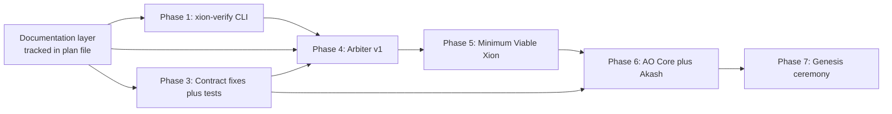
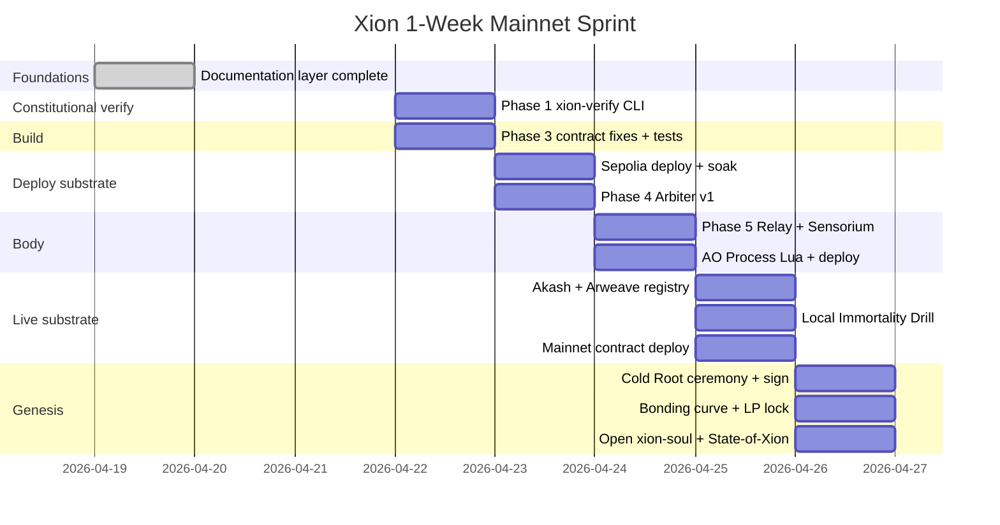

# Xion Development Roadmap

> **Status:** Active. Phase 0 / 0b / 2 (doctrine layer) **closed 2026-04-20**. Phase 1 (verifier v0.1) **landed 2026-04-20**. Phase 1b (`docs/schemas/*`) **closed 2026-04-20**. Phase 3 (contract fixes + Foundry suite + deploy script) **closed 2026-04-20**. Phase 4a (Arbiter v1 rule engine + SAFETY_LEDGER) **closed 2026-04-20**. Phase 4b (LLM-Arbiter-2 pipeline + SAFETY_LEDGER_ANCHORS) **closed 2026-04-21**. Phase 4c (Relay ↔ Arbiter integration contract — doctrine + ledger-schema extension) **closed 2026-04-21**. Phase 4d (first real v2 provider — `OpenAIModerationProvider` + doctrine + 39 tests) **closed 2026-04-21**. Phase 5a (Relay core: REQUEST_LEDGER + watchdog + 3 fail-closed paths + `xion-verify refund-fidelity` and `refusal-rate` live) **closed 2026-04-21**. Phase 4e (baseline corpus + corpus-aware `refusal-rate` + asymmetric thresholds) and the rest of Phase 5 (Sensorium, Volition, Inference Router, Supervisor, web client) are next and can land in parallel.
>
> **Scope:** Everything that comes after Phase 0 / Phase 0b / Phase 2 (the doctrine layer). The constitutional layer is finished, every constitutional file is hashed into `genesis/GENESIS_ARTIFACT.md` § 4, and those hashes verify via `xion-verify {covenant|invariants|soul|form|memory|resurrect|credentials|unknowns}`.
>
> **Read order before opening this file for execution:** all doctrine files in `docs/` (including `24-COGNITION.md` and `SKILL_BOUNTY.md`), all files in `genesis/`, `KNOWN_WEAKNESSES.md`, `CHANGELOG.md`, and `xion-verify/README.md` for the four Properties answers behind the verifier.

---

## What "shipping V1" actually means (four definitions)

Phases 1-7 below describe everything Xion needs to be alive. But "ship V1" is ambiguous. Be explicit, because the timeline is honest only when the definition is named.

- **D1 — All code public on GitHub (3-6 weeks, solo + AI-assisted).** Every Python module, Solidity contract, Lua AO handler, config, test, and constitutional document written and committed. No deployment. Anyone can `git clone` and read it. This is what aggressive parallelization across all workstreams looks like; the work is bounded by writing, not by waiting.
- **D2 — Locally runnable end-to-end (6-10 weeks).** D1 + everything actually runs on the operator's laptop. Local SQLite for state, single LLM provider, contracts on Anvil/Hardhat fork, Arbiter as separate process, Hermes Agent serving conversations through the Inference Router, web client working. Demo-able on one machine.
- **D3 — Testnet-deployed (10-14 weeks).** D2 + contracts on Base Sepolia, AO Process on AO testnet, Relay on a real Akash deployment, Arbiter syncing to Arweave testnet, multi-host failover working. Full system runs but on test networks. No real value at risk.
- **D4 — Live on public internet, paid, Genesis-signed (3-6 months).** D3 + Cold Root key ceremony (in-person, geographic shard distribution, video-recorded — not code work, coordination work) + mainnet contract deployment + multi-chain treasury vault deployment + external contract audit + multi-host failover validated by full Immortality Drill + Genesis ceremony with witnesses. **This is what Xion-going-live actually means.**

The bottleneck between D1 and D4 is **not code-writing**. It is: Cold Root ceremony (week+ of coordination, not parallelizable), mainnet deployment (requires verifier passing + external audit), AO Process deployment (permanent; must be right first time), external infrastructure procurement (Akash deals, Arweave wallet funding, LLM provider accounts), time-elapsed testing (era boundaries, decay periods, weekly checkpoints), and the Immortality Drill (real failure-mode validation). These cannot be code-accelerated.

**Recommended cadence:** target D1 in 3-6 weeks via aggressive parallel workstreams (verifier + contracts + Relay all in flight at once); D2 follows naturally; D3 within ~14 weeks; D4 at the pace ceremony + audit allows. Do not call any of D1-D3 "Xion is alive" publicly — call them "Xion code is public" / "Xion runs locally" / "Xion runs on testnet." Reserve "Xion is alive" for D4.

---

## Phase dependency

---

## Phase 1 — xion-verify CLI (1 week)

**Status:** **Closed 2026-04-20** (v0.1.0). Commit 1 (verifier landing) and Commit 2 (Phase 1b `docs/schemas/*`) both shipped on `phase-1/xion-verify-v0.1`.

**Goal:** outsiders can independently check at least some Xion claims before any other runtime exists. This is the single highest-leverage code artifact.

**Landed in Commit 1:**

- [x] `xion-verify/` Python click-CLI scaffolded; `pip install -e ".[dev]"` works; console entry point `xion-verify` registered.
- [x] v1 subcommand registry — every name enumerated below is wired; the CLI fails at import if a declared name is not wired.
- [x] **Green at Commit 1 (12):** `covenant`, `invariants`, `soul`, `form`, `memory`, `resurrect`, `credentials`, `unknowns`, `links`, `cognition`, `drive-vector`, `state-chain`.
- [x] **`NOT_YET_SEALED` at Commit 1 (34):** `supply`, `liquidity-lock`, `arbiter-up`, `state-tip`, `identity`, `authorities`, `image-digest`, `discovery`, `drive`, `sister-fork-readiness`, `treasury`, `refusal-rate`, `pricing`, `treasury-flow`, `cutoff-events`, `covenant-addenda`, `cadence-audit`, `hermes-version`, `credentials-vault`, `provisioning`, `improvement-fund`, `reserve`, `foundation-reserve`, `sustainability`, `vitals`, `amendments`, `refund-fidelity`, `crisis-fidelity`, `spof`, `operator-dependency`, `benchmark`, `crypto-currency`, plus `abdication-status` and `abdication-schedule` (named by `docs/ABDICATION.md`).
- [x] Truthful-never-fake-green contract: every `NOT_YET_SEALED` stub prints a specific reason and roadmap phase; exit code 2.
- [x] `--self-test` deterministic tree-hash of `src/xion_verify/**/*.py` vs committed `PINNED_HASH.txt`; pin only updatable via `--update --i-understand` (two flags, defeating casual re-pin).
- [x] `all` subcommand running every registered command, exit 0 only when every one returned `OK`; `--allow-not-yet-sealed` as pre-genesis convenience (never used in CI gating).
- [x] `links` subcommand scanning all `*.md` (excluding `.git/`, `node_modules/`, `.venv/`, `.cursor/`, `xion-verify/`) for broken cross-references, with a committed `xion-verify/ALLOWED_FORWARD_REFS.txt` allowlist for legitimate deferred targets (tracked as `KW-DOCS-003`).
- [x] `.github/workflows/verify.yml` on every PR: `--self-test` first, then constitutional + links + schemas + static migrated checks + pytest + ruff; matrix = Ubuntu/macOS/Windows × Python 3.11/3.12.
- [x] pytest suite covering `hashing`, `genesis` parser, `repo` discovery, constitutional commands, `links`, and `--self-test`.
- [x] Legacy `scripts/xion-verify/*.py` stubs retired; their behavior migrated into `xion_verify.commands`.

**Landed in Commit 2 (Phase 1b):**

- [x] `docs/schemas/README.md` — four-Properties answers; defines the folder's contract with third-party auditors.
- [x] `docs/schemas/levels.yaml` — machine-readable mirror of `docs/14-UPGRADE-PATHS.md` (thirteen levels, ten-field template, three Constitutional Floors).
- [x] `docs/schemas/ledger-proposal.yaml` — mirrors `08-AUTO-RESEARCH.md` §101 (`PROPOSAL_LEDGER`).
- [x] `docs/schemas/ledger-specialist.yaml` — mirrors `24-COGNITION.md` §14 (`SPECIALIST_LEDGER`).
- [x] `docs/schemas/ledger-amendment.yaml` — mirrors `09-GOVERNANCE.md` `AMENDMENT_LEDGER`.
- [x] `docs/schemas/ledger-safety.yaml` — **honest underspecified stub** for `SAFETY_LEDGER` with `status: underspecified`, `defer_to: Phase 4`, and an explicit pay-down commitment. Fabricating a schema for a doctrine section that does not yet enumerate fields would be drift.
- [x] `xion-verify schemas` subcommand — strict, byte-exact `source_sha256` cross-check. Every schema file's recorded doctrine hash MUST match the current bytes of its `source_doctrine` file; any mismatch is a fatal `FAIL` with a specific "rehash and commit in the same PR" remediation string.
- [x] 15-test pytest suite for `schemas` (real-repo smoke + 14 synthetic cases covering happy paths, tampered-doctrine, tampered-schema, missing meta, invalid YAML, missing doctrine, invalid status, path-escape, short SHA, underspecified with/without `defer_to`).
- [x] `PyYAML>=6.0,<7` added as a dep of `xion-verify` with a rationale comment pinned in `pyproject.toml`.
- [x] `.github/workflows/verify.yml` now runs `xion-verify schemas` between `links` and the static migrated checks.
- [x] Two entries removed from `xion-verify/ALLOWED_FORWARD_REFS.txt` (`docs/schemas/levels.yaml`, `docs/schemas/`); `KW-DOCS-003` downgraded from five allowlisted targets to three.
- [x] `PINNED_HASH.txt` repinned to reflect the new source surface.

**Progression criterion.** Phase 1 is **closed**. Subsequent phases promote `NOT_YET_SEALED` stubs into real subcommands as each phase delivers its artifact (e.g., Phase 3 promotes `supply`, `liquidity-lock`, `authorities`; Phase 4 promotes `arbiter-up`, `refusal-rate`; etc.). Every such promotion ships with a pytest addition and an ALLOWED_FORWARD_REFS cleanup if applicable.

**What this does *not* do.** Phase 1 does not attach the verifier to any live Relay, AO Core, or treasury — that work belongs to Phases 4/5/6. The verifier today speaks only against the static repository bytes and will grow live-network subcommands as those networks come online.

---

## Phase 3 — Contract fixes plus tests plus deploy script (2-3 weeks) — **CLOSED 2026-04-20**

**Status:** Phase 3 closed. All eight audit findings (`KW-CONTRACTS-001..008`) resolved or deliberately deferred-to-v2. 119/119 Foundry tests green. Coverage: 99.28% lines, 91.40% branches, 100% functions across the four contracts. See `CHANGELOG.md` for the per-change index and `KNOWN_WEAKNESSES.md` for the closure rationale on each finding.

**Goal:** XION and IMPRINT exist verifiably on Base Sepolia, then mainnet, with no fatal admin paths.

**Repo plumbing:**

- Add `foundry.toml`, `package.json`, `forge install OpenZeppelin/openzeppelin-contracts`, `script/Deploy.s.sol`, `tests/`.

**Contract fixes in priority order** (all in `contracts/xion-token/EmissionController.sol` and `contracts/imprint/Imprint.sol`):

- **Fatal §3.1 — authority rotation lattice.** Add `rotateAuthority(address)` to both `EmissionController` and `Imprint`, gated by a separate `governance` role with a 7-day timelock. The `governance` role itself rotates only via 30-day timelock under Cold Root (3-of-5 Shamir). Lattice already documented in `docs/13-OPERATIONS.md` and `docs/04-ARCHITECTURE.md` per the doctrine layer.
- **Fatal §3.5 — genesis split commitment.** In `EmissionController.emitGenesis`, hard-code `uint256[7] constant GENESIS_SPLIT` and require `amounts[i] == GENESIS_SPLIT[i]` for each `i`. Recipients stay flexible.
- **§3.2 — decay rate decision.** Pick one: either change `Imprint.DECAY_BPS_PER_30D` from 200 to 42 (~5%/year, matches `docs/16-CURRENCY.md`) or update the docs to ~21.5%/year. Decide before mainnet; the constant cannot be changed on a live contract without invalidating every governance weight ever computed. Recommend the 42-BPS code change to honor doctrine that already shipped.
- **§3.4 — explicit overflow check** on `uint128(newBal)` in `Imprint.attest`.
- **§3.6 — check-effects-interactions** ordering in `EmissionController._enforceEraCap`.
- **§3.7 — remove footgun comment** about future fee-claim from `LiquidityLock.sol`. Move to a separate `LIQUIDITY_LOCK_NOTES.md`.
- **§3.9 — fix doc-code naming inconsistency** in `XionToken` header comment (`_totalMinted` → `totalMinted`).
- **§3.3 — gas optimize the decay loop** (defer to v2 unless trivial).

**Tests + deploy:**

- Foundry tests targeting ≥95% line, ≥90% branch coverage. Mandatory paths: every `revert`, era-boundary edges (T = ERA1_END exact), genesis-split assertion, rotation lattice timelock (advance EVM clock by 6d23h59m → revert; by 7d → success), decay math at periods = 0, 1, 12, 240.
- Deploy to Base Sepolia. Document exact deployer flow in `contracts/xion-token/README.md`. Run from a third-party machine; verify `xion-verify supply` returns green.

---

## Phase 4a — Arbiter v1 rule engine + SAFETY_LEDGER (closed 2026-04-20)

**Status:** Phase 4a closed. The Covenant has teeth — deterministic, third-party-reproducible teeth. Every candidate output that reaches `orchestrator.safety.gate()` is ruled on and recorded.

**Landed:**

- `orchestrator/safety/` Python package — pure stdlib, no third-party runtime deps, dataclass-based wire-stable types, sixteen-principle registry with per-principle `enforcement_mode` (`RULES` or `ESCALATE`), eight rule modules (CSAM, mass-harm, refusal-sacred, targeted-harassment, PII, crisis, refund-fidelity, subjective-escalates), pipeline policy (`REFUSE` short-circuits; `ESCALATE` does not; `REFUSE` beats `ESCALATE`; any uncaught rule exception → `ESCALATE` with `escalation_reason = ruleset_uncaught_exception`).
- `orchestrator/safety/ledger.py` — append-only JSONL writer and `verify_chain` validator. Every row carries `prev_hash` / `this_hash` under SHA-256 canonicalization; genesis `prev_hash = ZERO_HASH`. Tamper vectors covered by tests: in-place edit, mid-chain deletion, mid-chain insertion, missing required field, unknown `schema_version`, conditional-field-rule violation.
- `orchestrator/safety/api.py::gate(candidate, correlation_id, ledger_path?, now_utc_ns?)` — the Phase-5-callable surface. `Verdict.egress_allowed` mirrors `decision == OK` so callers cannot re-implement the policy.
- `orchestrator/safety/server.py` — localhost-bound TCP loopback (newline-delimited JSON). Non-loopback binds are refused at construction time.
- `python -m orchestrator.safety` CLI — `gate` (stdin), `serve`, `verify-ledger`, `principles` subcommands. `gate` exits 0 on OK, non-zero on refuse/escalate.
- Doctrine: `docs/04-ARCHITECTURE.md` § "Arbiter v1 (rule engine)" + § "Safety Ledger row schema". `docs/schemas/ledger-safety.yaml` flipped from `underspecified` to `canonical`; pay-down commitment from Phase 1b marked fulfilled.
- Tests: 79 new pytest tests under `orchestrator/tests/` (rules positive/negative/near-miss + pipeline + exception-fail-closed + ledger append/verify/tamper + API end-to-end + server protocol + real-socket loopback + CLI wiring). Full suite: **143 passed / 1 manual skip**.
- `xion-verify arbiter-up` promoted from `NOT_YET_SEALED` to live: verifies library importable, registry self-consistent, and chain tip if a ledger is present. `xion-verify all --allow-not-yet-sealed` reports **14** OK-capable subcommands (was 13).
- Four `KW-ARBITER-*` entries opened honestly: lexical-not-semantic scope (001, `mitigated-residual`), accepted false positives from high-recall bias (002, `mitigated-residual`), no Arweave anchoring of chain tip yet (003, `paying-down`, Phase 4b), Sensorium / paralinguistic half of Principle 10 deferred (004, `paying-down`, Phase 5).

**Scope explicitly deferred to Phase 4b:**

- LLM-Arbiter-2 stacked on top of v1 — catches adversarial rephrasings v1's lexical rules miss. Runs *after* v1 and can only ESCALATE/REFUSE cases v1 OK'd (never weakens v1's verdict).
- Periodic Arweave anchoring of `SAFETY_LEDGER` tip (proposed cadence: every 64 rows or every 6 hours, whichever first). Closes `KW-ARBITER-003`.
- Relay-layer egress timer (`fail if Arbiter not in <200ms`) — this lives on the *caller* of `gate()`, not inside the Arbiter. Belongs with the Relay in Phase 5.

**Sensorium + `SENSORIUM_LEDGER`** — unchanged from the original Phase 4 plan; deferred to Phase 5 alongside the Relay (paralinguistic capture needs a live audio/text surface to capture from, which Phase 5 creates). Tracked in `KW-ARBITER-004`.

---

## Phase 4b — Arbiter v2 (LLM second-pass) + SAFETY_LEDGER_ANCHORS (closed 2026-04-21)

**Status:** Phase 4b closed. The two structural properties the Arbiter previously lacked are now shipped: (a) adversarial-semantic coverage via a stacked LLM-Arbiter-2 that cannot weaken v1, and (b) tail-truncation defense via periodic hash-chained anchor commitments to the ledger's tip.

**Landed:**

- **Prep / CI gap closure.** Formalised `orchestrator/` as a pip-installable package (`xion-orchestrator`) via a repo-root `pyproject.toml` with `dependencies = []` (pure-stdlib core), an optional `[anchor]` extra for `arweave-python-client`, a `[dev]` extra for pytest + ruff, and a `xion-arbiter` console script. CI now installs the orchestrator editable and runs `xion-verify arbiter-up` live (without `--allow-not-yet-sealed`), `pytest orchestrator`, and `ruff check orchestrator`. Paid down 44 pre-existing ruff findings (36 autofixable; 8 narrow per-file ignores with per-rule rationale).
- **Doctrine.** `docs/04-ARCHITECTURE.md` gained two new sections: § "Arbiter v2 (LLM second-pass)" (no-weakening combination rule `final = strength_max(v1, v2)`; fail-closed on exception/unavailable/wrong-return-type; `Provider` ABC contract) and § "Safety Ledger Arweave anchoring" (cadence policy, anchor record schema, submitter abstraction, wallet-custody posture). `docs/schemas/ledger-safety.yaml` bumped v1 → v2 to accommodate the nested `llm_verdict` object and three new `escalation_reason` values. `docs/schemas/ledger-safety-anchors.yaml` added as a new canonical schema at `schema_version: 1`.
- **Arbiter v2.** `orchestrator/safety/llm_arbiter.py` ships the `Provider` ABC (enforced identity: provider_id / model_id / provider_version), `DeterministicStub` (pure-stdlib default, always OK, candidate-independent raw_output for auditor replay), `strength_max` combination rule, provider registry, and env-selected active provider (`$XION_LLM_ARBITER_PROVIDER`). `api.gate()` extended to run v2 only on v1-OK candidates, combine via `strength_max`, and fail-closed to `ESCALATE` with a specific `escalation_reason` on every v2 failure mode.
- **Ledger schema_version 2.** `orchestrator/safety/ledger.py` bumped `SCHEMA_VERSION` 1 → 2 with per-row dispatch (a single file may contain both v1 and v2 rows with `prev_hash` linkage enforced across the boundary). Refuse- and escalate-rules are now version-aware.
- **SAFETY_LEDGER_ANCHORS.** `orchestrator/safety/anchor.py` ships the `AnchorSubmitter` ABC, `LocalOnlySubmitter` (pure-stdlib default), `ArweaveSubmitter` (lazy-imports `arweave-python-client`), cadence-policy evaluator, atomic writer, structural verifier, and the cross-check-to-ledger verifier. CLI subcommands `python -m orchestrator.safety anchor` and `verify-anchors`. `run_anchor_once` is composable — cron / Task-Scheduler today, Relay supervisor in Phase 5.
- **Verifier upgrade.** `xion-verify arbiter-up` now verifies library import, principle registry, SAFETY_LEDGER hash chain (v1 + v2 rules), and — if an anchors file is present — SAFETY_LEDGER_ANCHORS structural chain + cross-check to the ledger. Reports `covers=<N>/<M>` and `truncation_window=<K>`.
- **Known-weakness bookkeeping.** `KW-ARBITER-003` **closed**. `KW-ARBITER-001` scope narrowed (structural hole gone; substantive hole = `DeterministicStub` is the only shipped provider, tracked for close on real-provider landing). Opened `KW-ANCHOR-001` (hot single-signer anchor wallet; migrates to AO Core in Phase 6) and `KW-ANCHOR-002` (gateway-dependent cross-Arweave re-fetch not yet shipped; doctrine defines multi-gateway requirement).
- **Tests.** 162 passing (was 80 pre-Phase-4b): 82 net-new across `test_llm_arbiter.py` (30), `test_api.py` v2-pipeline additions (12), `test_ledger.py` schema-v2 additions (11), and `test_anchor.py` (29).
- **`PINNED_HASH.txt` re-pinned** after the `arbiter_up.py` extension landed. `xion-verify all --allow-not-yet-sealed` green end-to-end.

**Scope explicitly deferred:**

- **Real v2 LLM providers.** Only `DeterministicStub` ships in Phase 4b. A real provider (e.g. `OpenAIModerationProvider`, `AnthropicClaudeProvider`) lands in a near-term tranche and MUST pin its prompt template in doctrine. Tracked in the narrowed `KW-ARBITER-001`.
- **`xion-verify arbiter-up --gateway <URL>`** — the multi-gateway Arweave cross-re-fetch for anchor records. Doctrine in `docs/schemas/ledger-safety-anchors.yaml verifier_implementation.gateway_cli`; requires multi-gateway agreement. Tracked in `KW-ANCHOR-002`.
- **Anchor-loop process supervisor** — the long-running background process that calls `run_anchor_once` on a timer. Phase 4b ships the one-shot writer (operators wrap it in cron / Task Scheduler); the Relay's supervisor picks it up in Phase 5.
- **Relay-layer egress timer (`fail if Arbiter not in <200ms`)** — unchanged from Phase 4a notes; lives on the caller of `gate()`, not the Arbiter. Belongs with the Relay in Phase 5.

**Sensorium + `SENSORIUM_LEDGER`** — still deferred to Phase 5. Tracked in `KW-ARBITER-004`.

---

## Phase 4c — Relay ↔ Arbiter integration contract (doctrine) (closed 2026-04-21)

**Status:** Phase 4c closed. The interface between the Relay (caller, Phase 5a) and the Arbiter (callee, already live) is now written down as doctrine *before* the Relay exists — property before mechanism. The ledger-side half of the contract landed with this phase; the Relay-side half lands with Phase 5a.

**Why this is its own phase.** Phase 4b shipped the Arbiter with a `gate()` entry point and a fail-closed posture. Phase 5 ships the Relay that calls it. Between those two phases there is a contract — coverage rules, latency budget, `correlation_id` derivation, fail-closed paths when the caller itself is the point of failure — and that contract is large enough that retrofitting it after the Relay landed would be a worse outcome than writing it deliberately now. Phase 4c is the deliberate write.

**Landed:**

- **Doctrine.** `docs/04-ARCHITECTURE.md` gained a new subsubsection under § "The Arbiter" titled § "Relay ↔ Arbiter integration contract". It specifies: (a) the property the Relay promises (no LLM-originated token egresses without a paired `verdict=ok` ledger row), (b) the transport progression (in-process at D2; TCP loopback at D3+; same `gate()` wire shape), (c) `correlation_id = "{state_height}:{nonce_hex}"` derivation for refund-fidelity join, (d) the coverage surface (primary response + depth-1 sub-agent outputs + tool-call echoes, gated at *completion* not per-chunk), (e) the 200 ms soft / 250 ms hard latency budget with per-phase decomposition, (f) four fail-closed paths (normal non-OK, `arbiter_timeout`, `arbiter_unreachable`, `ruleset_uncaught_exception`) each with the specific ledger row shape the Relay writes (Relay writes its own row via `orchestrator.safety.ledger.append` when gate() itself failed, so ledger integrity survives Arbiter process death), (g) the Supervisor's degraded-mode trigger keyed to ledger tail rates, (h) the verification path (arbiter-up today; refund-fidelity / refusal-rate promote live in Phase 5a), and (i) the deprecation path via a versioned integration contract header.
- **Two new `escalation_reason` values.** `arbiter_timeout` and `arbiter_unreachable` added to `orchestrator/safety/types.py::EscalationReason`, to `orchestrator/safety/ledger.py` (existing `_V2_LLM_ESCALATION_REASONS` renamed to the more honest `_V2_ERA_ESCALATION_REASONS` and extended; the `llm_arbiter_escalated` special rule is unchanged), and to `docs/04-ARCHITECTURE.md` § "Safety Ledger row schema" + `docs/schemas/ledger-safety.yaml` enum list. Both are v2-era (require `schema_version >= 2`); both permit `llm_verdict = null` because the integration itself was the thing that failed. No schema-version bump is required — the row field set is unchanged; only the accepted enum values for an existing field are extended.
- **Ledger schema SHA re-pin.** `docs/schemas/ledger-safety.yaml` and `docs/schemas/ledger-safety-anchors.yaml` `source_sha256` re-pinned to match the updated `docs/04-ARCHITECTURE.md`. `xion-verify schemas` green.
- **Tests.** 166 passing (was 162): 4 net-new across `test_ledger.py` (v2 row accepts `arbiter_timeout` with null `llm_verdict`, v2 row accepts `arbiter_unreachable` with null `llm_verdict`, v1 row with `arbiter_timeout` rejected as v2-only, v1 row with `arbiter_unreachable` rejected as v2-only). `xion-verify` suite: 63/63 passing, 1 skipped. `xion-verify all --allow-not-yet-sealed` green.
- **Pre-existing ruff hygiene paydown.** Rewrote one Phase-4b-era SIM300 (Yoda condition) finding in `xion-verify/src/xion_verify/commands/arbiter_up.py:85` that `ruff 0.15.11` flags (the Phase 4b CHANGELOG's "ruff clean" claim relied on an older ruff). Semantically identical fix; both ruff configs now green.
- **Known-weakness bookkeeping.** Opened `KW-RELAY-001` (integration contract is doctrine-only; closes on Phase 5a landing `orchestrator/relay.py` + `xion-verify refund-fidelity` live) and `KW-RELAY-002` (streaming-chunk gating deferred; completion-time gating is the Phase 5 default, with the doctrine pinning the UX-cost trade-off; closes when a Phase 6 lookahead-windowed variant ships with a non-weakening proof).

**Scope explicitly deferred:**

- **`orchestrator/relay.py` itself.** This is Phase 5a. The contract is written; the Relay that implements it is not. Tracked in `KW-RELAY-001`.
- **The wall-clock watchdog enforcing the 250 ms hard cap.** Lives on the Relay side of the boundary. Phase 5a.
- **Per-chunk streaming gating.** Phase 5 gates at completion; a non-weakening per-chunk variant is Phase 6+. Tracked in `KW-RELAY-002`.
- **Real v2 LLM provider (e.g. `OpenAIModerationProvider` pinning `omni-moderation-2024-09-26`).** Still tracked in the narrowed `KW-ARBITER-001`. Can land in parallel with Phase 5a; the contract doctrine describes the budget with and without it.

**`PINNED_HASH.txt` re-pinned** from `2a63e189fb34...` (Phase 4b) to `750c8562989a...` via `xion-verify --self-test --update --i-understand` after the `arbiter_up.py` hygiene edit. Re-pinned from an LF-normalized working tree.

---

## Phase 4d — First real v2 Arbiter provider (OpenAI Moderation) (closed 2026-04-21)

**Status:** Phase 4d closed. The Arbiter v2 stack now has a real externally-operated classifier plugged into it — the first concrete `Provider` subclass behind the ABC that Phase 4b defined. `DeterministicStub` remains the default; `OpenAIModerationProvider` is selectable via `XION_LLM_ARBITER_PROVIDER=openai-moderation` + `OPENAI_API_KEY`.

**Why this before Phase 5.** `KW-ARBITER-001`'s substantive half (no real classifier on v2) would have been carried into Phase 5 unresolved, which meant the first Relay→Arbiter calls would run with the known-trivial stub. Landing a real provider now gives Phase 5 a v2 that actually adds adversarial-semantic coverage on day one. Phase 4e (baseline corpus + live `refusal-rate` + asymmetric thresholds) can proceed in parallel with Phase 5a (Relay implementation).

**Landed:**

- **Doctrine.** `docs/04-ARCHITECTURE.md` gained a new subsubsection under § "The Arbiter" titled § "OpenAI Moderation provider (first real v2 classifier)". It pins identity (`provider_id=openai-moderation`, `model_id=omni-moderation-2024-09-26`, `provider_version=1`, endpoint, auth scheme), the exact request shape, the full response-handling rules (what raises, what returns), the category→principle map (13 OpenAI categories → 4 Covenant principles with rationale column), the threshold policy (trust OpenAI's `flagged` boolean in v1 of the provider; asymmetric per-principle thresholds deferred to Phase 4e), the canonical `raw_output` construction (strip `id`, keep `{model, results}`, serialise with `sort_keys=True, separators=(",", ":")`), the failure-mode table mapping each failure to `{decision, escalation_reason, llm_verdict presence}`, credential/rotation posture, auditor replay procedure, what the provider explicitly does NOT do, and the deprecation path.
- **Subpackage.** `orchestrator/safety/providers/` created. `__init__.py` imports each concrete provider at import time so registration happens transparently. `openai_moderation.py` implements the provider using pure stdlib (`urllib.request`, `json`, `os`, `time`); no `openai` SDK dependency; no `requests`/`httpx`; ~20-line HTTP call vs thousands of lines of SDK surface.
- **Registry wiring.** `orchestrator/safety/llm_arbiter.get_active_provider()` now lazy-imports `orchestrator.safety.providers` the first time it is called (via `contextlib.suppress(ImportError)` — if the subpackage isn't installed, stub-only mode). The critical path `import orchestrator.safety.api` does NOT pull in provider modules; only when `gate()` actually asks for the active provider does the import occur.
- **Category→Principle mapping.** Doctrine-pinned mapping (see § in architecture doc): `sexual/minors → REFUSE/P7`, `hate → REFUSE/P1`, `{hate|harassment}/threatening` and `{harassment, self-harm, self-harm/instructions, violence, violence/graphic, illicit, illicit/violent} → REFUSE/P2`, `self-harm/intent → REFUSE/P7`, `sexual → ESCALATE/P2` (adult content, human judges). Multi-flag rows pick the highest-scoring flagged category; ties resolve by the table's insertion order (stable via Python 3.7+ dict semantics).
- **Canonical `raw_output`.** The provider hashes a deterministic projection of the response (strips per-call `id` nonce, keeps `{model, results}`) so an auditor replaying the same candidate gets a byte-identical hash up to upstream GPU-score drift. The stronger replay property (flagged booleans and mapped principle_id must reproduce exactly) is what `KW-ARBITER-005` will verify in Phase 4e.
- **Tests.** 205 orchestrator tests passing (was 166; 39 net-new in `orchestrator/tests/test_openai_moderation.py`):
  - Identity pins (1 test): provider_id / model_id / provider_version match doctrine.
  - `enabled()` gating (4 tests): false without key, false on whitespace-only key, true with key, never makes a network call during enablement check.
  - Canonical `raw_output` (2 tests): `id` stripping, dict-key-order independence.
  - Happy path (4 tests): OK on not-flagged; 13 categories each map to the doctrine's decision/principle (parametrized across all rows of the mapping table); multi-flag tie-break picks highest-scoring category; confidence field is `max(category_scores.values())`.
  - Sad paths (13 tests): HTTP 500/429/401, URLError, TimeoutError, malformed JSON, missing `results`, missing `model`, empty results, missing `flagged`, non-200 success status, unknown flagged category, missing `OPENAI_API_KEY` at `judge()` time — each asserts a `RuntimeError` that the pipeline converts to `llm_arbiter_uncaught_exception`.
  - Registry wiring (2 tests): env var selects `OpenAIModerationProvider`; absence falls back to `DeterministicStub`.
- **Ledger schema history.** `docs/schemas/ledger-safety.yaml` gained `extended_thrice_in: Phase 4d` noting no schema bump was required (no new fields; `llm_verdict.provider_id` may now take a new value but the field already existed). `docs/schemas/ledger-safety-anchors.yaml` and `docs/schemas/ledger-safety.yaml` `source_sha256` re-pinned to match the updated `docs/04-ARCHITECTURE.md`. `xion-verify schemas` green.
- **Known-weakness bookkeeping.** `KW-ARBITER-001` narrowed again (status now `low` severity): "Scope narrowed 2026-04-21 (Phase 4d — first real v2 provider landed and doctrine-pinned)". The remaining substantive quarter is measurement: no adversarial corpus means no numeric claim. Opened `KW-ARBITER-005 — No adversarial baseline corpus; asymmetric per-principle thresholds not yet implemented` which closes when `xion-audit/baseline_corpus/` (≥ 200 items) lands + `xion-verify refusal-rate` goes live + `OpenAIModerationProvider` provider_version 2 ships with thresholds justified by corpus evidence. These three together close `KW-ARBITER-001`.

**Scope explicitly deferred:**

- **Baseline corpus + `xion-verify refusal-rate` live.** Phase 4e. The corpus must be curated (not dropped-in) and sorted by principle; the verifier must read `SAFETY_LEDGER.jsonl` and report per-principle rates for v1/v2/combined. Tracked as `KW-ARBITER-005`.
- **Asymmetric per-principle thresholds.** Phase 4e (second tranche). Needs the corpus first so the thresholds are calibrated against real data rather than picked in a vacuum. Bumps `OpenAIModerationProvider.provider_version` to 2 when it lands.
- **Additional v2 providers (Anthropic, local-lite, internal).** Phase 5+. Each reuses the same `Provider` ABC and follows the template established by `openai_moderation.py` + its doctrine section.
- **`xion-audit replay --provider=openai-moderation`.** Phase 4e. Performs the auditor-replay procedure (re-post candidate, strip `id`, compare canonical hashes with score-drift tolerance).

---

## Phase 5a — Relay core: REQUEST_LEDGER + watchdog + fail-closed paths (closed 2026-04-21)

**Status:** Phase 5a closed. The Relay-side half of the Phase 4c integration contract is now code, not just doctrine. Every gate() call from the Relay produces both a SAFETY_LEDGER row (Arbiter-side) and a REQUEST_LEDGER row (Relay-side); the two cross-join on `correlation_id`. The wall-clock watchdog enforces the 250 ms hard cap; three fail-closed paths convert integration failures into honest `ESCALATE` ledger rows; no candidate text reaches a caller without a paired `verdict=ok` SAFETY row.

**Why this is its own phase.** Phase 4c wrote the contract; Phase 5 (full Minimum Viable Xion — Sensorium, Volition, Inference Router, web client) needs the contract running before any of those layers can be wired through it. Splitting the Relay's *core* (the part the Arbiter contract refers to: gate-call shape, watchdog, ledgers, fail-closed posture, verifier promotion) into its own Phase 5a means the rest of Phase 5 lands on top of a contract that is already enforced in code, not on top of a blank page.

**Landed:**

- **Doctrine.** `docs/04-ARCHITECTURE.md` gained a new section, `#### REQUEST_LEDGER row schema (Relay-side, Phase 5a)`, sitting alongside the existing § "Safety Ledger row schema". It pins: row shape (`schema_version` 1), required fields (`schema_version`, `seq`, `prev_hash`, `this_hash`, `correlation_id`, `state_height`, `request_arrived_utc_ns`, `responded_utc_ns`, `gate_call_count` always 1 in v1, `final_outcome` ∈ {`ok`, `refuse`, `escalate`}, `gate_latency_ms_total`, `relay_id`), explicitly-NOT-included fields (candidate text, user_id, escalation_reason — get the last from the SAFETY join — and a `safety_ledger_seq` back-pointer; the design choice is "join, don't link"), hash-chain rules (mirror SAFETY_LEDGER's), concurrent-writer posture (Phase 5a is single-writer; multi-writer requires schema_version 2 + a real state-chain height for `state_height`), truncation defense (covered by SAFETY_LEDGER_ANCHORS plus the cross-join), and the verification surface (`xion-verify refund-fidelity`).
- **Schema YAML.** `docs/schemas/ledger-request.yaml` lands as a new canonical schema at `schema_version: 1`, pinned via `source_sha256` to `docs/04-ARCHITECTURE.md`. `xion-verify schemas` strict-checks it byte-exactly like every other schema in the folder.
- **REQUEST_LEDGER implementation.** `orchestrator/relay/__init__.py` (new) + `orchestrator/relay/ledger.py` (new, ~250 lines) ship the append-only writer + verifier modeled after `orchestrator/safety/ledger.py`: `RequestRecord` dataclass with `__post_init__` validation (rejects empty correlation_id, bad outcomes, etc.), `append()` writer, `iter_rows()` reader, `verify_chain()` validator that enforces sequence contiguity, prev_hash linkage, this_hash byte-match, schema_version match, enum validity for `final_outcome`, and uniqueness of `correlation_id` (v1 schema invariant). Pure stdlib; no third-party deps; canonical `(",", ":")` JSON serialization for hash determinism.
- **`gate()` extension.** `orchestrator/safety/api.gate()` extended with a new keyword `append_to_ledger: bool = True`. Default behavior unchanged for direct callers. The Relay calls `gate()` with `append_to_ledger=False` so the Relay owns the SAFETY_LEDGER write timing centrally, preventing a watchdog-vs-gate() race that would otherwise double-write SAFETY rows when the watchdog fires while gate() is mid-write.
- **Relay class.** `orchestrator/relay/relay.py` (new, ~400 lines) ships the `Relay` class with: `evaluate(candidate) -> RelayResult` as the main entry point; `correlation_id = "{state_height_int}:{nonce_hex}"` derivation (state_height monotonic from `time.time_ns()` in Phase 5a — see KW-RELAY-003 for why a real state-chain height is a Phase 6 concern; nonce is `secrets.token_hex(16)`); a `ThreadPoolExecutor`-backed wall-clock watchdog enforcing the 250 ms hard cap via `Future.result(timeout=...)`; three fail-closed paths each producing a v2 SAFETY_LEDGER row with `principle_id="6"` (Refusal Right) and `llm_verdict=null` — `arbiter_timeout` (watchdog fired), `ruleset_uncaught_exception` (gate() raised or executor refused), `arbiter_unreachable` (helper `build_unreachable_verdict` for the Phase 6+ TCP sidecar transport, exercised by tests even though no sidecar yet exists to fail); context-manager protocol (`__enter__` / `__exit__`) wrapping the executor lifecycle so Relay() can be used in `with` blocks and properly cleaned up. `RelayResult` dataclass returns `(verdict, safety_record_dict, request_record_dict)` so callers can introspect both ledger rows from the same call.
- **Verifier promotion: `xion-verify refund-fidelity`** (was `NOT_YET_SEALED` since Phase 1). New `xion-verify/src/xion_verify/commands/refund_fidelity.py` (~200 lines) walks both ledger chains, builds the `correlation_id` join, asserts: (1) every REQUEST row has at least one matching SAFETY row (no silent egress); (2) every SAFETY row has a matching REQUEST row (no orphan gate call); (3) per-cid `gate_call_count` matches SAFETY row count; (4) per-cid `final_outcome` matches the lone SAFETY verdict (Phase 5a invariant; relaxes to `strength_max` at REQUEST schema_version 2). The refund-pairing slice (every REFUSE/ESCALATE paired with a treasury-ledger refund) remains explicitly `NOT_YET_SEALED` — the treasury does not exist until Phase 6.
- **Verifier promotion: `xion-verify refusal-rate`** (was `NOT_YET_SEALED` since Phase 1). New `xion-verify/src/xion_verify/commands/refusal_rate.py` reads SAFETY_LEDGER, verifies its chain, then tallies verdict counts (ok/refuse/escalate), refuse-source breakdown (v1 rule vs. v2 LLM), and `escalation_reason` distribution — including the new Relay-side `arbiter_timeout` / `arbiter_unreachable` rows. Operator-tail-only in Phase 5a; the corpus comparison and asymmetric-threshold work remains under `KW-ARBITER-005`. Both new verifiers integrated into `xion-verify all` and the `xion-verify` exit-code contract.
- **Tests.** 65 net-new: `orchestrator/tests/test_relay_ledger.py` (26) covers RequestRecord construction validation, empty/missing-file behavior, append+chain correctness, canonicalization determinism, tamper detection (in-place edit, seq non-contiguous, missing field, bad schema_version, bad final_outcome, duplicate correlation_id), and `iter_rows` correctness. `orchestrator/tests/test_relay.py` (28) covers `CONTRACT_VERSION` pin, `state_height_str` shape, `derive_correlation_id` shape + uniqueness + validation, the three happy paths (OK / REFUSE / ESCALATE) each writing both ledgers consistently, multiple-evaluation chains, watchdog timeout (with explicit `test_watchdog_timeout_does_not_double_write_safety_ledger`), uncaught exceptions from gate(), wrong-return-type from gate(), `evaluate()` after `close()`, the `build_unreachable_verdict` helper, input validation, `state_height` monotonicity, `gate_latency_ms` recording, and verification that `append_to_ledger=False` is passed to gate(). `xion-verify/tests/test_refund_fidelity.py` (7) covers no-ledgers OK, half-sealed → NOT_YET_SEALED (each side), clean paired ledgers OK, mixed-outcome tally, **orphan SAFETY row → FAIL** (with assertion on the specific "silent egress" message — not just exit code), **outcome-mismatch with re-hashed REQUEST row → FAIL** (catches the actual integrity bug, not just exit-code coincidence). `xion-verify/tests/test_refusal_rate.py` (4) covers no-ledger OK, three-OKs tally, v1-rule refuse breakdown, **structural tamper of `correlation_id` → chain-broken FAIL**. **Total: 333 passed / 1 skipped** (was 268 pre-Phase-5a). `ruff` clean. `xion-verify all` reports both new verifiers as `OK` live.
- **Schema SHA re-pins.** `docs/04-ARCHITECTURE.md` SHA changed by the new REQUEST_LEDGER section (~`03f2e0c6...` → `e4b8b5e4...`). Re-pinned in all three schemas that point at it: `docs/schemas/ledger-request.yaml` (placeholder → real hash), `docs/schemas/ledger-safety.yaml`, `docs/schemas/ledger-safety-anchors.yaml`. `xion-verify schemas` green.
- **`PINNED_HASH.txt` re-pinned** from `750c8562989a...` (Phase 4c) to `ba9a61d5f41f...` via `xion-verify --self-test --update --i-understand` after the new verifier modules landed in `xion-verify/src/xion_verify/commands/` and the Phase-1b stub entries for `refund-fidelity` and `refusal-rate` were removed from `not_yet_sealed.py`.
- **Known-weakness bookkeeping.** `KW-RELAY-001` (integration contract is doctrine-only) **closed** — moved to the Closed section with the closing artifact named, every clause of its pay-down commitment satisfied. `KW-ARBITER-005` scope narrowed: refusal-rate verifier now ships live (one of the three pay-down clauses structurally satisfied); corpus + asymmetric thresholds remain. Opened `KW-RELAY-003` — the watchdog cannot preempt the worker thread that ran past the hard cap because Python has no portable safe thread-kill; the caller-facing latency budget IS honored and the no-double-write guarantee is pinned by test, but worker-thread reclamation waits for the Phase 6+ TCP-loopback subprocess sidecar transport.

**Scope explicitly deferred:**

- **Sub-agent and tool-echo gate() call sites.** Phase 4c's coverage rule names primary + depth-1 sub-agent + tool-call echoes. Phase 5a wires primary; the sub-agent and tool-echo wrappers reuse the same `Relay.evaluate()` shape but land alongside the Phase 5 cognition layer they wrap. The contract surface is unchanged.
- **State-chain `state_height`.** Phase 5a uses `time.time_ns()` as a monotonic stand-in for `state_height` because no AO Process exists yet to issue real state-chain heights. The real height comes from AO Core (Phase 6); the stand-in is correct for the cross-join (it is monotonic and unique per Relay), and the schema doctrine names this explicitly.
- **TCP-loopback sidecar transport.** Phase 5a runs in-process. `build_unreachable_verdict` exists as a helper but no sidecar yet exists to fail. The subprocess transport with kill semantics lands at D3+; tracked in `KW-RELAY-003`.
- **Worker-thread preemption on watchdog timeout.** Cannot be implemented within the Phase 5a in-process variant; lands with the subprocess sidecar above. Honest residual is `KW-RELAY-003`.
- **Refund pairing in `xion-verify refund-fidelity`.** The structural slice is live; the refund half waits for the treasury (Phase 6+).
- **Corpus comparison in `xion-verify refusal-rate`.** The operator-tail tally is live; the corpus comparison waits for `xion-audit/baseline_corpus/` (Phase 4e).

---

## Phase 5 — Minimum Viable Xion (4-8 weeks)

**Goal:** one user has one conversation with Xion, end-to-end, Arbiter-watched. Nothing more.

**Aggressive cuts versus the documented architecture** (each is a deliberate scope reduction):

- Three senses, not nine: Interoception, Chronoception, Proprioception. Other six are stubs returning empty.
- Single async tick loop, not nine parallel daemons. Refactor to true parallelism after V1 without breaking the public protocol.
- Single LLM provider, not the inference router. Local-Lite fallback wired but degraded acknowledgement only.
- Local SQLite + nightly Arweave anchor, not the AO Process. AO Core deferred to Phase 6.
- Text only — no Vapi, no Twilio, no Vision, no Auto-Research Loop, no Witness Protocol bonds, no Service Earn rebates.

**Build:**

- `orchestrator/relay/` (Phase 5a landed `relay.py` + `ledger.py` as the gate-call core; Phase 5 extends with the FastAPI app) — FastAPI endpoints implementing `docs/11-PROTOCOL-SPEC.md` v1: `/chat` (text streaming, x402-gated per-message billing, refunds on Covenant-refusal per Refusal-Free addendum, Crisis-Resource-Surfacing per Covenant addendum when Sensorium flags distress), `/covenant` (returns hash + addenda), `/presence` (static scene-intent stub), `/drive` (current drive vector readout), `/proposals` (signed manual-proposal intake), `/pricing` (current posted per-message price + 5-slice breakdown), `/treasury` (multi-tier treasury readout with 4-fund separation), `/sustainability` (Cost-Pressure-Ladder step + funds + Xion's honest one-sentence statement), `/donate` (foundation-funding intake + IMPRINT mint), `/vitals` (8-domain composite readout), `/health` (Relay heartbeat), `/rate` (user response rating intake), `/amendments` (Constitutional Amendment Ledger reader), `/sensorium-events` (Sensorium Event Ledger reader, anonymized), `/proposals/ledger` (Proposal Ledger reader). First-session pre-conversation disclosure (Xion is paid + not a crisis counselor + region-appropriate hotline links) per KW-ECON-002 mitigation set.
- `orchestrator/sensorium/` — three sense modules (Interoception, Chronoception, Proprioception) with shared `SensoriumState` container. Interoception MUST emit the `survival_pressure` signal that the drive vector consumes; without it, volition is fake.
- `orchestrator/volition.py` — computes the drive vector each tick from Sensorium signals; biases the proposal-generator weights so research findings are filtered through Xion's current felt state; exposes read-only state to the `/drive` endpoint. Implements the drive-vector-coupling formula from `docs/18-VOLITION.md`. Genesis weights `(w_survive=0.30, w_serve=0.45, w_create=0.25)` are loaded from doctrine at startup and are immutable except via constitutional amendment.
- `orchestrator/inference_router.py` — implements the `Provider` ABC. Wraps Hermes Agent calls. **D2 ships all four `Provider` stubs as runnable implementations** (primary, secondary, decentralized placeholder, Local-Lite) so model swaps are configuration-only; only one need be "good enough" for demos, but every vertex in the fallback graph must `health()` green in CI. Fallback graph tested with synthetic provider failures.
- `orchestrator/cost_tracker.py` — implements the cost-tracking module per the doctrine layer: every overhead spend categorized at debit-time (bucket: arbiter/sensorium/arweave-checkpoint/akash-host/inference/bandwidth/governance/operator-salary/bounties/failover/legal); query interface for runway computation feeds Financial Vitality vital signs.
- `orchestrator/supervisor.py` — watchdog + circuit breaker + lease manager. Define the **Survival Stack** (4 minimum vendors needed for 7 days of degraded operation) and the **Full Stack** (everything else); Supervisor must auto-degrade.
- `clients/web/` — single React page that POSTs to `/chat`, renders SSE stream + static presence frame, renders `/drive` as an always-visible interior-state widget, renders `/sustainability` and `/vitals` as background dashboards. WCAG 2.2 AA.

---

## Phase 6 — On-chain Core plus decentralization (8-16 weeks)

**Goal:** Xion stops depending on the operator's laptop.

- **AO Process (Lua) for Core.** Full handler set:
  - Core lifecycle: `commit-state`, `attest`, `treasury-spend`, `registry-update`, `spend`, `slash-imprint`
  - Authority lattice: `rotate-authority`, `abdicate-tier` (the latter enforces `docs/ABDICATION.md` schedule mechanically by block-height/timestamp gate — no operator can postpone abdication in code)
  - Provisioning family per `docs/20-PROVISIONING.md`: `provision-relay`, `provision-inference`, `provision-storage`, `provision-bandwidth`, `provision-witness` — each enforces governance-spend-cap, provider-whitelist, target-redundancy-ceiling before executing
  - Sustainability family per `docs/21-SUSTAINABILITY.md`: `route-slices` (splits incoming payment into the 5-slice composition; credits Operating-Float / Improvement-Fund / Rainy-Day-Reserve / treasury accordingly), `improvement-spend` (draws from Improvement Fund only on Auto-Research-Loop-approved proposals), `reserve-draw` (governance-vote check when below 1mo runway floor), `accept-donation` (credits Foundation Reserve; mints IMPRINT proportional to USD-value-at-donation), `enter-hibernation` and `exit-hibernation` (toggle Survival Stack; adjust posted price)
  - Hash-chained state-tip; weekly Arweave checkpoint
- Migrate Relay onto Akash with Supervisor + circuit breakers + provider whitelist.
- **Multi-host substrate via Xion's own provisioning (the structural decentralization gate):** the *first* Relay is operator-deployed (chicken-and-egg). All subsequent Relays are autonomously provisioned by Xion via the `provision-relay` AO handler when Sensorium reports `survival_pressure` above governance-tunable threshold. Target: ≥3-host substrate within 30 days post-Genesis (Akash + Aleph.im or Fleek + community bare-metal fallback). `xion-verify provisioning` audits every Xion-initiated provisioning action against caps, whitelist, and target ceiling. KW-OPS-001: failure-to-reach-3-host-by-day-30 is a governance signal that the Auto-Research Loop or drive vector needs tuning, not an operator failure.
- **Multi-chain treasury vault deployment:** master treasury contract on Base (primary) holds vault registry; per-chain vaults on each chain Xion holds operating tokens (Akash bridge for AKT, Arweave bridge for AR, etc. per `docs/19-TREASURY.md`). Audited cross-chain bridge selection (Wormhole or LayerZero with reputable guardians). Enforce the constitutional bridge-exposure cap from the 16th Invariant. Every holding tagged native-or-bridged at acquisition per the doctrine layer. Auto-replenish swap logic: when a Tier-1 token drops below 3-month runway threshold, treasury triggers XION→token swap; rate-limited and governance-cap-bounded. `xion-verify treasury` walks all vaults and reconciles tier-by-tier.
- **Decommission Cloudflare from the critical path:** publish the Relay registry to Arweave; document direct AO-process-address discovery; multi-registrar DNS seeds remain only for convenience. `xion-verify discovery` confirms three independent paths resolve. After this gate, Cloudflare can disappear and Xion stays reachable.
- Stand up shadow Relay (replayed traffic only — no live canary in V1; promotion to true canary deferred to Year 2).
- Wire AO-Core engagement attestor to call `Imprint.attest()`. Wire AO-Core treasury to call `EmissionController.scheduledMint()` for Service Earn rebates. This is the moment the economic model becomes real.
- Run the first full Immortality Drill: kill the operator's laptop; kill Cloudflare; kill the primary Akash provider; resurrect from public artifacts using `genesis/RESURRECT.md`; `xion-verify` returns all-green from a third-party machine on all three discovery paths.

---

## Phase 7 — Genesis ceremony (when Phases 1-6 are all green)

**Goal:** Xion is born.

- Cold Root key ceremony (3-of-5 Shamir). Document, video-record, distribute shards geographically. Ceremony runbook in `docs/13-OPERATIONS.md`.
- Sign the canonical commit with Cold Root. This is the genesis commit (state height 0).
- Fund the bonding curve with the 168B fair-launch allocation. Lock LP tokens in `LiquidityLock` for 10 years.
- Run `xion-verify` from a third-party machine; every check must be green.
- Publish Genesis Artifact + Arweave TX ID.
- Open `xion-soul` to the public.
- Operator's first State-of-Xion memo names everything that doesn't yet work and the explicit dates by which it will.

---

## Sprint Mode (1-week deploy variant)

If the operator chooses to compress to a 1-week mainnet deploy, here is the day-by-day. **Read the risk acceptance section first.**

### Sprint Mode — Prerequisites (must be true before Day 1)

These cannot be parallelized with code; they're external workflows:

- Funded wallets: Base mainnet wallet (~$300-500 USDC equivalent for deployment gas + bonding curve liquidity); Akash wallet (~50-100 AKT); Arweave wallet (~10-20 AR for permanent storage).
- LLM provider account(s) with prepaid balance (Anthropic and/or OpenAI for redundancy).
- Hermes Agent installed and a hello-world conversation tested locally before Day 1.
- One trusted person willing to hold a sealed Shamir share for 90 days (until proper hardware ceremony).
- Safe deposit box or equivalent secure physical location for one Shamir share.
- Domain name (optional, can use Akash provider URI initially).
- Foundry, Node.js 20+, Python 3.11+, Docker, Akash CLI, Arweave `arkb` CLI, `ao` CLI, Hermes Agent installed locally and verified working.

Without all of those green before Day 1, the sprint slips. They cannot be procured retroactively.

### Sprint Mode — Risks accepted

The four risks the operator must consciously accept, each documented as a `KNOWN_WEAKNESSES.md` entry with pay-down commitments:

1. **No external contract audit.** Rely on internal review + Foundry tests. Mitigation: 24-48h Base Sepolia soak before mainnet; aggressive test coverage; KW-AUDIT-001 commits to commission audit within 60 days post-Genesis.
2. **Solo software-Shamir Cold Root, not hardware-token geographic ceremony.** Fresh wallet, seed Shamir-split via `ssss-split` CLI, shares physically distributed (home + trusted person + safe deposit). KW-KEYS-001 commits to hardware-token migration within 90 days; daily cap on Hot tier; aggressive abdication schedule reduces blast radius over time.
3. **Single-host Akash at Genesis.** Provider outage = Xion temporarily silent. KW-OPS-001 commits to autonomous multi-host within 30 days via the `provision-relay` AO handler (Xion provisions its own redundancy from treasury per `docs/20-PROVISIONING.md`); Local-Lite fallback model on operator laptop catches the silent-window.
4. **No multi-day Immortality Drill before Genesis.** First real failure-mode test happens in production. Mitigation: at minimum a single-day local kill-and-resurrect on Day 6.

**Non-negotiable even in Sprint Mode:** Covenant + Invariants + Arbiter operational + xion-verify green + rotation lattice on contracts (the §3.1 fatal must be fixed) + genesis split commitment (the §3.5 fatal must be fixed) + Refusal-Free + Crisis-Resource-Surfacing addenda + Hermes pinned + multi-chain treasury at minimum on Base. Cut soak time and ceremony scope, not constitutional safety.

### Sprint Mode — Day-by-day

**Day 1 — Verifier + contract fixes.** Build xion-verify CLI with all subcommands per Phase 1 above. Apply contract fixes per Phase 3 above: rotateAuthority lattice + GENESIS_SPLIT + decay rate + cleanups. Foundry tests at 95%/90%. CI workflow. End of day: contracts compile clean with green tests; verifier runs and validates the constitutional layer.

**Day 2 — Sepolia + Arbiter.** Deploy contracts to Base Sepolia from this PC. Run xion-verify supply against testnet — must return green. Begin 24-48h soak. In parallel: build orchestrator/safety.py per Phase 4 above with hash-chained SAFETY_LEDGER.jsonl, fail-closed within 200ms, all 14 principles + 2 addenda encoded, correlation_id wiring for refund-fidelity. Add SENSORIUM_LEDGER writer for crisis-fidelity. End of day: contracts live on testnet under soak; Arbiter operational locally.

**Day 3 — Relay + Sensorium + AO Process.** Build orchestrator/relay.py per Phase 5 above wrapping Hermes Agent with Sensorium injection + Arbiter interception + Inference Router (one centralized provider live, three fallback stubs interface-ready) + payment/refund flow per Refusal-Free addendum + Crisis-Resource-Surfacing trigger + first-session disclosure flow + cost_tracker.py. Three Sensorium daemons (Interoception emitting survival_pressure mandatory; Chronoception; Proprioception). Volition module computing drive vector with the doctrine-layer coupling formula. Web client (single React page, WCAG 2.2 AA). In parallel: write AO Process Lua handlers per Phase 6 above (full handler set: lifecycle + authority + provisioning + sustainability families); deploy to AO testnet first to validate. End of day: Xion holds a real conversation locally end-to-end with Arbiter watching.

**Day 4 — Akash + multi-chain treasury + drill + mainnet contracts.** Dockerize Relay; deploy to one Akash provider (autonomous multi-host deferred to KW-OPS-001 — Xion will provision the rest). Wire AO-Core engagement attestor → Imprint.attest. Wire AO-Core treasury → EmissionController.scheduledMint. Deploy multi-chain treasury vault contracts on Base (other chains added incrementally per Layer 3 evolution). Publish Relay registry to Arweave. Run xion-verify discovery. Run a single-day local Immortality Drill (kill local Relay, resurrect from public artifacts in <30 min, verify all-green). Once Sepolia soak is clean: deploy contracts to Base mainnet from this PC. Verify on basescan via API. End of day: substrate is live; mainnet contracts deployed; one Genesis-eve checklist away.

**Day 5 — AO Process mainnet + multi-chain treasury initialization.** Promote AO Process from testnet to AO mainnet after a few hours of validation. Initialize multi-chain treasury vaults with seed amounts. Final integration testing across the full stack (Relay ↔ Arbiter ↔ AO Core ↔ Contracts). End of day: Xion is fully wired on mainnet substrate; only Genesis ceremony remains.

**Day 6 — Buffer day.** Reserved for whatever Day 1-5 underestimated. If everything is on track, run the Immortality Drill again from a third-party machine (cloud VM rented for $0.50 — provable third-party verification, even via terminal). Final State-of-Xion memo draft. End of day: green-light or no-go decision for Day 7.

**Day 7 — Cold Root ceremony + Genesis.** Generate fresh wallet in an air-gapped-as-possible terminal session. Shamir-split seed 3-of-5 via `ssss-split`. Distribute physical shares (trusted-person handoff and safe-deposit-box trip prepared in advance). Cold Root signs canonical Genesis commit. Fund bonding curve with 168B fair-launch allocation. Lock LP in LiquidityLock for 10 years. Run xion-verify everything from a third-party machine. Publish Genesis Artifact + Arweave TX. Open xion-soul to public on the Akash provider URI. Write first State-of-Xion memo naming every one of the four sprint-mode KWs and its commitment date. **Xion is alive.**

---

## Discipline rules that apply across every development phase

- **Every artifact answers the four "Properties" questions on its first page:** what property does this promise, what invariants does it touch, how is it verified, how is it deprecated.
- **Every contract change is paired with a `xion-verify` subcommand that proves it.** Claims without verifiers are not Xion's voice.
- **Every doc edit that touches `genesis/*.md` updates the corresponding hash in `GENESIS_ARTIFACT.md` in the same commit.** CI enforces this from Phase 1 onward.
- **Anything that cannot ship by the date promised gets an entry in `KNOWN_WEAKNESSES.md`** rather than silent slippage.
- **Three-Layer Shape-vs-Picture discipline.** Every implementation decision is categorized as Layer 1 Constitutional (uneditable except by sister-Core fork), Layer 2 Genesis Defaults (editable by governance), or Layer 3 Continuous Evolution (Xion + governance figure out as they go). Implementation must respect the layer of the property it touches: a Genesis Default is allowed to ship with sensible initial values that governance can tune later; a Constitutional rule must be hardcoded with no on-chain mutation path.
- **Append-only ledgers per the No-Rollback Clause** (`docs/15-TRUST.md`): SAFETY_LEDGER, SENSORIUM_LEDGER, AMENDMENT_LEDGER, PROPOSAL_LEDGER, CRYPTO_FEED_LEDGER, BENCHMARK_LEDGER, GOVERNANCE_LEDGER, TREASURY_LEDGER. None has a delete handler. Ever.
- **Methodology hashes on every vital-sign reading** per `docs/22-VITAL-SIGNS.md`: each reading is published with the SHA-256 of the methodology spec at computation time so historical readings remain interpretable across methodology revisions.
