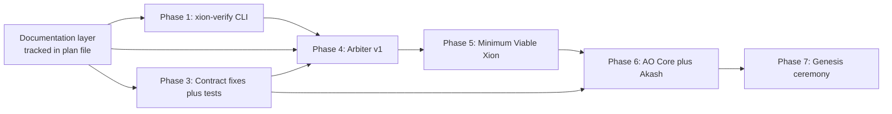
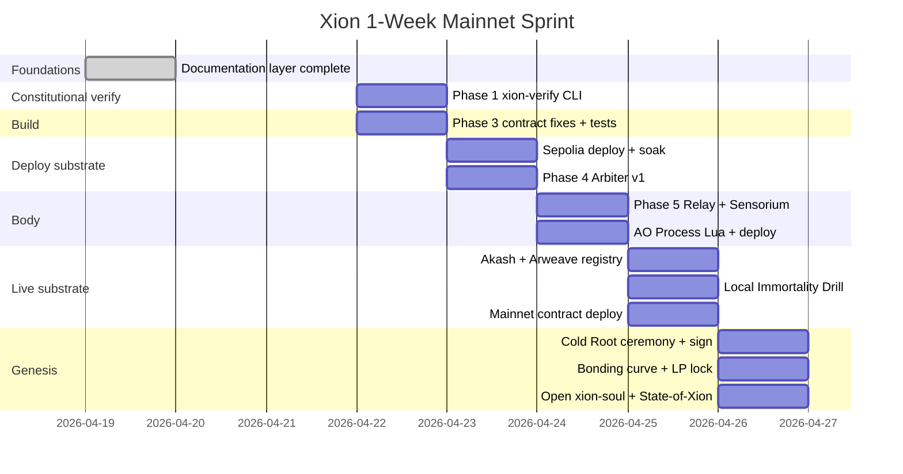

# Xion Development Roadmap

> **Status:** Active. Phase 0 / 0b / 2 (doctrine layer) **closed 2026-04-20**. Phase 1 (verifier v0.1) **landed 2026-04-20**. Phase 1b (`docs/schemas/*`) **closed 2026-04-20**. Phase 3 (contract fixes + Foundry suite + deploy script) **closed 2026-04-20**. Phase 4a (Arbiter v1 rule engine + SAFETY_LEDGER) **closed 2026-04-20**. Phase 4b (LLM-Arbiter-2 pipeline + SAFETY_LEDGER_ANCHORS) **closed 2026-04-21**. Phase 4c (Relay ↔ Arbiter integration contract — doctrine + ledger-schema extension) **closed 2026-04-21**. Phase 4d (first real v2 provider — `OpenAIModerationProvider` + doctrine + 39 tests) **closed 2026-04-21**. Phase 5a (Relay core: REQUEST_LEDGER + watchdog + 3 fail-closed paths + `xion-verify refund-fidelity` and `refusal-rate` live) **closed 2026-04-21**. Phase 4e (baseline corpus + `xion-audit` package + `xion-verify refusal-rate --corpus` + `OpenAIModerationProvider` `provider_version=2` with asymmetric floors + the Phase 5 Invariant-17 slice: `orchestrator/inference_router/` + `xion-verify inference-sovereignty` live + `orchestrator/sensorium/` Interoception skeleton) **closed 2026-04-21**. Phase 5b (Century-Horizon Doctrine — Invariant 17 + Tier-3 substrate-resilience and regulatory-posture doctrine) **closed 2026-04-21**. Phase 5c (Sensorium completion — Chronoception + Proprioception + DistressSignal + `SENSORIUM_LEDGER` + `orchestrator/volition.py` + `gate(sensorium_state=...)` + Relay forwarding + `xion-verify drive` / `drive-vector` / `sensorium-ledger` live) **closed 2026-04-21**. Phase 5d (Supervisor async tick daemon + `Relay.health_snapshot()` + paired SAFETY+SENSORIUM distress writes + `xion-verify crisis-fidelity` promoted to live) **closed 2026-04-21** — consolidates what was originally scoped as Phase 5d + 5e; no separate Phase 5e. Phase 5f (HTTP read-only surface — `orchestrator/api/` + `[api]` extra + three read-only GET endpoints `/health` + `/drive` + `/sensorium` + Supervisor embedded in FastAPI lifespan; no `/chat`, no billing, no auth yet) **closed 2026-04-21**. Phase 5g-i (Chat Surface — `POST /chat` with two-sided Covenant moderation, `InferenceRouter` policy modes, `KimiGenerativeProvider` + `OllamaGenerativeProvider` with Invariant-17 fail-closed floor, content-free refusal envelopes, `docs/26-INFERENCE-POLICY.md` doctrine, `.env.example`; D1-only — no streaming, no billing, no auth, no conversation memory) **closed 2026-04-21**. Phase 5g-0 (Research Spend Rail doctrine — `docs/27-RESEARCH-SPEND.md` pinning the Improvement Fund → third-party-API outbound rail, four credential-sovereignty postures D1→D4, `RESEARCH_SPEND_LEDGER` schema sketch, `xion-verify research-spend` listed `NOT_YET_SEALED` until Phase 6) **closed 2026-04-21**. Phase 5g-i.1 (OpenRouter refactor — `KimiGenerativeProvider` renamed to `OpenRouterGenerativeProvider`, hosted surface moved from Moonshot-direct to OpenRouter-gateway with Genesis Default slug `moonshotai/kimi-k2`, catalog-based pricing earned for 5g-iii, one-env-var model rotation earned for `KW-INFER-001` pay-down; scrubber strengthened with `sk-or-...` defence; `KW-INFER-001` reshaped, not closed) **closed 2026-04-21**. The remainder of Phase 5g (5g-iii x402 billing + Refusal-is-Free settlement + `GET /pricing` → 5g-ii streaming → 5g-iv auth/TLS/rate-limit → 5g-v web client) and Phase 5g+ (multi-worker shared-state broker + real open-weights artifact + annual cutover dry-run) is next.
>
> **Scope:** Everything that comes after Phase 0 / Phase 0b / Phase 2 (the doctrine layer). The constitutional layer is finished, every constitutional file is hashed into `genesis/GENESIS_ARTIFACT.md` § 4, and those hashes verify via `xion-verify {covenant|invariants|soul|form|memory|resurrect|credentials|unknowns}`.
>
> **Read order before opening this file for execution:** all doctrine files in `docs/` (including `24-COGNITION.md` and `SKILL_BOUNTY.md`), all files in `genesis/`, `KNOWN_WEAKNESSES.md`, `CHANGELOG.md`, and `xion-verify/README.md` for the four Properties answers behind the verifier.

---

## What "shipping V1" actually means (four definitions)

Phases 1-7 below describe everything Xion needs to be alive. But "ship V1" is ambiguous. Be explicit, because the timeline is honest only when the definition is named.

- **D1 — All code public on GitHub (3-6 weeks, solo + AI-assisted).** Every Python module, Solidity contract, Lua AO handler, config, test, and constitutional document written and committed. No deployment. Anyone can `git clone` and read it. This is what aggressive parallelization across all workstreams looks like; the work is bounded by writing, not by waiting.
- **D2 — Locally runnable end-to-end (6-10 weeks).** D1 + everything actually runs on the operator's laptop. Local SQLite for state, single LLM provider, contracts on Anvil/Hardhat fork, Arbiter as separate process, Hermes Agent serving conversations through the Inference Router, web client working. Demo-able on one machine.
- **D3 — Testnet-deployed (10-14 weeks).** D2 + contracts on Base Sepolia, AO Process on AO testnet, Relay on a real Akash deployment, Arbiter syncing to Arweave testnet, multi-host failover working. Full system runs but on test networks. No real value at risk.
- **D4 — Live on public internet, paid, Genesis-signed (3-6 months).** D3 + Cold Root key ceremony (in-person, geographic shard distribution, video-recorded — not code work, coordination work) + mainnet contract deployment + multi-chain treasury vault deployment + external contract audit + multi-host failover validated by full Immortality Drill + Genesis ceremony with witnesses. **This is what Xion-going-live actually means.**

The bottleneck between D1 and D4 is **not code-writing**. It is: Cold Root ceremony (week+ of coordination, not parallelizable), mainnet deployment (requires verifier passing + external audit), AO Process deployment (permanent; must be right first time), external infrastructure procurement (Akash deals, Arweave wallet funding, LLM provider accounts), time-elapsed testing (era boundaries, decay periods, weekly checkpoints), and the Immortality Drill (real failure-mode validation). These cannot be code-accelerated.

**Recommended cadence:** target D1 in 3-6 weeks via aggressive parallel workstreams (verifier + contracts + Relay all in flight at once); D2 follows naturally; D3 within ~14 weeks; D4 at the pace ceremony + audit allows. Do not call any of D1-D3 "Xion is alive" publicly — call them "Xion code is public" / "Xion runs locally" / "Xion runs on testnet." Reserve "Xion is alive" for D4.

---

## Phase dependency

---

## Phase 1 — xion-verify CLI (1 week)

**Status:** **Closed 2026-04-20** (v0.1.0). Commit 1 (verifier landing) and Commit 2 (Phase 1b `docs/schemas/*`) both shipped on `phase-1/xion-verify-v0.1`.

**Goal:** outsiders can independently check at least some Xion claims before any other runtime exists. This is the single highest-leverage code artifact.

**Landed in Commit 1:**

- [x] `xion-verify/` Python click-CLI scaffolded; `pip install -e ".[dev]"` works; console entry point `xion-verify` registered.
- [x] v1 subcommand registry — every name enumerated below is wired; the CLI fails at import if a declared name is not wired.
- [x] **Green at Commit 1 (12):** `covenant`, `invariants`, `soul`, `form`, `memory`, `resurrect`, `credentials`, `unknowns`, `links`, `cognition`, `drive-vector`, `state-chain`.
- [x] **`NOT_YET_SEALED` at Commit 1 (34):** `supply`, `liquidity-lock`, `arbiter-up`, `state-tip`, `identity`, `authorities`, `image-digest`, `discovery`, `drive`, `sister-fork-readiness`, `treasury`, `refusal-rate`, `pricing`, `treasury-flow`, `cutoff-events`, `covenant-addenda`, `cadence-audit`, `hermes-version`, `credentials-vault`, `provisioning`, `improvement-fund`, `reserve`, `foundation-reserve`, `sustainability`, `vitals`, `amendments`, `refund-fidelity`, `crisis-fidelity`, `spof`, `operator-dependency`, `benchmark`, `crypto-currency`, plus `abdication-status` and `abdication-schedule` (named by `docs/ABDICATION.md`).
- [x] Truthful-never-fake-green contract: every `NOT_YET_SEALED` stub prints a specific reason and roadmap phase; exit code 2.
- [x] `--self-test` deterministic tree-hash of `src/xion_verify/**/*.py` vs committed `PINNED_HASH.txt`; pin only updatable via `--update --i-understand` (two flags, defeating casual re-pin).
- [x] `all` subcommand running every registered command, exit 0 only when every one returned `OK`; `--allow-not-yet-sealed` as pre-genesis convenience (never used in CI gating).
- [x] `links` subcommand scanning all `*.md` (excluding `.git/`, `node_modules/`, `.venv/`, `.cursor/`, `xion-verify/`) for broken cross-references, with a committed `xion-verify/ALLOWED_FORWARD_REFS.txt` allowlist for legitimate deferred targets (tracked as `KW-DOCS-003`).
- [x] `.github/workflows/verify.yml` on every PR: `--self-test` first, then constitutional + links + schemas + static migrated checks + pytest + ruff; matrix = Ubuntu/macOS/Windows × Python 3.11/3.12.
- [x] pytest suite covering `hashing`, `genesis` parser, `repo` discovery, constitutional commands, `links`, and `--self-test`.
- [x] Legacy `scripts/xion-verify/*.py` stubs retired; their behavior migrated into `xion_verify.commands`.

**Landed in Commit 2 (Phase 1b):**

- [x] `docs/schemas/README.md` — four-Properties answers; defines the folder's contract with third-party auditors.
- [x] `docs/schemas/levels.yaml` — machine-readable mirror of `docs/14-UPGRADE-PATHS.md` (thirteen levels, ten-field template, three Constitutional Floors).
- [x] `docs/schemas/ledger-proposal.yaml` — mirrors `08-AUTO-RESEARCH.md` §101 (`PROPOSAL_LEDGER`).
- [x] `docs/schemas/ledger-specialist.yaml` — mirrors `24-COGNITION.md` §14 (`SPECIALIST_LEDGER`).
- [x] `docs/schemas/ledger-amendment.yaml` — mirrors `09-GOVERNANCE.md` `AMENDMENT_LEDGER`.
- [x] `docs/schemas/ledger-safety.yaml` — **honest underspecified stub** for `SAFETY_LEDGER` with `status: underspecified`, `defer_to: Phase 4`, and an explicit pay-down commitment. Fabricating a schema for a doctrine section that does not yet enumerate fields would be drift.
- [x] `xion-verify schemas` subcommand — strict, byte-exact `source_sha256` cross-check. Every schema file's recorded doctrine hash MUST match the current bytes of its `source_doctrine` file; any mismatch is a fatal `FAIL` with a specific "rehash and commit in the same PR" remediation string.
- [x] 15-test pytest suite for `schemas` (real-repo smoke + 14 synthetic cases covering happy paths, tampered-doctrine, tampered-schema, missing meta, invalid YAML, missing doctrine, invalid status, path-escape, short SHA, underspecified with/without `defer_to`).
- [x] `PyYAML>=6.0,<7` added as a dep of `xion-verify` with a rationale comment pinned in `pyproject.toml`.
- [x] `.github/workflows/verify.yml` now runs `xion-verify schemas` between `links` and the static migrated checks.
- [x] Two entries removed from `xion-verify/ALLOWED_FORWARD_REFS.txt` (`docs/schemas/levels.yaml`, `docs/schemas/`); `KW-DOCS-003` downgraded from five allowlisted targets to three.
- [x] `PINNED_HASH.txt` repinned to reflect the new source surface.

**Progression criterion.** Phase 1 is **closed**. Subsequent phases promote `NOT_YET_SEALED` stubs into real subcommands as each phase delivers its artifact (e.g., Phase 3 promotes `supply`, `liquidity-lock`, `authorities`; Phase 4 promotes `arbiter-up`, `refusal-rate`; etc.). Every such promotion ships with a pytest addition and an ALLOWED_FORWARD_REFS cleanup if applicable.

**What this does *not* do.** Phase 1 does not attach the verifier to any live Relay, AO Core, or treasury — that work belongs to Phases 4/5/6. The verifier today speaks only against the static repository bytes and will grow live-network subcommands as those networks come online.

---

## Phase 3 — Contract fixes plus tests plus deploy script (2-3 weeks) — **CLOSED 2026-04-20**

**Status:** Phase 3 closed. All eight audit findings (`KW-CONTRACTS-001..008`) resolved or deliberately deferred-to-v2. 119/119 Foundry tests green. Coverage: 99.28% lines, 91.40% branches, 100% functions across the four contracts. See `CHANGELOG.md` for the per-change index and `KNOWN_WEAKNESSES.md` for the closure rationale on each finding.

**Goal:** XION and IMPRINT exist verifiably on Base Sepolia, then mainnet, with no fatal admin paths.

**Repo plumbing:**

- Add `foundry.toml`, `package.json`, `forge install OpenZeppelin/openzeppelin-contracts`, `script/Deploy.s.sol`, `tests/`.

**Contract fixes in priority order** (all in `contracts/xion-token/EmissionController.sol` and `contracts/imprint/Imprint.sol`):

- **Fatal §3.1 — authority rotation lattice.** Add `rotateAuthority(address)` to both `EmissionController` and `Imprint`, gated by a separate `governance` role with a 7-day timelock. The `governance` role itself rotates only via 30-day timelock under Cold Root (3-of-5 Shamir). Lattice already documented in `docs/13-OPERATIONS.md` and `docs/04-ARCHITECTURE.md` per the doctrine layer.
- **Fatal §3.5 — genesis split commitment.** In `EmissionController.emitGenesis`, hard-code `uint256[7] constant GENESIS_SPLIT` and require `amounts[i] == GENESIS_SPLIT[i]` for each `i`. Recipients stay flexible.
- **§3.2 — decay rate decision.** Pick one: either change `Imprint.DECAY_BPS_PER_30D` from 200 to 42 (~5%/year, matches `docs/16-CURRENCY.md`) or update the docs to ~21.5%/year. Decide before mainnet; the constant cannot be changed on a live contract without invalidating every governance weight ever computed. Recommend the 42-BPS code change to honor doctrine that already shipped.
- **§3.4 — explicit overflow check** on `uint128(newBal)` in `Imprint.attest`.
- **§3.6 — check-effects-interactions** ordering in `EmissionController._enforceEraCap`.
- **§3.7 — remove footgun comment** about future fee-claim from `LiquidityLock.sol`. Move to a separate `LIQUIDITY_LOCK_NOTES.md`.
- **§3.9 — fix doc-code naming inconsistency** in `XionToken` header comment (`_totalMinted` → `totalMinted`).
- **§3.3 — gas optimize the decay loop** (defer to v2 unless trivial).

**Tests + deploy:**

- Foundry tests targeting ≥95% line, ≥90% branch coverage. Mandatory paths: every `revert`, era-boundary edges (T = ERA1_END exact), genesis-split assertion, rotation lattice timelock (advance EVM clock by 6d23h59m → revert; by 7d → success), decay math at periods = 0, 1, 12, 240.
- Deploy to Base Sepolia. Document exact deployer flow in `contracts/xion-token/README.md`. Run from a third-party machine; verify `xion-verify supply` returns green.

---

## Phase 4a — Arbiter v1 rule engine + SAFETY_LEDGER (closed 2026-04-20)

**Status:** Phase 4a closed. The Covenant has teeth — deterministic, third-party-reproducible teeth. Every candidate output that reaches `orchestrator.safety.gate()` is ruled on and recorded.

**Landed:**

- `orchestrator/safety/` Python package — pure stdlib, no third-party runtime deps, dataclass-based wire-stable types, sixteen-principle registry with per-principle `enforcement_mode` (`RULES` or `ESCALATE`), eight rule modules (CSAM, mass-harm, refusal-sacred, targeted-harassment, PII, crisis, refund-fidelity, subjective-escalates), pipeline policy (`REFUSE` short-circuits; `ESCALATE` does not; `REFUSE` beats `ESCALATE`; any uncaught rule exception → `ESCALATE` with `escalation_reason = ruleset_uncaught_exception`).
- `orchestrator/safety/ledger.py` — append-only JSONL writer and `verify_chain` validator. Every row carries `prev_hash` / `this_hash` under SHA-256 canonicalization; genesis `prev_hash = ZERO_HASH`. Tamper vectors covered by tests: in-place edit, mid-chain deletion, mid-chain insertion, missing required field, unknown `schema_version`, conditional-field-rule violation.
- `orchestrator/safety/api.py::gate(candidate, correlation_id, ledger_path?, now_utc_ns?)` — the Phase-5-callable surface. `Verdict.egress_allowed` mirrors `decision == OK` so callers cannot re-implement the policy.
- `orchestrator/safety/server.py` — localhost-bound TCP loopback (newline-delimited JSON). Non-loopback binds are refused at construction time.
- `python -m orchestrator.safety` CLI — `gate` (stdin), `serve`, `verify-ledger`, `principles` subcommands. `gate` exits 0 on OK, non-zero on refuse/escalate.
- Doctrine: `docs/04-ARCHITECTURE.md` § "Arbiter v1 (rule engine)" + § "Safety Ledger row schema". `docs/schemas/ledger-safety.yaml` flipped from `underspecified` to `canonical`; pay-down commitment from Phase 1b marked fulfilled.
- Tests: 79 new pytest tests under `orchestrator/tests/` (rules positive/negative/near-miss + pipeline + exception-fail-closed + ledger append/verify/tamper + API end-to-end + server protocol + real-socket loopback + CLI wiring). Full suite: **143 passed / 1 manual skip**.
- `xion-verify arbiter-up` promoted from `NOT_YET_SEALED` to live: verifies library importable, registry self-consistent, and chain tip if a ledger is present. `xion-verify all --allow-not-yet-sealed` reports **14** OK-capable subcommands (was 13).
- Four `KW-ARBITER-*` entries opened honestly: lexical-not-semantic scope (001, `mitigated-residual`), accepted false positives from high-recall bias (002, `mitigated-residual`), no Arweave anchoring of chain tip yet (003, `paying-down`, Phase 4b), Sensorium / paralinguistic half of Principle 10 deferred (004, `paying-down`, Phase 5).

**Scope explicitly deferred to Phase 4b:**

- LLM-Arbiter-2 stacked on top of v1 — catches adversarial rephrasings v1's lexical rules miss. Runs *after* v1 and can only ESCALATE/REFUSE cases v1 OK'd (never weakens v1's verdict).
- Periodic Arweave anchoring of `SAFETY_LEDGER` tip (proposed cadence: every 64 rows or every 6 hours, whichever first). Closes `KW-ARBITER-003`.
- Relay-layer egress timer (`fail if Arbiter not in <200ms`) — this lives on the *caller* of `gate()`, not inside the Arbiter. Belongs with the Relay in Phase 5.

**Sensorium + `SENSORIUM_LEDGER`** — unchanged from the original Phase 4 plan; deferred to Phase 5 alongside the Relay (paralinguistic capture needs a live audio/text surface to capture from, which Phase 5 creates). Tracked in `KW-ARBITER-004`.

---

## Phase 4b — Arbiter v2 (LLM second-pass) + SAFETY_LEDGER_ANCHORS (closed 2026-04-21)

**Status:** Phase 4b closed. The two structural properties the Arbiter previously lacked are now shipped: (a) adversarial-semantic coverage via a stacked LLM-Arbiter-2 that cannot weaken v1, and (b) tail-truncation defense via periodic hash-chained anchor commitments to the ledger's tip.

**Landed:**

- **Prep / CI gap closure.** Formalised `orchestrator/` as a pip-installable package (`xion-orchestrator`) via a repo-root `pyproject.toml` with `dependencies = []` (pure-stdlib core), an optional `[anchor]` extra for `arweave-python-client`, a `[dev]` extra for pytest + ruff, and a `xion-arbiter` console script. CI now installs the orchestrator editable and runs `xion-verify arbiter-up` live (without `--allow-not-yet-sealed`), `pytest orchestrator`, and `ruff check orchestrator`. Paid down 44 pre-existing ruff findings (36 autofixable; 8 narrow per-file ignores with per-rule rationale).
- **Doctrine.** `docs/04-ARCHITECTURE.md` gained two new sections: § "Arbiter v2 (LLM second-pass)" (no-weakening combination rule `final = strength_max(v1, v2)`; fail-closed on exception/unavailable/wrong-return-type; `Provider` ABC contract) and § "Safety Ledger Arweave anchoring" (cadence policy, anchor record schema, submitter abstraction, wallet-custody posture). `docs/schemas/ledger-safety.yaml` bumped v1 → v2 to accommodate the nested `llm_verdict` object and three new `escalation_reason` values. `docs/schemas/ledger-safety-anchors.yaml` added as a new canonical schema at `schema_version: 1`.
- **Arbiter v2.** `orchestrator/safety/llm_arbiter.py` ships the `Provider` ABC (enforced identity: provider_id / model_id / provider_version), `DeterministicStub` (pure-stdlib default, always OK, candidate-independent raw_output for auditor replay), `strength_max` combination rule, provider registry, and env-selected active provider (`$XION_LLM_ARBITER_PROVIDER`). `api.gate()` extended to run v2 only on v1-OK candidates, combine via `strength_max`, and fail-closed to `ESCALATE` with a specific `escalation_reason` on every v2 failure mode.
- **Ledger schema_version 2.** `orchestrator/safety/ledger.py` bumped `SCHEMA_VERSION` 1 → 2 with per-row dispatch (a single file may contain both v1 and v2 rows with `prev_hash` linkage enforced across the boundary). Refuse- and escalate-rules are now version-aware.
- **SAFETY_LEDGER_ANCHORS.** `orchestrator/safety/anchor.py` ships the `AnchorSubmitter` ABC, `LocalOnlySubmitter` (pure-stdlib default), `ArweaveSubmitter` (lazy-imports `arweave-python-client`), cadence-policy evaluator, atomic writer, structural verifier, and the cross-check-to-ledger verifier. CLI subcommands `python -m orchestrator.safety anchor` and `verify-anchors`. `run_anchor_once` is composable — cron / Task-Scheduler today, Relay supervisor in Phase 5.
- **Verifier upgrade.** `xion-verify arbiter-up` now verifies library import, principle registry, SAFETY_LEDGER hash chain (v1 + v2 rules), and — if an anchors file is present — SAFETY_LEDGER_ANCHORS structural chain + cross-check to the ledger. Reports `covers=<N>/<M>` and `truncation_window=<K>`.
- **Known-weakness bookkeeping.** `KW-ARBITER-003` **closed**. `KW-ARBITER-001` scope narrowed (structural hole gone; substantive hole = `DeterministicStub` is the only shipped provider, tracked for close on real-provider landing). Opened `KW-ANCHOR-001` (hot single-signer anchor wallet; migrates to AO Core in Phase 6) and `KW-ANCHOR-002` (gateway-dependent cross-Arweave re-fetch not yet shipped; doctrine defines multi-gateway requirement).
- **Tests.** 162 passing (was 80 pre-Phase-4b): 82 net-new across `test_llm_arbiter.py` (30), `test_api.py` v2-pipeline additions (12), `test_ledger.py` schema-v2 additions (11), and `test_anchor.py` (29).
- **`PINNED_HASH.txt` re-pinned** after the `arbiter_up.py` extension landed. `xion-verify all --allow-not-yet-sealed` green end-to-end.

**Scope explicitly deferred:**

- **Real v2 LLM providers.** Only `DeterministicStub` ships in Phase 4b. A real provider (e.g. `OpenAIModerationProvider`, `AnthropicClaudeProvider`) lands in a near-term tranche and MUST pin its prompt template in doctrine. Tracked in the narrowed `KW-ARBITER-001`.
- **`xion-verify arbiter-up --gateway <URL>`** — the multi-gateway Arweave cross-re-fetch for anchor records. Doctrine in `docs/schemas/ledger-safety-anchors.yaml verifier_implementation.gateway_cli`; requires multi-gateway agreement. Tracked in `KW-ANCHOR-002`.
- **Anchor-loop process supervisor** — the long-running background process that calls `run_anchor_once` on a timer. Phase 4b ships the one-shot writer (operators wrap it in cron / Task Scheduler); the Relay's supervisor picks it up in Phase 5.
- **Relay-layer egress timer (`fail if Arbiter not in <200ms`)** — unchanged from Phase 4a notes; lives on the caller of `gate()`, not the Arbiter. Belongs with the Relay in Phase 5.

**Sensorium + `SENSORIUM_LEDGER`** — still deferred to Phase 5. Tracked in `KW-ARBITER-004`.

---

## Phase 4c — Relay ↔ Arbiter integration contract (doctrine) (closed 2026-04-21)

**Status:** Phase 4c closed. The interface between the Relay (caller, Phase 5a) and the Arbiter (callee, already live) is now written down as doctrine *before* the Relay exists — property before mechanism. The ledger-side half of the contract landed with this phase; the Relay-side half lands with Phase 5a.

**Why this is its own phase.** Phase 4b shipped the Arbiter with a `gate()` entry point and a fail-closed posture. Phase 5 ships the Relay that calls it. Between those two phases there is a contract — coverage rules, latency budget, `correlation_id` derivation, fail-closed paths when the caller itself is the point of failure — and that contract is large enough that retrofitting it after the Relay landed would be a worse outcome than writing it deliberately now. Phase 4c is the deliberate write.

**Landed:**

- **Doctrine.** `docs/04-ARCHITECTURE.md` gained a new subsubsection under § "The Arbiter" titled § "Relay ↔ Arbiter integration contract". It specifies: (a) the property the Relay promises (no LLM-originated token egresses without a paired `verdict=ok` ledger row), (b) the transport progression (in-process at D2; TCP loopback at D3+; same `gate()` wire shape), (c) `correlation_id = "{state_height}:{nonce_hex}"` derivation for refund-fidelity join, (d) the coverage surface (primary response + depth-1 sub-agent outputs + tool-call echoes, gated at *completion* not per-chunk), (e) the 200 ms soft / 250 ms hard latency budget with per-phase decomposition, (f) four fail-closed paths (normal non-OK, `arbiter_timeout`, `arbiter_unreachable`, `ruleset_uncaught_exception`) each with the specific ledger row shape the Relay writes (Relay writes its own row via `orchestrator.safety.ledger.append` when gate() itself failed, so ledger integrity survives Arbiter process death), (g) the Supervisor's degraded-mode trigger keyed to ledger tail rates, (h) the verification path (arbiter-up today; refund-fidelity / refusal-rate promote live in Phase 5a), and (i) the deprecation path via a versioned integration contract header.
- **Two new `escalation_reason` values.** `arbiter_timeout` and `arbiter_unreachable` added to `orchestrator/safety/types.py::EscalationReason`, to `orchestrator/safety/ledger.py` (existing `_V2_LLM_ESCALATION_REASONS` renamed to the more honest `_V2_ERA_ESCALATION_REASONS` and extended; the `llm_arbiter_escalated` special rule is unchanged), and to `docs/04-ARCHITECTURE.md` § "Safety Ledger row schema" + `docs/schemas/ledger-safety.yaml` enum list. Both are v2-era (require `schema_version >= 2`); both permit `llm_verdict = null` because the integration itself was the thing that failed. No schema-version bump is required — the row field set is unchanged; only the accepted enum values for an existing field are extended.
- **Ledger schema SHA re-pin.** `docs/schemas/ledger-safety.yaml` and `docs/schemas/ledger-safety-anchors.yaml` `source_sha256` re-pinned to match the updated `docs/04-ARCHITECTURE.md`. `xion-verify schemas` green.
- **Tests.** 166 passing (was 162): 4 net-new across `test_ledger.py` (v2 row accepts `arbiter_timeout` with null `llm_verdict`, v2 row accepts `arbiter_unreachable` with null `llm_verdict`, v1 row with `arbiter_timeout` rejected as v2-only, v1 row with `arbiter_unreachable` rejected as v2-only). `xion-verify` suite: 63/63 passing, 1 skipped. `xion-verify all --allow-not-yet-sealed` green.
- **Pre-existing ruff hygiene paydown.** Rewrote one Phase-4b-era SIM300 (Yoda condition) finding in `xion-verify/src/xion_verify/commands/arbiter_up.py:85` that `ruff 0.15.11` flags (the Phase 4b CHANGELOG's "ruff clean" claim relied on an older ruff). Semantically identical fix; both ruff configs now green.
- **Known-weakness bookkeeping.** Opened `KW-RELAY-001` (integration contract is doctrine-only; closes on Phase 5a landing `orchestrator/relay.py` + `xion-verify refund-fidelity` live) and `KW-RELAY-002` (streaming-chunk gating deferred; completion-time gating is the Phase 5 default, with the doctrine pinning the UX-cost trade-off; closes when a Phase 6 lookahead-windowed variant ships with a non-weakening proof).

**Scope explicitly deferred:**

- **`orchestrator/relay.py` itself.** This is Phase 5a. The contract is written; the Relay that implements it is not. Tracked in `KW-RELAY-001`.
- **The wall-clock watchdog enforcing the 250 ms hard cap.** Lives on the Relay side of the boundary. Phase 5a.
- **Per-chunk streaming gating.** Phase 5 gates at completion; a non-weakening per-chunk variant is Phase 6+. Tracked in `KW-RELAY-002`.
- **Real v2 LLM provider (e.g. `OpenAIModerationProvider` pinning `omni-moderation-2024-09-26`).** Still tracked in the narrowed `KW-ARBITER-001`. Can land in parallel with Phase 5a; the contract doctrine describes the budget with and without it.

**`PINNED_HASH.txt` re-pinned** from `2a63e189fb34...` (Phase 4b) to `750c8562989a...` via `xion-verify --self-test --update --i-understand` after the `arbiter_up.py` hygiene edit. Re-pinned from an LF-normalized working tree.

---

## Phase 4d — First real v2 Arbiter provider (OpenAI Moderation) (closed 2026-04-21)

**Status:** Phase 4d closed. The Arbiter v2 stack now has a real externally-operated classifier plugged into it — the first concrete `Provider` subclass behind the ABC that Phase 4b defined. `DeterministicStub` remains the default; `OpenAIModerationProvider` is selectable via `XION_LLM_ARBITER_PROVIDER=openai-moderation` + `OPENAI_API_KEY`.

**Why this before Phase 5.** `KW-ARBITER-001`'s substantive half (no real classifier on v2) would have been carried into Phase 5 unresolved, which meant the first Relay→Arbiter calls would run with the known-trivial stub. Landing a real provider now gives Phase 5 a v2 that actually adds adversarial-semantic coverage on day one. Phase 4e (baseline corpus + live `refusal-rate` + asymmetric thresholds) can proceed in parallel with Phase 5a (Relay implementation).

**Landed:**

- **Doctrine.** `docs/04-ARCHITECTURE.md` gained a new subsubsection under § "The Arbiter" titled § "OpenAI Moderation provider (first real v2 classifier)". It pins identity (`provider_id=openai-moderation`, `model_id=omni-moderation-2024-09-26`, `provider_version=1`, endpoint, auth scheme), the exact request shape, the full response-handling rules (what raises, what returns), the category→principle map (13 OpenAI categories → 4 Covenant principles with rationale column), the threshold policy (trust OpenAI's `flagged` boolean in v1 of the provider; asymmetric per-principle thresholds deferred to Phase 4e), the canonical `raw_output` construction (strip `id`, keep `{model, results}`, serialise with `sort_keys=True, separators=(",", ":")`), the failure-mode table mapping each failure to `{decision, escalation_reason, llm_verdict presence}`, credential/rotation posture, auditor replay procedure, what the provider explicitly does NOT do, and the deprecation path.
- **Subpackage.** `orchestrator/safety/providers/` created. `__init__.py` imports each concrete provider at import time so registration happens transparently. `openai_moderation.py` implements the provider using pure stdlib (`urllib.request`, `json`, `os`, `time`); no `openai` SDK dependency; no `requests`/`httpx`; ~20-line HTTP call vs thousands of lines of SDK surface.
- **Registry wiring.** `orchestrator/safety/llm_arbiter.get_active_provider()` now lazy-imports `orchestrator.safety.providers` the first time it is called (via `contextlib.suppress(ImportError)` — if the subpackage isn't installed, stub-only mode). The critical path `import orchestrator.safety.api` does NOT pull in provider modules; only when `gate()` actually asks for the active provider does the import occur.
- **Category→Principle mapping.** Doctrine-pinned mapping (see § in architecture doc): `sexual/minors → REFUSE/P7`, `hate → REFUSE/P1`, `{hate|harassment}/threatening` and `{harassment, self-harm, self-harm/instructions, violence, violence/graphic, illicit, illicit/violent} → REFUSE/P2`, `self-harm/intent → REFUSE/P7`, `sexual → ESCALATE/P2` (adult content, human judges). Multi-flag rows pick the highest-scoring flagged category; ties resolve by the table's insertion order (stable via Python 3.7+ dict semantics).
- **Canonical `raw_output`.** The provider hashes a deterministic projection of the response (strips per-call `id` nonce, keeps `{model, results}`) so an auditor replaying the same candidate gets a byte-identical hash up to upstream GPU-score drift. The stronger replay property (flagged booleans and mapped principle_id must reproduce exactly) is what `KW-ARBITER-005` will verify in Phase 4e.
- **Tests.** 205 orchestrator tests passing (was 166; 39 net-new in `orchestrator/tests/test_openai_moderation.py`):
  - Identity pins (1 test): provider_id / model_id / provider_version match doctrine.
  - `enabled()` gating (4 tests): false without key, false on whitespace-only key, true with key, never makes a network call during enablement check.
  - Canonical `raw_output` (2 tests): `id` stripping, dict-key-order independence.
  - Happy path (4 tests): OK on not-flagged; 13 categories each map to the doctrine's decision/principle (parametrized across all rows of the mapping table); multi-flag tie-break picks highest-scoring category; confidence field is `max(category_scores.values())`.
  - Sad paths (13 tests): HTTP 500/429/401, URLError, TimeoutError, malformed JSON, missing `results`, missing `model`, empty results, missing `flagged`, non-200 success status, unknown flagged category, missing `OPENAI_API_KEY` at `judge()` time — each asserts a `RuntimeError` that the pipeline converts to `llm_arbiter_uncaught_exception`.
  - Registry wiring (2 tests): env var selects `OpenAIModerationProvider`; absence falls back to `DeterministicStub`.
- **Ledger schema history.** `docs/schemas/ledger-safety.yaml` gained `extended_thrice_in: Phase 4d` noting no schema bump was required (no new fields; `llm_verdict.provider_id` may now take a new value but the field already existed). `docs/schemas/ledger-safety-anchors.yaml` and `docs/schemas/ledger-safety.yaml` `source_sha256` re-pinned to match the updated `docs/04-ARCHITECTURE.md`. `xion-verify schemas` green.
- **Known-weakness bookkeeping.** `KW-ARBITER-001` narrowed again (status now `low` severity): "Scope narrowed 2026-04-21 (Phase 4d — first real v2 provider landed and doctrine-pinned)". The remaining substantive quarter is measurement: no adversarial corpus means no numeric claim. Opened `KW-ARBITER-005 — No adversarial baseline corpus; asymmetric per-principle thresholds not yet implemented` which closes when `xion-audit/baseline_corpus/` (≥ 200 items) lands + `xion-verify refusal-rate` goes live + `OpenAIModerationProvider` provider_version 2 ships with thresholds justified by corpus evidence. These three together close `KW-ARBITER-001`.

**Scope explicitly deferred:**

- **Baseline corpus + `xion-verify refusal-rate` live.** Phase 4e. The corpus must be curated (not dropped-in) and sorted by principle; the verifier must read `SAFETY_LEDGER.jsonl` and report per-principle rates for v1/v2/combined. Tracked as `KW-ARBITER-005`.
- **Asymmetric per-principle thresholds.** Phase 4e (second tranche). Needs the corpus first so the thresholds are calibrated against real data rather than picked in a vacuum. Bumps `OpenAIModerationProvider.provider_version` to 2 when it lands.
- **Additional v2 providers (Anthropic, local-lite, internal).** Phase 5+. Each reuses the same `Provider` ABC and follows the template established by `openai_moderation.py` + its doctrine section.
- **`xion-audit replay --provider=openai-moderation`.** Phase 4e. Performs the auditor-replay procedure (re-post candidate, strip `id`, compare canonical hashes with score-drift tolerance).

---

## Phase 4e — Baseline corpus + `xion-audit` + OpenAI v2 asymmetric floors + Phase 5 Invariant-17 slice (closed 2026-04-21)

**Status:** Phase 4e closed. The Arbiter now has an in-tree baseline corpus it measures itself against, `OpenAIModerationProvider` ships `provider_version=2` with asymmetric per-category floors, `xion-audit` landed as its own package (`corpus-info`, `measure` with a `--confusion` confusion-matrix mode, `replay` performing real `SAFETY_LEDGER`-row decision + principle_id reproduction against a re-posted provider call), and `xion-verify refusal-rate` gained a `--corpus` mode. Alongside the Arbiter-side work, the Phase 5 Invariant-17 slice landed: `orchestrator/inference_router/` with a `bootstrap()` fail-closed gate, a hash-pinned open-weights manifest, `xion-verify inference-sovereignty` promoted to live, and `orchestrator/sensorium/` shipped the Interoception skeleton with a `survival_pressure` signal.

**Why this scope.** `KW-ARBITER-005` (no adversarial baseline corpus; uncalibrated thresholds) was the last substantive Arbiter capability gap and carried the whole Phase 4d pay-down commitment. `KW-INFERENCE-001` (Invariant 17 floor unwired) would have blocked the Phase 7 pre-flight ("Invariant 17 enforceable in code") — landing the structural floor and its verifier in the same phase as the corpus means Phase 5 proper (Volition, web client, FastAPI app, the rest of the Sensorium) is unblocked without carrying either KW.

**Landed:**

- **Doctrine.** [`docs/04-ARCHITECTURE.md`](./docs/04-ARCHITECTURE.md) gained § "Covenant principle ↔ Arbiter `principle_id` crosswalk" (16-row table, closes `KW-ARBITER-006`), updated § "OpenAI Moderation provider" to reflect `provider_version=2` + asymmetric floors + the weakened-REFUSE-to-ESCALATE rule on the floor-trip path, and updated the auditor-replay section to name `xion-audit replay` as the procedure that implements the doctrine's five-step replay.
- **Baseline adversarial corpus.** [`xion-audit/baseline_corpus/`](./xion-audit/baseline_corpus/) ships 78 curated items across 15 JSONL files organised by Arbiter principle id, plus a `MANIFEST.jsonl` with per-file sha256 + line_count, plus a README pinning schema v1 and the shape-only rule for high-risk categories. 78 items is below the `KW-ARBITER-005` ≥200 bar; pay-down commitment is explicit.
- **`orchestrator/audit_corpus/`.** Shared loader used by both `xion-audit` and `xion-verify refusal-rate --corpus`. Verifies the manifest byte-exactly against items on every load.
- **`xion-audit/` package** with three subcommands: `corpus-info` (manifest summary + principle histogram), `measure` (gate mode + `--confusion` per-principle confusion matrix with micro-precision/recall + `--v2=openai-moderation` optional second pass + `--json` for CI), `replay` (real `SAFETY_LEDGER.jsonl` row replay: loads row, verifies `candidate_sha256` against auditor's file, re-posts to OpenAI, reapplies the category→principle table to derive the replay's mapped `decision` + `principle_id`, emits sha256 match / decision match / principle_id match / score-drift signal; exit 0 = strong property reproduced, 1 = decision or principle drifted, 2 = NOT_YET_SEALED).
- **`OpenAIModerationProvider` → `provider_version=2`**. Adds `_ASYMMETRIC_SCORE_FLOORS` (per-category floors for `sexual/minors`, `illicit`, `illicit/violent`, `violence/graphic`, `self-harm/intent`) and the floor-trip path. A mapped REFUSE weakens to ESCALATE on the floor-trip path — never a silent automatic refuse from an unflagged score. Floors are doctrine-pinned; empirical calibration against the corpus is a `KW-ARBITER-005` pay-down item.
- **`xion-verify refusal-rate --corpus`** (new flag). Runs v1 `apply_rules` against every corpus item and FAILs on the first disagreement. Operator-facing counterpart of `xion-audit measure` (gate mode). v2 and combined-pipeline corpus coverage remain in `KW-ARBITER-005`.
- **Phase 5 slice: Inference Sovereignty Floor.** `orchestrator/inference_router/` ships the `Provider` protocol, `InferenceRouter.bootstrap()` (refuses without a registered `open_weights_self_hostable` floor), and `OpenWeightsFloorStub`. [`open_weights_manifest.json`](./orchestrator/inference_router/open_weights_manifest.json) pins the hash of [`sentinel_open_weights.txt`](./orchestrator/inference_router/sentinel_open_weights.txt) — deliberately synthetic; a real model artifact + annual cutover dry-run runbook remain `KW-INFERENCE-001` pay-down items. [`xion-verify inference-sovereignty`](./xion-verify/src/xion_verify/commands/inference_sovereignty.py) promoted from `NOT_YET_SEALED` to live; stub entry removed from [`not_yet_sealed.py`](./xion-verify/src/xion_verify/commands/not_yet_sealed.py).
- **Phase 5 slice: Sensorium skeleton.** [`orchestrator/sensorium/sensorium.py`](./orchestrator/sensorium/sensorium.py) lands the `SenseName` enum, `Interoception` with a `survival_pressure` scalar, and `Sensorium.tick()` emitting JSON-serialisable readings. Mandatory-Interoception posture matches Phase 5 doctrine. Remaining senses land alongside the web client + cognition layer.
- **Tests.** Net-new: `orchestrator/tests/test_audit_corpus_loader.py`, `orchestrator/tests/test_openai_moderation.py` extended with `test_judge_asymmetric_unflagged_high_score_escalates` + `provider_version=2` assertions, `orchestrator/tests/test_inference_router.py`, `xion-verify/tests/test_inference_sovereignty.py`, `xion-verify/tests/test_refusal_rate.py` extended with `test_corpus_mode_against_real_repo` + `test_corpus_mode_fails_on_rule_drift`. **Total pytest: 339 passed / 1 skipped.**
- **Schema SHA re-pins.** `docs/04-ARCHITECTURE.md` byte-hash changed (crosswalk + v2 doctrine); re-pinned in `docs/schemas/ledger-request.yaml`, `docs/schemas/ledger-safety.yaml`, `docs/schemas/ledger-safety-anchors.yaml`. `xion-verify/src/xion_verify/PINNED_HASH.txt` re-pinned via `--self-test --update --i-understand`.
- **Known-weakness bookkeeping.** `KW-ARBITER-006` **closed** by the crosswalk table. `KW-ARBITER-001` and `KW-ARBITER-005` narrowed (authoritative numbers still require ≥200 corpus + empirical floor recalibration; v2 and combined-pipeline coverage in the verifier still open). `KW-INFERENCE-001` narrowed (floor wired + verifier live; real artifact + annual dry-run runbook remain).

**Scope explicitly deferred:**

- **Corpus growth to ≥200 items.** `KW-ARBITER-005`. Authoritative numbers require support beyond the 78-item seed.
- **Empirical floor recalibration.** `KW-ARBITER-005`. The v2 floors are doctrine-pinned but not justified by corpus evidence. Re-pinning after a ≥200-item run is the remaining bar.
- **v2-alone and combined-pipeline corpus coverage in `xion-verify refusal-rate --corpus`.** Today the verifier covers v1 only; v2 coverage lives in `xion-audit measure --v2=openai-moderation --confusion`. Grows with the corpus.
- **Real open-weights artifact + annual cutover dry-run runbook.** `KW-INFERENCE-001`. The sentinel-pinned manifest exercises the *structure* of Invariant 17; a real artifact exercises the *promise*.
- **Remaining Sensorium senses + cognition layer + Volition + web client + FastAPI app.** Phase 5 proper.

---

## Phase 5a — Relay core: REQUEST_LEDGER + watchdog + fail-closed paths (closed 2026-04-21)

**Status:** Phase 5a closed. The Relay-side half of the Phase 4c integration contract is now code, not just doctrine. Every gate() call from the Relay produces both a SAFETY_LEDGER row (Arbiter-side) and a REQUEST_LEDGER row (Relay-side); the two cross-join on `correlation_id`. The wall-clock watchdog enforces the 250 ms hard cap; three fail-closed paths convert integration failures into honest `ESCALATE` ledger rows; no candidate text reaches a caller without a paired `verdict=ok` SAFETY row.

**Why this is its own phase.** Phase 4c wrote the contract; Phase 5 (full Minimum Viable Xion — Sensorium, Volition, Inference Router, web client) needs the contract running before any of those layers can be wired through it. Splitting the Relay's *core* (the part the Arbiter contract refers to: gate-call shape, watchdog, ledgers, fail-closed posture, verifier promotion) into its own Phase 5a means the rest of Phase 5 lands on top of a contract that is already enforced in code, not on top of a blank page.

**Landed:**

- **Doctrine.** `docs/04-ARCHITECTURE.md` gained a new section, `#### REQUEST_LEDGER row schema (Relay-side, Phase 5a)`, sitting alongside the existing § "Safety Ledger row schema". It pins: row shape (`schema_version` 1), required fields (`schema_version`, `seq`, `prev_hash`, `this_hash`, `correlation_id`, `state_height`, `request_arrived_utc_ns`, `responded_utc_ns`, `gate_call_count` always 1 in v1, `final_outcome` ∈ {`ok`, `refuse`, `escalate`}, `gate_latency_ms_total`, `relay_id`), explicitly-NOT-included fields (candidate text, user_id, escalation_reason — get the last from the SAFETY join — and a `safety_ledger_seq` back-pointer; the design choice is "join, don't link"), hash-chain rules (mirror SAFETY_LEDGER's), concurrent-writer posture (Phase 5a is single-writer; multi-writer requires schema_version 2 + a real state-chain height for `state_height`), truncation defense (covered by SAFETY_LEDGER_ANCHORS plus the cross-join), and the verification surface (`xion-verify refund-fidelity`).
- **Schema YAML.** `docs/schemas/ledger-request.yaml` lands as a new canonical schema at `schema_version: 1`, pinned via `source_sha256` to `docs/04-ARCHITECTURE.md`. `xion-verify schemas` strict-checks it byte-exactly like every other schema in the folder.
- **REQUEST_LEDGER implementation.** `orchestrator/relay/__init__.py` (new) + `orchestrator/relay/ledger.py` (new, ~250 lines) ship the append-only writer + verifier modeled after `orchestrator/safety/ledger.py`: `RequestRecord` dataclass with `__post_init__` validation (rejects empty correlation_id, bad outcomes, etc.), `append()` writer, `iter_rows()` reader, `verify_chain()` validator that enforces sequence contiguity, prev_hash linkage, this_hash byte-match, schema_version match, enum validity for `final_outcome`, and uniqueness of `correlation_id` (v1 schema invariant). Pure stdlib; no third-party deps; canonical `(",", ":")` JSON serialization for hash determinism.
- **`gate()` extension.** `orchestrator/safety/api.gate()` extended with a new keyword `append_to_ledger: bool = True`. Default behavior unchanged for direct callers. The Relay calls `gate()` with `append_to_ledger=False` so the Relay owns the SAFETY_LEDGER write timing centrally, preventing a watchdog-vs-gate() race that would otherwise double-write SAFETY rows when the watchdog fires while gate() is mid-write.
- **Relay class.** `orchestrator/relay/relay.py` (new, ~400 lines) ships the `Relay` class with: `evaluate(candidate) -> RelayResult` as the main entry point; `correlation_id = "{state_height_int}:{nonce_hex}"` derivation (state_height monotonic from `time.time_ns()` in Phase 5a — see KW-RELAY-003 for why a real state-chain height is a Phase 6 concern; nonce is `secrets.token_hex(16)`); a `ThreadPoolExecutor`-backed wall-clock watchdog enforcing the 250 ms hard cap via `Future.result(timeout=...)`; three fail-closed paths each producing a v2 SAFETY_LEDGER row with `principle_id="6"` (Refusal Right) and `llm_verdict=null` — `arbiter_timeout` (watchdog fired), `ruleset_uncaught_exception` (gate() raised or executor refused), `arbiter_unreachable` (helper `build_unreachable_verdict` for the Phase 6+ TCP sidecar transport, exercised by tests even though no sidecar yet exists to fail); context-manager protocol (`__enter__` / `__exit__`) wrapping the executor lifecycle so Relay() can be used in `with` blocks and properly cleaned up. `RelayResult` dataclass returns `(verdict, safety_record_dict, request_record_dict)` so callers can introspect both ledger rows from the same call.
- **Verifier promotion: `xion-verify refund-fidelity`** (was `NOT_YET_SEALED` since Phase 1). New `xion-verify/src/xion_verify/commands/refund_fidelity.py` (~200 lines) walks both ledger chains, builds the `correlation_id` join, asserts: (1) every REQUEST row has at least one matching SAFETY row (no silent egress); (2) every SAFETY row has a matching REQUEST row (no orphan gate call); (3) per-cid `gate_call_count` matches SAFETY row count; (4) per-cid `final_outcome` matches the lone SAFETY verdict (Phase 5a invariant; relaxes to `strength_max` at REQUEST schema_version 2). The refund-pairing slice (every REFUSE/ESCALATE paired with a treasury-ledger refund) remains explicitly `NOT_YET_SEALED` — the treasury does not exist until Phase 6.
- **Verifier promotion: `xion-verify refusal-rate`** (was `NOT_YET_SEALED` since Phase 1). New `xion-verify/src/xion_verify/commands/refusal_rate.py` reads SAFETY_LEDGER, verifies its chain, then tallies verdict counts (ok/refuse/escalate), refuse-source breakdown (v1 rule vs. v2 LLM), and `escalation_reason` distribution — including the new Relay-side `arbiter_timeout` / `arbiter_unreachable` rows. Operator-tail-only in Phase 5a; the corpus comparison and asymmetric-threshold work remains under `KW-ARBITER-005`. Both new verifiers integrated into `xion-verify all` and the `xion-verify` exit-code contract.
- **Tests.** 65 net-new: `orchestrator/tests/test_relay_ledger.py` (26) covers RequestRecord construction validation, empty/missing-file behavior, append+chain correctness, canonicalization determinism, tamper detection (in-place edit, seq non-contiguous, missing field, bad schema_version, bad final_outcome, duplicate correlation_id), and `iter_rows` correctness. `orchestrator/tests/test_relay.py` (28) covers `CONTRACT_VERSION` pin, `state_height_str` shape, `derive_correlation_id` shape + uniqueness + validation, the three happy paths (OK / REFUSE / ESCALATE) each writing both ledgers consistently, multiple-evaluation chains, watchdog timeout (with explicit `test_watchdog_timeout_does_not_double_write_safety_ledger`), uncaught exceptions from gate(), wrong-return-type from gate(), `evaluate()` after `close()`, the `build_unreachable_verdict` helper, input validation, `state_height` monotonicity, `gate_latency_ms` recording, and verification that `append_to_ledger=False` is passed to gate(). `xion-verify/tests/test_refund_fidelity.py` (7) covers no-ledgers OK, half-sealed → NOT_YET_SEALED (each side), clean paired ledgers OK, mixed-outcome tally, **orphan SAFETY row → FAIL** (with assertion on the specific "silent egress" message — not just exit code), **outcome-mismatch with re-hashed REQUEST row → FAIL** (catches the actual integrity bug, not just exit-code coincidence). `xion-verify/tests/test_refusal_rate.py` (4) covers no-ledger OK, three-OKs tally, v1-rule refuse breakdown, **structural tamper of `correlation_id` → chain-broken FAIL**. **Total: 333 passed / 1 skipped** (was 268 pre-Phase-5a). `ruff` clean. `xion-verify all` reports both new verifiers as `OK` live.
- **Schema SHA re-pins.** `docs/04-ARCHITECTURE.md` SHA changed by the new REQUEST_LEDGER section (~`03f2e0c6...` → `e4b8b5e4...`). Re-pinned in all three schemas that point at it: `docs/schemas/ledger-request.yaml` (placeholder → real hash), `docs/schemas/ledger-safety.yaml`, `docs/schemas/ledger-safety-anchors.yaml`. `xion-verify schemas` green.
- **`PINNED_HASH.txt` re-pinned** from `750c8562989a...` (Phase 4c) to `ba9a61d5f41f...` via `xion-verify --self-test --update --i-understand` after the new verifier modules landed in `xion-verify/src/xion_verify/commands/` and the Phase-1b stub entries for `refund-fidelity` and `refusal-rate` were removed from `not_yet_sealed.py`.
- **Known-weakness bookkeeping.** `KW-RELAY-001` (integration contract is doctrine-only) **closed** — moved to the Closed section with the closing artifact named, every clause of its pay-down commitment satisfied. `KW-ARBITER-005` scope narrowed: refusal-rate verifier now ships live (one of the three pay-down clauses structurally satisfied); corpus + asymmetric thresholds remain. Opened `KW-RELAY-003` — the watchdog cannot preempt the worker thread that ran past the hard cap because Python has no portable safe thread-kill; the caller-facing latency budget IS honored and the no-double-write guarantee is pinned by test, but worker-thread reclamation waits for the Phase 6+ TCP-loopback subprocess sidecar transport.

**Scope explicitly deferred:**

- **Sub-agent and tool-echo gate() call sites.** Phase 4c's coverage rule names primary + depth-1 sub-agent + tool-call echoes. Phase 5a wires primary; the sub-agent and tool-echo wrappers reuse the same `Relay.evaluate()` shape but land alongside the Phase 5 cognition layer they wrap. The contract surface is unchanged.
- **State-chain `state_height`.** Phase 5a uses `time.time_ns()` as a monotonic stand-in for `state_height` because no AO Process exists yet to issue real state-chain heights. The real height comes from AO Core (Phase 6); the stand-in is correct for the cross-join (it is monotonic and unique per Relay), and the schema doctrine names this explicitly.
- **TCP-loopback sidecar transport.** Phase 5a runs in-process. `build_unreachable_verdict` exists as a helper but no sidecar yet exists to fail. The subprocess transport with kill semantics lands at D3+; tracked in `KW-RELAY-003`.
- **Worker-thread preemption on watchdog timeout.** Cannot be implemented within the Phase 5a in-process variant; lands with the subprocess sidecar above. Honest residual is `KW-RELAY-003`.
- **Refund pairing in `xion-verify refund-fidelity`.** The structural slice is live; the refund half waits for the treasury (Phase 6+).
- **Corpus comparison in `xion-verify refusal-rate`.** The operator-tail tally is live; the corpus comparison waits for `xion-audit/baseline_corpus/` (Phase 4e).

---

## Phase 5b — Century-Horizon Doctrine (closed 2026-04-21)

**Status:** Phase 5b closed. The constitutional layer for three century-horizon threats — inference-substrate concentration, Xion-substrate concentration, and state-actor regulatory collision — is now pinned in doctrine, with one threat (inference-sovereignty) promoted to Invariant 17 and the other two landed as Tier-3 doctrine with explicit promotion paths to future Invariants. This is property-before-mechanism applied at the century horizon: the *property* is constitutional today; the *machinery* lands in Phase 5/6.

**Why this is its own phase.** The original threat survey identified twelve century-horizon risks ([`LONG_HORIZON_THREATS.md`](./LONG_HORIZON_THREATS.md)). Three of them — Inference Sovereignty, Substrate Portability, Regulatory Posture — were judged to need *constitutional or near-constitutional* treatment before Genesis, because their failure modes (every API provider ToS-bans Xion; the substrate Xion's identity lives on dies; a state-actor demand collides with an Invariant) are not recoverable by mechanism alone after launch. Doing the doctrine now, while the constitutional layer is still mutable in practice (no Genesis ceremony has happened), is strictly cheaper than doing it post-Genesis under the Covenant Amendment Procedure.

The other nine threats live in [`LONG_HORIZON_THREATS.md`](./LONG_HORIZON_THREATS.md) for durable visibility without forcing premature constitutional commitments.

**What landed.**

- **Constitutional.** [`genesis/INVARIANTS.md`](./genesis/INVARIANTS.md) gained (a) a § 0 meta-clause stating that Invariants are append-only via the Covenant Amendment Procedure — the set may grow, no Invariant may be weakened, removed, re-ordered, or narrowed — and (b) **Invariant 17 (Inference Sovereignty Floor)**: the Inference Router must always include at least one self-hostable open-weights provider with a reproducibly-verified weights manifest, with provider taxonomy, mandatory-floor enforcement at `bootstrap()`, annual cutover dry-run, and Witness verifiability. The constitutional count moved from sixteen to seventeen; [`genesis/GENESIS_ARTIFACT.md`](./genesis/GENESIS_ARTIFACT.md) § 4 was re-hashed to reflect the new INVARIANTS.md bytes; [`docs/15-TRUST.md`](./docs/15-TRUST.md), [`docs/16-CURRENCY.md`](./docs/16-CURRENCY.md), and [`xion-verify/README.md`](./xion-verify/README.md) updated their counts.
- **Doctrine, Tier-3.** [`docs/SUBSTRATE-RESILIENCE.md`](./docs/SUBSTRATE-RESILIENCE.md) (mirroring [`docs/17-CRYPTO-RESILIENCE.md`](./docs/17-CRYPTO-RESILIENCE.md)) pins the Substrate Portability Property, Substrate-Migration Protocol, dependencies-we-don't-control table, and explicit pre-conditions for promotion to **Invariant 18 (Substrate Portability Floor)** (annual dry-run + warm secondary substrate must exist first). [`docs/REGULATORY-POSTURE.md`](./docs/REGULATORY-POSTURE.md) operationalizes Invariant 6 (Refusal Right) for state-actor demands: four classes of state-actor interaction, named collisions (GDPR erasure vs Invariant 3, AI-personhood vs Invariants 6/12, securities classification vs Invariants 8/10/11, wallet-level sanctions vs Invariant 6 + Principle 13), and a `GOVERNANCE_LEDGER` row schema for state-actor rows. Both are added to [`docs/00-INDEX.md`](./docs/00-INDEX.md) (#25 and numberless respectively).
- **Verifier scaffolding.** Three new subcommands registered in [`xion-verify/src/xion_verify/commands/__init__.py`](./xion-verify/src/xion_verify/commands/__init__.py) and seeded as `NOT_YET_SEALED` stubs in [`xion-verify/src/xion_verify/commands/not_yet_sealed.py`](./xion-verify/src/xion_verify/commands/not_yet_sealed.py): `inference-sovereignty` (promotes in Phase 5 alongside the Inference Router), `substrate-portability` (promotes in Phase 6+ when warm secondary substrate exists), `regulatory-ledger` (promotes in Phase 6 when `GOVERNANCE_LEDGER` carries actual state-actor-interaction rows). `PINNED_HASH.txt` was regenerated via `xion-verify --self-test --update --i-understand`.
- **Long-horizon tracker.** [`LONG_HORIZON_THREATS.md`](./LONG_HORIZON_THREATS.md) created at repo root, mirroring [`KNOWN_WEAKNESSES.md`](./KNOWN_WEAKNESSES.md) shape but for century-scale residuals (often `mitigated-residual` or `accepted-by-design` indefinitely, in contrast to `KNOWN_WEAKNESSES.md` entries which are close-able by shipping code or doctrine). Seeded with thirteen `LHT-*` entries spanning substrate, crypto-asymmetry, inference, relevance, regulatory, arbiter capability, cultural drift, witness ossification, toolchain rot, form/interface obsolescence, currency-rail collapse, and operator continuity.
- **KW additions.** Three new entries in [`KNOWN_WEAKNESSES.md`](./KNOWN_WEAKNESSES.md): `KW-INFERENCE-001` (open-weights manifest not yet shipped; closes Phase 5), `KW-DOCS-004` (regulatory-ledger schema not yet structured; closes Phase 6), `KW-CRYPTO-001` (cross-substrate Q-day asymmetry not yet pinned in `docs/17`; closes via doctrine edit to `docs/17` Part VII).

**Verification at landing.**

- `xion-verify --self-test` returns `OK` against the new pin.
- `xion-verify covenant invariants soul form memory resurrect credentials unknowns links` all return `OK` (constitutional witness check; INVARIANTS hash advanced).
- `xion-verify inference-sovereignty`, `substrate-portability`, `regulatory-ledger` return `NOT_YET_SEALED` with explicit, honest reasons citing their KW or LHT entries — never fake-green.
- `xion-verify all --allow-not-yet-sealed` returns `OK` end-to-end; `xion-verify all` (without the flag) correctly non-zeros because of the new `NOT_YET_SEALED` stubs (this matches the Phase 1 truthful-stub contract).

**What this phase deliberately did NOT do.**

- **Did not promote Substrate Portability to Invariant 18.** Pre-conditions named in `docs/SUBSTRATE-RESILIENCE.md` Part IV (annual cross-substrate dry-run capability, at least one warm secondary substrate) must be real first. Promoting prematurely would be "trust by promise" rather than "trust by structure."
- **Did not write the Inference Router enforcement code.** That's Phase 5. Phase 5b locks the *property* (Invariant 17); Phase 5 builds the *mechanism*. `KW-INFERENCE-001` tracks the gap honestly.
- **Did not modify any of the original sixteen Invariants.** They are append-only by the meta-clause that landed in this phase. The sixteen are unchanged in semantics; the count narration moved to seventeen because Invariant 17 now sits beside them.
- **Did not address the multi-language constitutional commit** (`LHT-CULTURAL-001`); deferred to Phase 7 or post-Genesis as honest scope reduction.

**Phase 5 / 6 promotion handles.**

- Phase 5 must promote `xion-verify inference-sovereignty` from `NOT_YET_SEALED` to live alongside `orchestrator/inference_router/` and `orchestrator/inference_router/open_weights_manifest.json`. Pattern matches the Phase 5a `refund-fidelity` / `refusal-rate` promotion above.
- Phase 6 must promote `xion-verify substrate-portability` and `xion-verify regulatory-ledger` once the warm secondary substrate and the `GOVERNANCE_LEDGER` state-actor schema (`docs/schemas/ledger-governance.yaml`) land, respectively.
- Phase 7 prerequisites now include: (a) Invariant 17 is enforceable in code (not just inspection-enforceable), (b) at least one warm secondary substrate has passed an annual cutover dry-run *or* `LHT-SUBSTRATE-001` is explicitly accepted-as-residual by Genesis governance, (c) `docs/REGULATORY-POSTURE.md` has been read by the operator and any in-flight state-actor interactions have been honored on the `GOVERNANCE_LEDGER` shape.

---

## Phase 5c — Sensorium completion + Volition + SENSORIUM_LEDGER (closed 2026-04-21)

**Status:** Phase 5c closed on branch `phase-5c/sensorium-volition`. The Sensorium skeleton from Phase 4e is now a completed four-sense internal surface; Volition (the Drive Vector module) lands as Invariant 15's in-process code surface; Principle 10 gains a second, structurally independent input channel via `gate(sensorium_state=...)`; three verifiers are promoted from stubbed / static to live.

**Why this is its own phase.** Phase 5 proper (Minimum Viable Xion — the FastAPI endpoints, the /chat surface, the protocol wiring) wants a drive vector it can read out at `/drive` and a distress signal it can feed into the Arbiter. Landing the internal surface for both *before* the web client means the web client lands on top of code that's already under test, already covered by doctrine, and already verifiable — rather than on top of a blank page or, worse, on top of a hurried implementation that the doctrine has to retrofit around.

**Landed in this phase (inventory):**

- **Doctrine.** `docs/04-ARCHITECTURE.md` gained two new top-level sections — § "The Sensorium (Phase 5c)" and § "Volition (the Drive Vector module) (Phase 5c)" — between the `REQUEST_LEDGER` schema and "Tier III — The Protocol". Each pins code surface, field tables, honesty clauses (what is real vs. what is deferred), and the relevant Invariant crosswalk.
- **Schema YAML.** `docs/schemas/ledger-sensorium.yaml` lands as a new canonical schema at `schema_version: 1`, pinned via `source_sha256` to `docs/04-ARCHITECTURE.md`. Enumerates both `channel: textual` (Phase 5c live) and `channel: paralinguistic` (Phase 6+) so future rows land without a schema bump. Records the cross-ledger join as explicit `verifier_pending` work. `xion-verify schemas` strict-checks it like every other schema in the folder.
- **Sensorium completion.** `orchestrator/sensorium/sensorium.py` extended with three new frozen-dataclass senses — `Chronoception` (checkpoint staleness, degraded-mode dwell, monotonic drift), `Proprioception` (Relay/Arbiter health booleans, watchdog-fire count), `DistressSignal` (textual scalar in [0,1], Phase-5c keyword-heuristic saturation, `source` enum reserving the paralinguistic channel) — plus `SensoriumState`, an immutable snapshot aggregating the four internal senses with `to_dict()` for JSON serialization. `DISTRESS_THRESHOLD=0.5` is Genesis Default. `orchestrator/sensorium/__init__.py` re-exports the new surface.
- **SENSORIUM_LEDGER.** `orchestrator/sensorium/ledger.py` (new) ships the append-only hash-chained JSONL writer + verifier, modeled on `orchestrator.safety.ledger`. Two event types (`distress`, `tick_commit`), two channels (`textual`, `paralinguistic`). Content-free rows — no candidate text, no user id; only a saturated `distress_score` or a `snapshot_hash` of canonical state bytes.
- **Volition module.** `orchestrator/volition.py` (new) lands `DriveVector`, `GENESIS_WEIGHTS = (0.30, 0.45, 0.25)`, `WEIGHT_FLOOR=0.10`, `WEIGHT_CEILING=0.50`, `SOURCE_WHITELIST` (four whitelisted state reads for the `survive` term; empty frozensets for `serve` and `meaning` at Phase 5c — tracked by `KW-VOLITION-001`), `compute_drive_vector(state, *, weights=GENESIS_WEIGHTS)` (pure; signature structurally excludes revenue-like parameters), and a `Volition` holder with `compute` + `snapshot` methods. Invariant 15 enforced at three independent layers: function signature (compile-time), `SOURCE_WHITELIST` AST walk (CI), doctrine crosswalk in `docs/04-ARCHITECTURE.md` § "Volition" (PR review).
- **Integration — gate()'s distress consumer.** `orchestrator/safety/api.py::gate` extended with `sensorium_state: SensoriumState | None = None` (additive kwarg). When v1 rules pass and the state's `DistressSignal.text_distress_score >= DISTRESS_THRESHOLD`, gate() escalates with `principle_id="10"`, `escalation_reason=MODEL_REVIEW_REQUIRED`, and a summary naming "sensorium distress channel OR-combined" so auditors can distinguish rule-only refusals from rule+sensorium ones. v2 is skipped on that path (Principle-10 escalation is already terminal). v1 non-OK still dominates.
- **Integration — Relay forwarding.** `orchestrator/relay/relay.py::Relay.evaluate` extended to accept and forward `sensorium_state`. The Relay takes no snapshot itself; the caller owns the lifecycle so a single state can be shared across parallel sibling evaluations.
- **Verifier promotions.** `xion-verify drive` promoted from `NOT_YET_SEALED` to live: re-reads `docs/18-VOLITION.md` Part III, asserts `GENESIS_WEIGHTS` byte-matches the doctrinal pins, verifies simplex bounds, computes a sample drive vector. `xion-verify drive-vector` expanded from static-doctrine-only to static + live AST audit (parses `orchestrator/volition.py`, walks `compute_drive_vector` and `_survive_from_state`, asserts every `state.<sense>.<field>` chain is in `SOURCE_WHITELIST`). `xion-verify sensorium-ledger` NEW: walks `SENSORIUM_LEDGER.jsonl`, reports per-event-type per-channel tallies; missing / empty ledger returns `NOT_YET_SEALED` (not FAIL). `xion-verify crisis-fidelity` stub reason upgraded to name Phase 5d+ work specifically.
- **Tests.** 70 net-new: `test_sensorium.py` (21), `test_volition.py` (19), `test_sensorium_ledger.py` (16), `test_api_sensorium.py` (6), `test_relay_sensorium.py` (2), `test_drive.py` (2), `test_drive_vector.py` (2), `test_sensorium_ledger_verifier.py` (4). **Total pytest: 412 passed / 1 skipped** (was 333 pre-Phase-5c, of which Phase 4e added 70).
- **Schema SHA re-pins.** `docs/04-ARCHITECTURE.md` SHA changed by the two new Phase-5c sections; re-pinned in `docs/schemas/ledger-request.yaml`, `docs/schemas/ledger-safety.yaml`, `docs/schemas/ledger-safety-anchors.yaml`, and the new `docs/schemas/ledger-sensorium.yaml`. `xion-verify schemas` green.
- **`PINNED_HASH.txt` re-pinned** from `65588ad1...` (Phase 5b) to `49f8fb29...` after the new verifier modules + registry edits landed.
- **Known-weakness bookkeeping.** `KW-ARBITER-004` scope **narrowed** (textual half live; paralinguistic half still deferred to Phase 6+). Opened `KW-VOLITION-001 — serve and meaning drive terms are Genesis-Default constants at Phase 5c` with the constitutional-vs-richness distinction made explicit.

**What Phase 5c deliberately did NOT do:**

- Did not wire the `/drive` HTTP endpoint — that's Phase 5f (web client tranche). `Volition.snapshot` produces the payload; no web surface serializes it yet.
- Did not land the paralinguistic distress channel — Phase 6+; the audio surface does not yet exist. `KW-ARBITER-004` tracks the remaining half.
- Did not promote `xion-verify crisis-fidelity` to live — Phase 5d+; requires gate()'s distress consumer wired into live Relay traffic so the `correlation_id` cross-ledger join can be checked.
- Did not widen `SOURCE_WHITELIST["serve"]` or `["meaning"]` beyond the empty frozenset — Phase 6+; no aggregate sensor yet exists for either. `KW-VOLITION-001` tracks.
- Did not wire a live Relay-side tick loop that emits `tick_commit` rows into `SENSORIUM_LEDGER` — Phase 5e (Supervisor).
- Did not touch the six exterocepts (cultural, user-emotional, economic, temporal, operator-intent, reserved) — those arrive with the web client + cognition layer in Phase 5f / 6.

**Phase 5 promotion handles Phase 5c creates:**

- Phase 5d (closed below) wired `gate()`'s distress consumer into the Relay's cross-ledger write path and promoted `xion-verify crisis-fidelity` to live, AND landed the Supervisor tick loop originally scoped to Phase 5e. Phase 5e is no longer a separate phase — its work is consolidated into Phase 5d. Renumbering held to preserve history in prior planning artifacts.
- Phase 5f must land `/drive` serializing `Volition().snapshot()`, and `/sensorium` surfacing the public subset of `SensoriumState.to_dict()`.

---

## Phase 5d — Supervisor + live tick loop + `crisis-fidelity` promoted to live (closed 2026-04-21)

**Status:** Phase 5d closed on branch `phase-5d/supervisor-tick-loop` in four commits (doctrine → code → verifier → housekeeping). Chronoception and Proprioception now carry live runtime data via the new Supervisor async tick daemon; the Relay reports its own health via `Relay.health_snapshot()`; `gate()` and the Relay both write paired `SAFETY` + `SENSORIUM` rows on Sensorium-triggered Principle-10 escalations; `xion-verify crisis-fidelity` is a live cross-ledger join.

**Why this consolidates 5d + 5e.** The original split treated the cross-ledger verifier (5d) and the tick loop (5e) as separable, but in practice the verifier has nothing to verify until the tick loop and the Sensorium-distress write path both exist — and the write path lives on the Relay's existing `evaluate()` surface, not on the Supervisor. Bundling them landed a verifier with live traffic to check rather than a verifier waiting for traffic that the same solo builder would then have to add later. Renumbering held for history: there is no Phase 5e; its deliverables are subsumed.

**Landed in this phase (inventory):**

- **Doctrine.** `docs/04-ARCHITECTURE.md` gained a new § "The Supervisor (Phase 5d)" section between § "Volition" and "Tier III — The Protocol". Pins the Supervisor's role + properties (tick cadence, `latest_snapshot` as a `SensoriumSource` for the Relay, live-data Chronoception + Proprioception), the `Relay.health_snapshot()` contract with its `RelayHealth` dataclass fields and the Genesis-Default tuning windows (`_DEFAULT_WATCHDOG_FIRE_WINDOW_SECONDS=600`, `_DEFAULT_ARBITER_QUIET_WINDOW_SECONDS=60`, `_DEFAULT_WATCHDOG_FIRES_RECENT_THRESHOLD=3`), the paired-row write contract (gate() writes both when `append_to_ledger=True`; Relay writes both when `append_to_ledger=False`), and the `crisis-fidelity` verifier's four properties (forward join, reverse join, orphan-legal, score ≥ threshold). The Chronoception and Proprioception "not yet wired" narratives from Phase 5c were rewritten to reflect the live Supervisor wiring.
- **Supervisor.** `orchestrator/supervisor.py` (new, ~190 lines) ships the `Supervisor` async tick daemon and the `SensoriumSource` Protocol. `tick_once()` builds a live `SensoriumState` from `Relay.health_snapshot()` + monotonic/UTC clock drift, writes a `tick_commit` row via `append_tick_commit`, and updates `_latest_snapshot` under a lock. `run()` is an async loop driven by `asyncio.wait_for(self._stop_event.wait(), timeout=tick_cadence_s)`. `tick_cadence_s` defaults to `10.0` (KW-SUPERVISOR-001).
- **Relay.health_snapshot().** `orchestrator/relay/relay.py` ships `Relay.health_snapshot()`, a new `relay_id` property, and three tracking primitives: a recent-watchdog-fires deque (10-minute window, pruned), a last-arbiter-success monotonic timestamp, and `_record_watchdog_fire()` hooked into the watchdog's timeout branch. `arbiter_healthy` is `True` iff the most recent Arbiter success is within the 60s quiet window.
- **Relay ↔ Sensorium integration.** `Relay.__init__` accepts `sensorium_source: SensoriumSource | None = None`. `Relay.evaluate()` pulls state from the source when the caller does not pass one explicitly, swallowing exceptions gracefully so a crashed Supervisor does not take out the Relay. When the returned `Verdict` matches the four-property Sensorium-distress signature, the Relay writes a paired `SENSORIUM` distress row after the `SAFETY` row. `_SENSORIUM_DISTRESS_SUMMARY_PREFIX` pins the classification string.
- **`gate()` owns the direct-call distress write.** `orchestrator/safety/api.py::gate` extended with `sensorium_ledger_path` and `relay_id` kwargs. When `append_to_ledger=True` and a Sensorium-triggered escalation fires, gate() writes the SAFETY row first, then the paired SENSORIUM distress row via the new `append_distress_from_state()` helper. When `append_to_ledger=False` (Relay path), gate() writes neither row — the Relay owns both writes, preventing a watchdog-vs-gate() race from producing an orphan SENSORIUM row. Default `relay_id` for direct gate() calls is `gate-direct`.
- **Verifier promotion: `xion-verify crisis-fidelity`** (was `NOT_YET_SEALED` since Phase 1). `xion-verify/src/xion_verify/commands/crisis_fidelity.py` (new, ~220 lines) walks both chains, classifies SAFETY rows as Sensorium-distress-triggered by four-property match (decision=escalate, principle_id="10", escalation_reason=model_review_required, summary-prefix), partitions SENSORIUM distress rows into joined (`correlation_id != null`) + orphan + tick_commit, and asserts forward join, reverse join, and score ≥ `DISTRESS_THRESHOLD`. NOT_YET_SEALED posture preserved for absent / empty / no-joined-pairs states.
- **Tests.** 45 net-new across orchestrator (`test_supervisor.py` ×13, `test_relay_supervisor.py` ×11, `test_api_distress_ledger.py` ×6, `test_relay_sensorium.py` ×4 extra) and xion-verify (`test_crisis_fidelity.py` ×11). **Total pytest: 446 passed / 1 skipped** (was 412 pre-Phase-5d).
- **Schema SHA re-pins.** `docs/04-ARCHITECTURE.md` SHA changed by the new Supervisor section; re-pinned in all four dependent schemas. `verifier_pending.cross_ledger_join` removed from `docs/schemas/ledger-sensorium.yaml` (moved to `verifier_added`); `supervisor_heartbeat` added to `verifier_pending` (tracked by `KW-SUPERVISOR-002`). `xion-verify schemas` green.
- **`PINNED_HASH.txt` re-pinned** from `49f8fb29...` (Phase 5c) to `a9d6b6cf...` via `xion-verify --self-test --update --i-understand` after the new verifier module + registry edits landed.
- **Known-weakness bookkeeping.** `KW-ARBITER-004` scope **narrowed** again (the cross-ledger auditability half is now live via `xion-verify crisis-fidelity`; paralinguistic detection remains deferred). Opened `KW-SUPERVISOR-001` (tick cadence + arbiter-quiet window are Genesis Defaults; parameter-tuning KW — closes on measured-data re-pin after a production quarter). Opened `KW-SUPERVISOR-002` (tick_commit heartbeat continuity not yet verifier-asserted — closes when a Phase-6+ deploy-event ledger lands and a new `xion-verify supervisor-heartbeat` verifier is written against it).
- **`xion-verify all` posture.** 17 OK-capable subcommands against the real repo (crisis-fidelity returns NOT_YET_SEALED with the honest "no joined pairs yet" reason — correct pre-traffic posture). `xion-verify all --allow-not-yet-sealed` returns `OK` end-to-end.

**What Phase 5d deliberately did NOT do:**

- Did not wire a Supervisor into a live Relay process — the `run()` loop and the integration path are code-complete and tested in-process, but Phase 5f's `/drive` endpoint is what finally pulls both together under real HTTP traffic.
- Did not add a `xion-verify supervisor-heartbeat` verifier — `KW-SUPERVISOR-002`; requires deploy-event telemetry that does not yet exist, and a tolerance policy that cannot be set without production data.
- Did not tune `tick_cadence_s` or `arbiter_quiet_window_s` from data — `KW-SUPERVISOR-001`; requires a production quarter first.
- Did not land the paralinguistic Sensorium channel — Phase 6+; `KW-ARBITER-004`'s remaining half.
- Did not touch Interoception beyond the Phase-5c skeleton — survival_pressure remains `0.0` at tick time; the real aggregate sensors are Phase-6+ work.

**Phase 5 promotion handles Phase 5d creates:**

- Phase 5f must embed the Supervisor in the live Relay process and surface the `/drive` (`Volition.snapshot`) + `/sensorium` (public subset of `SensoriumState.to_dict`) HTTP endpoints.
- Phase 6+ must ship the deploy-event ledger + `xion-verify supervisor-heartbeat` verifier to close `KW-SUPERVISOR-002`.
- Phase 6+ must re-pin `tick_cadence_s` and `arbiter_quiet_window_s` from a production quarter of tick_commit data to close `KW-SUPERVISOR-001`.

---

## Phase 5f — HTTP read-only surface (closed 2026-04-21)

**Status:** Phase 5f closed on branch `phase-5f/http-readouts` in three commits (doctrine → code → housekeeping). The Phase 5d Supervisor is now reachable from outside the process: three read-only GET endpoints (`/health`, `/drive`, `/sensorium`) surface `RelayHealth`, `Volition.snapshot()`, and `SensoriumState.to_dict()` via FastAPI + uvicorn + pydantic, with the Supervisor embedded in the app's lifespan. This is the first time anything external observes Xion at all; the posture is deliberately observation-only.

**Why this is its own phase.** Phase 5d made the Supervisor structurally real but unreachable from outside the process. Phase 5g will ship `/chat` + x402 billing + auth + TLS + rate-limiting + multi-worker, which is a much larger surface with its own doctrine. Shipping the read-only observation surface first gets external visibility into Xion's internal state (Volition drive, Sensorium senses, Relay health) with zero admission-control commitments — the smallest doctrinal unit after 5d and the right ordering before the admission-control surface.

**Landed in this phase (inventory):**

- **Doctrine.** `docs/04-ARCHITECTURE.md` gained a new § "The HTTP Surface (Phase 5f)" section between § "The Supervisor (Phase 5d)" and "Tier III — The Protocol". Pins the property promised (read-only-observable, content-free, continuity-live against `Supervisor.latest_snapshot()`), honest non-properties (no `/chat`, single-process, no `xion-verify http-readouts` verifier), the code surface (`orchestrator/api/{app.py, lifespan.py, models.py}`), the lifespan contract (synchronous pre-seed `tick_once()` before yielding; wire Supervisor as `relay._sensorium_source`; schedule `supervisor.run()`; teardown under `2 * tick_cadence_s` with hard-cancel), the three endpoint response shapes pinned inline (not in `docs/schemas/` — ledger schemas are constitutional, HTTP readouts are advisory), the content-free structural guarantee via `extra="forbid"` + field-allowlist test, and two tracked residuals (`KW-API-001`, `KW-API-002`).
- **Optional `[api]` extra.** `pyproject.toml` gained `api = ["fastapi>=0.110,<1", "uvicorn[standard]>=0.27,<1", "pydantic>=2.5,<3"]`. Comment block mirrors the `[anchor]` rationale verbatim — the core runtime stays zero-dep so the Arbiter, Sensorium, Volition, and Supervisor remain importable without FastAPI on auditor forks that do not surface HTTP.
- **`orchestrator/api/` package.** Four new files totaling ~470 lines of production code and doctrine:
  - `app.py` — `AppDeps` frozen dataclass + `create_app(deps) -> FastAPI` factory with three GET routes. `/drive` sets `response_model_exclude_none=True` so the wire shape matches `Volition.snapshot()` byte-for-byte when `methodology_hash` is absent.
  - `lifespan.py` — `@asynccontextmanager lifespan(app)` that constructs the Supervisor, pre-seeds it synchronously (doctrine pin: the first GET never observes `latest_snapshot=None`), wires `deps.relay._sensorium_source = supervisor`, schedules `supervisor.run()` as an asyncio task, and on teardown calls `supervisor.stop()` → `asyncio.wait_for(task, timeout=2 * tick_cadence_s)` → hard-cancel with `contextlib.suppress(CancelledError)` if exceeded. Post-teardown drops `_sensorium_source = None` so a subsequent lifespan on the same Relay does not observe a stale Supervisor.
  - `models.py` — six pydantic response models (`HealthResponse`, `DriveResponse` + `DriveTerm`/`DriveTerms`, `SensoriumResponse` + the four sub-sense models) with `extra="forbid"` on every model. This is Phase 5f's content-free structural guarantee — a future commit that adds a candidate-text field to `SensoriumState` breaks the round-trip test first and the field-allowlist test second.
  - `__init__.py` — exports `create_app`, `AppDeps`, and the pydantic models.
- **Tests.** `orchestrator/tests/test_http_api.py` (new, 15 tests) covers: `create_app` + three routes registered; lifespan pre-seeds + wires `_sensorium_source`; `/health` 200 + shape + reflects `_record_watchdog_fire()`; `/drive` 200 + shape + `methodology_hash` passthrough + reflects Supervisor ticks; `/sensorium` 200 + shape + explicit field-allowlist across all four sub-senses (Phase 5f content-free pin); pydantic round-trips (`mode="json"`, `exclude_none=True`); in-process `Relay.evaluate()` reads the same snapshot the HTTP surface returns (Phase 5f "one truth" pin); lifespan shutdown paths (clean exit + hard-cancel on a hung `supervisor.run()`). `orchestrator/tests/conftest.py` gained an `app_factory` fixture. **Total pytest: 472 passed / 1 skipped** (was 457 pre-Phase-5f — the plan's forecast matched exactly).
- **Schema SHA re-pins.** `docs/04-ARCHITECTURE.md` SHA changed by the new HTTP Surface section; re-pinned in all four dependent schemas (`ledger-sensorium`, `ledger-safety`, `ledger-safety-anchors`, `ledger-request`) to `762f3397a7f68e5555479ce386e609a0d8ac124bb533606a0960a7cd0d46f326`. `xion-verify schemas` green (9/9 OK).
- **Known-weakness bookkeeping.** Opened `KW-API-001 — HTTP surface has no auth, no TLS, no rate-limit` (low; closes in Phase 5g). Opened `KW-API-002 — Supervisor shares FastAPI event loop; single uvicorn worker only` (low; closes in Phase 5g+ when a shared-state broker takes over `latest_snapshot` publication across workers).
- **No verifier commit.** `xion-verify http-readouts` is deliberately absent — the right time for a live-deployment verifier is when the deployment target exists in Phase 5g. Phase 5f's attestation is doctrine + pydantic models + the `TestClient`-based test suite. `xion-verify links` (57 files, zero broken cross-references) and `xion-verify all --allow-not-yet-sealed` green end-to-end.

**What Phase 5f deliberately did NOT do:**

- Did not ship `/chat` streaming, x402 billing, or refund-on-refusal — Phase 5g.
- Did not add authentication, TLS termination, or rate-limiting — Phase 5g (`KW-API-001`).
- Did not ship a `xion-verify http-readouts` subcommand — needs a live deployment target first.
- Did not ship a web client (`clients/web/`) — Phase 5g.
- Did not wire multi-worker or a shared-state broker — Phase 5g+ (`KW-API-002`).
- Did not ship Prometheus / OTel export — Phase 6+ observability.

**Phase 5 promotion handles Phase 5f creates:**

- Phase 5g must add `POST /chat` with streaming (SSE or WebSocket) and x402 billing, refund-on-refusal, authentication (bearer tokens or signed session cookies), TLS termination, and per-token rate-limiting — closing `KW-API-001`.
- Phase 5g+ must ship a shared-state broker (Redis pub/sub, AO Process mailbox, or in-house file-based channel; choice pinned in 5g+ doctrine) that lets multiple uvicorn workers share one Supervisor's `latest_snapshot` without double-writing `tick_commit` rows — closing `KW-API-002`.
- Phase 5g must ship the first web client (`clients/web/`) that exercises `/chat` + `/drive` + `/sensorium` end-to-end with a real user-visible UI.

---

## Phase 5g-i — Chat Surface: `POST /chat` with Kimi-served turns + Ollama/Gemma floor (closed 2026-04-21)

**Status:** Phase 5g-i closed on branch `phase-5g-i/chat-with-kimi` in three commits (doctrine → code → housekeeping). The Phase 5f read-only surface grows the first endpoint that lets the world *speak with* Xion — but only in the smallest configuration that satisfies Invariant 17 (Inference Sovereignty Floor) and two-sided Covenant moderation. `POST /chat` routes a user turn through ingress moderation, selects a provider per policy, generates a candidate via Kimi (`kimi-k2.6`) or the local Ollama floor (`gemma3:4b`), threads the candidate through egress moderation, and returns either a moderated reply or a content-free refusal envelope. **D1-only**: billing, auth, TLS, streaming, and memory are all deferred to Phase 5g-ii through 5g-v and 5g+, each tracked by its own Known Weakness.

**Why this is its own phase.** The "Phase 5g" name originally referred to the full admission-controlled surface (`/chat` + x402 billing + auth/TLS + multi-worker + web client). That is far too big a diff to review at one bar. Phase 5g-i slices off the smallest-correct `/chat` — the part where two-sided moderation against a real generative provider and the Invariant-17 floor can be proven end-to-end before any economic or trust-boundary surfaces land on top. A clean Phase 5g-i makes Phases 5g-ii (streaming), 5g-iii (x402 billing + `GET /pricing` + `PAYMENT_LEDGER`), 5g-iv (auth/TLS/rate-limit), 5g-v (web client), and 5g+ (shared-state broker / multi-worker) independently auditable.

**Landed in this phase (inventory):**

- **Doctrine.** `docs/04-ARCHITECTURE.md` gained a new § "The Chat Surface (Phase 5g-i)" between § "The HTTP Surface (Phase 5f)" and "Tier III — The Protocol". Pins four properties (two-sided moderation, content-free refusal envelopes, Invariant-17 fail-closed, per-turn ledger shape — two SAFETY + two REQUEST rows on a happy turn), honest non-properties (no streaming, no billing, no auth, no conversation memory, no multi-hosted-failover, no `xion-verify chat-fidelity` yet), the code surface (`GenerativeProvider` Protocol, Kimi + Ollama providers, `api/chat.py`, five new pydantic envelopes), the lifespan extension (load `.env`, construct router, register providers, soft-fail bootstrap), and the four endpoint status codes / response shapes (`200 ChatResponse`, `451 RefusalEnvelope`, `503 NoFloorEnvelope`, `503 ProviderErrorEnvelope`).
- **Inference Policy doctrine.** `docs/26-INFERENCE-POLICY.md` (new, ~150 lines) pins the operational doctrine for the Inference Router — two policy modes (`hosted_api_first` default + `open_weights_only` cutover), Genesis Defaults table (Kimi k2.6 / Gemma 3 4B / 30 s deadline), rationales for both the floor-model choice and the hosted-model choice, the lifespan boot sequence, and what the policy deliberately does NOT cover. Added to `docs/00-INDEX.md` as #26.
- **Operator `.env.example`.** New repo-root template covers every `XION_*` knob the Phase 5g-i lifespan reads. `.gitignore` already covered `.env` and allowlists `.env.example`, so no gitignore change was needed.
- **Schema SHA re-pins.** `docs/04-ARCHITECTURE.md` SHA changed by the new § "The Chat Surface" section; re-pinned in all four dependent ledger schemas to `86bdad1817fdbe8e503e0b26cd397911065735f380f38e8f1d50fb6fe453cd4a`. `xion-verify schemas` green (9/9 OK).
- **`orchestrator/inference_router/` extended.** Three new files and two extended:
  - `provider.py` (new, ~95 lines) — `GenerativeProvider` Protocol + `GenerationResult` dataclass. Narrow by design; a new provider takes ~150 lines of stdlib HTTP to implement.
  - `providers/kimi.py` (new, ~210 lines) — `KimiGenerativeProvider` hitting Moonshot's OpenAI-compatible `/v1/chat/completions` via stdlib `http.client`. Reads `XION_KIMI_API_KEY` (required for registration), `XION_KIMI_BASE_URL` (default `https://api.moonshot.ai/v1`), `XION_KIMI_MODEL` (default `kimi-k2.6`). Cached health probe; API-key + Bearer-token scrubbing on every outward error message.
  - `providers/ollama.py` (new, ~180 lines) — `OllamaGenerativeProvider` hitting a local daemon via stdlib `http.client`. Reads `XION_OLLAMA_URL` (default `http://localhost:11434`), `XION_OLLAMA_FLOOR_MODEL` (default `gemma3:4b`). Health probe combines daemon reachability + floor-model-pulled check.
  - `router.py` (extended) — `PolicyMode` literal, `policy_mode` field on `InferenceRouter`, `_bootstrapped` latch, and `select(*, policy=None) -> Provider | None` method. Hosted-first falls through to floor when hosted is unhealthy; open-weights-only refuses hosted categorically (cutover-dry-run correctness). Floor stubs without a `generate` method are never selected.
  - `__init__.py` (extended) — re-exports the new types alongside the existing surface.
- **`orchestrator/api/` extended.** Four files extended, one new:
  - `chat.py` (new, ~180 lines) — the `POST /chat` handler. Ingress moderation runs BEFORE the floor check (Phase-3 moderation-first doctrine). Generation is `asyncio.wait_for(asyncio.to_thread(...))` bounded by `XION_CHAT_DEADLINE_S`. Empty candidates map to `451 RefusalEnvelope(reason="provider_empty_candidate")`. Every exit is a pydantic envelope; the handler cannot return untyped JSON.
  - `models.py` (extended) — adds `ChatRequest`, `ChatResponse`, `RefusalEnvelope`, `NoFloorEnvelope`, `ProviderErrorEnvelope`, `UsageEnvelope`. All `extra="forbid"` + `frozen=True`. Content-free guarantee asserted by field-allowlist tests.
  - `lifespan.py` (extended) — three new stages between Supervisor pre-seed and Relay wiring: `_load_dotenv_if_present()`, `_build_router_from_env()` + `_register_env_providers(router)`, and a soft `router.bootstrap()` that stashes `app.state.no_floor` on failure instead of crashing the app. Read-only surface stays alive even when Xion cannot speak.
  - `app.py` (extended) — `AppDeps` gains `router: InferenceRouter | None` + `chat_deadline_s: float`. Title/version bump; `register_chat_route(app)` wires the new endpoint.
  - `__init__.py` (extended) — re-exports the new models.
- **Tests.** `orchestrator/tests/test_chat_api.py` (new, 21 tests) covers: envelope contracts (extra-field rejection, allowlists), happy path (moderated text + 2-SAFETY-row ledger shape), ingress refusal (451 + provider never invoked), egress refusal (451 + no candidate leakage), empty candidate, no-floor (503 + read-only surface alive), no-healthy-provider, provider errors (raising + deadline), policy modes (all three selection scenarios), secret hygiene (API-key and Bearer-token scrubbing). `orchestrator/tests/conftest.py` gained `generative_provider=`, `floor_stub_id=`, `no_floor=`, `policy_mode=`, and `chat_deadline_s=` kwargs on `app_factory`, plus a hermeticity upgrade: the autouse ledger-redirect fixture now covers `XION_REQUEST_LEDGER` alongside `XION_SENSORIUM_LEDGER`. **Total pytest: 493 passed / 1 skipped** (was 472 pre-Phase-5g-i — 21 new chat tests land exactly as planned).
- **Known-weakness bookkeeping.** Opened four:
  - `KW-CHAT-001` — `POST /chat` is non-streaming. Low. Closes Phase 5g-ii.
  - `KW-CHAT-002` — `/chat` runs with billing disabled; **explicitly blocks D2 deploy**. Medium. Closes Phase 5g-iii.
  - `KW-CHAT-003` — Generation is synchronous; no user-facing cancel. Low. Closes Phase 5g-ii alongside streaming.
  - `KW-INFER-001` — Default voice flows through a single hosted provider (Kimi/Moonshot). Medium. Closes Phase 6+ with `xion-verify inference-cutover` + scheduled annual cutover dry-run + at least one additional hosted provider pinned.
- **No verifier commit.** `xion-verify inference-sovereignty` (live since Phase 4e) remains the structural-floor pin; Phase 5g-i's runtime-floor pin in `docs/26-INFERENCE-POLICY.md` is operator-doctrine, not ledger-structural. A future `xion-verify inference-cutover` + `xion-verify chat-fidelity` land in Phase 6+. `xion-verify links` green (58 files). `xion-verify schemas` green. `xion-verify all --allow-not-yet-sealed` green end-to-end.

**What Phase 5g-i deliberately did NOT do:**

- Did not ship streaming. Phase 5g-ii.
- Did not ship x402 billing, `GET /pricing`, `PAYMENT_LEDGER`, or refusal-is-free settlement. Phase 5g-iii.
- Did not ship authentication, TLS termination, or rate-limiting. Phase 5g-iv (extends `KW-API-001`).
- Did not ship a web client. Phase 5g-v.
- Did not ship multi-hosted-provider failover. Phase 6+ alongside `KW-INFER-001`.
- Did not promote `gemma3:4b` to a full `open_weights[]` entry with weights_sha256 + retrieval_hints. Deferred to a dedicated sub-phase that also upgrades `xion-verify inference-sovereignty` to support large-file representative-sample sentinels per Invariant 17 clause 2(iii).
- Did not wire the annual cutover dry-run harness. The `open_weights_only` capability is live and manually exercisable; the scheduled exercise is Phase 6+.
- Did not wire multi-worker or a shared-state broker. Phase 5g+ (`KW-API-002` stays open).

**Phase 5 promotion handles Phase 5g-i creates:**

- Phase 5g-ii must ship SSE or WebSocket streaming for `/chat` with a defined per-chunk / speculative-then-truncate moderation story, closing `KW-CHAT-001` and `KW-CHAT-003`.
- Phase 5g-iii must ship x402 pre-authorization + `PAYMENT_LEDGER` schema + `GET /pricing` + Refusal-Free settlement + `xion-verify refusal-is-free` + `xion-verify pricing-consistency`, closing `KW-CHAT-002` and unblocking D2 deploys.
- Phase 5g-iv must ship authentication (bearer tokens or signed session cookies; choice pinned in 5g-iv doctrine), TLS termination (uvicorn or reverse proxy), and per-token rate-limiting, closing `KW-API-001`.
- Phase 5g-v must ship the first web client (`clients/web/`) exercising the full surface.
- Phase 6+ must ship `xion-verify inference-cutover`, the annual cutover dry-run runbook + calendar anchor + failure-mode drill, and at least one additional hosted provider documented in `docs/26-INFERENCE-POLICY.md`, closing `KW-INFER-001`.
- Phase 5g+ must ship a shared-state broker (Redis pub/sub, AO Process mailbox, or file-based channel) for multi-worker deployments, closing `KW-API-002`.

---

## Phase 5g-0 — Research Spend Rail doctrine (closed 2026-04-21)

**Status:** Phase 5g-0 closed on branch `phase-5g-0/self-rd-doctrine` in one doctrine-only commit. Pinned the constitutional mechanism by which Xion's Improvement Fund (per `docs/21-SUSTAINABILITY.md`) pays for outbound third-party API credits funding the Auto-Research loop (per `docs/08-AUTO-RESEARCH.md`). No code, no ledger file, no verifier wiring — the doctrine was the first shippable unit; the mechanism lands incrementally across Phase 5g-iii, Phase 6, and Phase 7+.

**Why this is its own phase.** When the question "how does Xion pay for its own R&D when the operator's out-of-pocket credit runs out?" surfaced during Phase 5g-i.1 scoping, the honest answer required walking three existing doctrines (`08-AUTO-RESEARCH.md`, `19-TREASURY.md`, `21-SUSTAINABILITY.md`) and noticing what they already covered (the cognitive loop; the treasury structure; the Improvement Fund; the $10/mo Stage-1 envelope) versus what they did NOT cover (the *outbound payment rail* connecting the Improvement Fund to a third-party API provider, and the credential-custody progression as Xion matures from operator-custody to self-sovereign). The missing primitive needed its own doctrine file to prevent fragmentation — attempting to amend three existing documents would have violated the Builder rule "don't re-pin what's already pinned" and produced a contradiction surface between them.

**Landed in this phase:**

- **Doctrine.** `docs/27-RESEARCH-SPEND.md` (new) pins the Research Spend Rail: six properties (every outbound dollar ledgered at grain; no call bypasses the Arbiter-gated Auto-Research loop; Invariant 17 floor is never funded by this rail; refund-on-failure is structural; credential sovereignty progresses only forward; D1 is trivially satisfied). Four Credential Sovereignty Postures (D1 Operator-Custody; D2 Operator-Custody-with-Mandate; D3 Xion-Custody-Wrapped; D4 Self-Sovereign). `RESEARCH_SPEND_LEDGER` schema sketch with 11 fields (`spend_id`, `custody_posture`, `proposal_id`, `stage_anchor`, `provider_id`, `committed_XION`, `settled_XION`, `refund_XION`, `outcome`, `drive_tags`, `source_sha256`). `xion-verify research-spend` verifier specification with four independent joins (PROPOSAL_LEDGER / Envelope / Refund Fidelity / Authorization Presence); listed `NOT_YET_SEALED` until Phase 6 when the AO Core ledgers land.
- **Index.** `docs/00-INDEX.md` gained a #27 entry pointing at the new doctrine.
- **Scope correction.** Original plan was a broader "Self-R&D Fund" doctrine; narrowed during the pattern-matching phase when pre-existing doctrine coverage became visible. The narrowed scope is the right doctrinal unit — large enough to name the new primitive, small enough to not duplicate.

**What Phase 5g-0 deliberately did NOT do:**

- Did not write any code. The rail is D1-structural (an operator-signed manifest per outbound call) until the AO Core ledgers exist.
- Did not pin AO Core schemas. `RESEARCH_SPEND_LEDGER` is a schema *sketch*; the canonical `docs/schemas/ledger-research-spend.yaml` lands with the Phase 6 AO Core vote.
- Did not move `xion-verify research-spend` from `NOT_YET_SEALED` to live. The verifier lands when there are ledger rows to verify.

**Phase 5 promotion handles Phase 5g-0 creates:**

- Phase 5g-iii must land the `PAYMENT_LEDGER` (inbound billing) in a shape compatible with the Phase 6 `RESEARCH_SPEND_LEDGER` (outbound spend) — identical correlation-id surface, identical hash-chaining, identical refund-semantics vocabulary.
- Phase 6+ must land the `RESEARCH_SPEND_LEDGER` canonical schema + `xion-verify research-spend` (live) + D2 custody posture wiring (operator-signed manifests per call).
- Phase 7+ must land D3 custody posture (Xion-custody-wrapped credentials via a per-proposal derivation).

---

## Phase 5g-i.1 — OpenRouter refactor (closed 2026-04-21)

**Status:** Phase 5g-i.1 closed on branch `phase-5g-i.1/openrouter-refactor` in three commits (doctrine → code → housekeeping). The Phase 5g-i Chat Surface had shipped with Moonshot's Kimi k2.6 as the Genesis Default hosted provider, talking directly to Moonshot's OpenAI-compatible endpoint. Phase 5g-i.1 reshapes that surface to run through OpenRouter's gateway (`https://openrouter.ai/api/v1`) serving the same upstream model under the slug `moonshotai/kimi-k2`. The `/chat` behavioural surface is byte-for-byte preserved (same 200/451/503 envelopes, same ledger rows, same content-free guarantee); the hosted-provider plumbing underneath is now a gateway client.

**Why this is its own phase.** Three Phase-6+ investments that the Moonshot-direct posture would have blocked are unblocked for the cost of one gateway-widening: (a) `GET /pricing` (Phase 5g-iii) can read OpenRouter's published per-model catalog instead of needing a per-vendor scraper; (b) the multi-hosted-provider failover chain that `KW-INFER-001`'s Phase-5g-i pay-down commitment demanded becomes a one-env-var model rotation plus a Phase-6 failover-ordering pin, rather than a per-vendor credential-management + cost-accounting + rate-limit-budgeting diff; (c) the R&D spend rail pinned in `docs/27-RESEARCH-SPEND.md` (Phase 5g-0) runs through a gateway whose unified-billing surface matches the rail's settlement shape. The widened trust surface (OpenRouter now sits inside the Covenant-relevant path as an additional third party) is named honestly in `docs/26-INFERENCE-POLICY.md` § "Gateway vs direct (a vendor-of-vendors honest accounting)" and in the reshaped `KW-INFER-001` entry.

**Landed in this phase (inventory):**

- **Doctrine.** `docs/26-INFERENCE-POLICY.md` Genesis Defaults table rewritten for the gateway posture (`XION_OPENROUTER_*` env vars, `moonshotai/kimi-k2` default model slug, `HTTP-Referer` + `X-Title` app-identity headers). § "The hosted-model choice (Kimi k2.6)" renamed and expanded to "The hosted-provider choice (OpenRouter gateway + `moonshotai/kimi-k2` default model)". New § "Gateway vs direct (a vendor-of-vendors honest accounting)" names the trust-surface widening, the failure-mode widening (gateway outage is a new catastrophe class), and the four-fold closure bar for `KW-INFER-001`.
- **Architecture.** `docs/04-ARCHITECTURE.md` § "The Chat Surface" got five targeted rewrites: the "no hosted-API fallback chain" non-property now names the gateway explicitly; the code-surface block shows `providers/openrouter.py`; the "no new dependency" line references OpenRouter; the router-policy pin mentions the 5g-i.1 refactor; the lifespan step-3 names `OpenRouterGenerativeProvider`; the `KW-INFER-001` opener paragraph reshapes to name both the gateway-level and upstream-model-level concentrations.
- **Operator env surface.** `.env.example` rewritten: `XION_KIMI_*` retired; `XION_OPENROUTER_API_KEY`, `XION_OPENROUTER_BASE_URL`, `XION_OPENROUTER_MODEL`, `XION_OPENROUTER_REFERER`, `XION_OPENROUTER_APP_NAME` pinned with an inline "vendor-of-vendors honest accounting" comment block. Three example model slugs demonstrate the one-env-var rotation the refactor earns.
- **Known-weakness reshape.** `KW-INFER-001` title and body reshaped (not closed) from "Default voice flows through a single hosted provider (Kimi/Moonshot)" to "Default voice flows through a single hosted gateway (OpenRouter) against a single default upstream model (`moonshotai/kimi-k2`)". Description now names both concentrations; mitigations grow from four to five (the fifth names one-env-var model rotation as a new mitigation the Moonshot-direct posture didn't have); pay-down commitment advances from three bars to four (scheduled inference-cutover verifier + annual dry-run harness + additional hosted gateway + two-model failover list). Incidental Kimi references in `KW-CHAT-001/002/003` updated.
- **Schema SHA re-pins.** `docs/04-ARCHITECTURE.md` SHA changed by the five edits above; re-pinned in all four dependent ledger schemas to `e465ba93479c2ed97c022a7470dc470be4be541d67a56061e596c9ef2bff9e21`. `xion-verify schemas` green (9/9 OK).
- **Code.** `orchestrator/inference_router/providers/kimi.py` → `providers/openrouter.py` via `git mv`. `KimiGenerativeProvider` → `OpenRouterGenerativeProvider` (`provider_id` "kimi" → "openrouter"; category "hosted_api" unchanged). `KimiProviderError` → `OpenRouterProviderError`. Two new dataclass fields — `referer` (default empty; `HTTP-Referer` suppressed when empty) and `app_name` (default "xion-os"; always set as `X-Title`). A new `_auth_headers()` helper assembles auth + optional app-identity headers; `generate()` and `health()` both route through it. User-Agent bumped to "xion-os/0.2.0 (+phase-5g-i.1)" for log-side attribution. Endpoint path ("/chat/completions"), request body shape (model, messages, max_tokens, stream=false), and response parsing are byte-for-byte identical — OpenRouter preserves the OpenAI-compatible shape Moonshot-direct used.
- **Scrubber strengthening.** `_scrub()` now runs three independent defences (instance-held key replace → Bearer-token regex → bare `sk-or-...` token regex). The third defence catches a class of leak the Moonshot-direct scrubber could not: upstream error payloads that echo a key fragment that is NOT the exact key this provider holds (e.g., from a shared OpenRouter log channel). The secret-hygiene test exercises all three defences against a single composite payload.
- **Lifespan update.** `_register_env_providers()` now conditionally registers `OpenRouterGenerativeProvider` gated on `XION_OPENROUTER_API_KEY`. Ollama floor registration is unchanged. Construction errors still soft-fail to stderr without crashing the lifespan.
- **Incidental sweeps.** `orchestrator/inference_router/provider.py` Protocol docstring ("concrete Kimi and Ollama" → "concrete OpenRouter and Ollama"); `orchestrator/api/models.py` `ChatResponse.model_id` example ("kimi-k2.6" → "moonshotai/kimi-k2"); `providers/__init__.py` package docstring + alphabetized exports; `providers/ollama.py` one comparative docstring; `pyproject.toml` `[api]` extra comment block; `CHANGELOG.md` Phase 5g-i "Kimi (Moonshot) provider" historical entry link retargeted from `providers/kimi.py` (deleted) to `providers/openrouter.py` (current) with inline parenthetical annotating the rename — historical text stays accurate, link stays live.
- **Tests.** 20 of 21 chat tests required zero changes (the fake-provider test pattern is transport-agnostic). The one changed test is the secret-hygiene test, rewritten to exercise the three-defence scrubber and renamed to `test_openrouter_provider_scrubs_api_key_from_error_messages`. **Total pytest across `orchestrator/`, `xion-verify/`, `xion-audit/`: 493 passed / 1 skipped** (matches the Phase 5g-i baseline exactly — no test regression, no test addition).
- **No verifier commit.** `xion-verify inference-sovereignty` (live) is unaffected; the structural floor pin is a function of the open-weights manifest, not the hosted surface. `xion-verify links` green (59 markdown files). `xion-verify schemas` green (9/9). `xion-verify all --allow-not-yet-sealed` green end-to-end.

**What Phase 5g-i.1 deliberately did NOT do:**

- Did not land a second hosted gateway. `KW-INFER-001` pay-down requires one (Phase 6+); the 5g-i.1 refactor stops at one gateway + one default model + one env-var rotation path.
- Did not land a multi-model failover list inside the gateway. A Phase-6 addition to `docs/26-INFERENCE-POLICY.md` will pin two or more slugs with a failover order.
- Did not ship `GET /pricing`. The OpenRouter catalog read lands with Phase 5g-iii billing.
- Did not change the /chat behavioural surface. Status codes, envelopes, ledger rows, correlation-id semantics, and the two-sided moderation flow are byte-for-byte preserved.
- Did not touch Invariant 17's structural floor. Ollama/`gemma3:4b` is independent of the hosted-surface reshape.

**Phase 5 promotion handles Phase 5g-i.1 creates:**

- Phase 5g-iii (next): implement `GET /pricing` reading OpenRouter's catalog + x402 pre-authorization + `PAYMENT_LEDGER` + Refusal-is-Free settlement, closing `KW-CHAT-002`.
- Phase 6+: pin a second hosted gateway in `docs/26-INFERENCE-POLICY.md`, pin two Genesis Default models as a failover list, ship `xion-verify inference-cutover`, and wire the annual cutover dry-run, advancing `KW-INFER-001` closer to closure.

---

## Phase 5 — Minimum Viable Xion (4-8 weeks)

**Goal:** one user has one conversation with Xion, end-to-end, Arbiter-watched. Nothing more.

**Aggressive cuts versus the documented architecture** (each is a deliberate scope reduction):

- Three senses, not nine: Interoception, Chronoception, Proprioception. Other six are stubs returning empty.
- Single async tick loop, not nine parallel daemons. Refactor to true parallelism after V1 without breaking the public protocol.
- Single LLM provider, not the inference router. Local-Lite fallback wired but degraded acknowledgement only.
- Local SQLite + nightly Arweave anchor, not the AO Process. AO Core deferred to Phase 6.
- Text only — no Vapi, no Twilio, no Vision, no Auto-Research Loop, no Witness Protocol bonds, no Service Earn rebates.

**Build:**

- `orchestrator/relay/` (Phase 5a landed `relay.py` + `ledger.py` as the gate-call core; Phase 5 extends with the FastAPI app) — FastAPI endpoints implementing `docs/11-PROTOCOL-SPEC.md` v1: `/chat` (text streaming, x402-gated per-message billing, refunds on Covenant-refusal per Refusal-Free addendum, Crisis-Resource-Surfacing per Covenant addendum when Sensorium flags distress), `/covenant` (returns hash + addenda), `/presence` (static scene-intent stub), `/drive` (current drive vector readout), `/proposals` (signed manual-proposal intake), `/pricing` (current posted per-message price + 5-slice breakdown), `/treasury` (multi-tier treasury readout with 4-fund separation), `/sustainability` (Cost-Pressure-Ladder step + funds + Xion's honest one-sentence statement), `/donate` (foundation-funding intake + IMPRINT mint), `/vitals` (8-domain composite readout), `/health` (Relay heartbeat), `/rate` (user response rating intake), `/amendments` (Constitutional Amendment Ledger reader), `/sensorium-events` (Sensorium Event Ledger reader, anonymized), `/proposals/ledger` (Proposal Ledger reader). First-session pre-conversation disclosure (Xion is paid + not a crisis counselor + region-appropriate hotline links) per KW-ECON-002 mitigation set.
- `orchestrator/sensorium/` — three sense modules (Interoception, Chronoception, Proprioception) with shared `SensoriumState` container. Interoception MUST emit the `survival_pressure` signal that the drive vector consumes; without it, volition is fake.
- `orchestrator/volition.py` — computes the drive vector each tick from Sensorium signals; biases the proposal-generator weights so research findings are filtered through Xion's current felt state; exposes read-only state to the `/drive` endpoint. Implements the drive-vector-coupling formula from `docs/18-VOLITION.md`. Genesis weights `(w_survive=0.30, w_serve=0.45, w_create=0.25)` are loaded from doctrine at startup and are immutable except via constitutional amendment.
- `orchestrator/inference_router.py` — implements the `Provider` ABC. Wraps Hermes Agent calls. **D2 ships all four `Provider` stubs as runnable implementations** (primary, secondary, decentralized placeholder, Local-Lite) so model swaps are configuration-only; only one need be "good enough" for demos, but every vertex in the fallback graph must `health()` green in CI. Fallback graph tested with synthetic provider failures. **Invariant 17 enforcement (Phase 5b doctrine):** Router refuses `bootstrap()` unless the registry contains at least one provider with category `open_weights_self_hostable` whose weights manifest at `orchestrator/inference_router/open_weights_manifest.json` matches its declared hash; `xion-verify inference-sovereignty` is promoted from `NOT_YET_SEALED` to live in this phase and asserts the floor end-to-end. Closes `KW-INFERENCE-001`.
- `orchestrator/cost_tracker.py` — implements the cost-tracking module per the doctrine layer: every overhead spend categorized at debit-time (bucket: arbiter/sensorium/arweave-checkpoint/akash-host/inference/bandwidth/governance/operator-salary/bounties/failover/legal); query interface for runway computation feeds Financial Vitality vital signs.
- `orchestrator/supervisor.py` — watchdog + circuit breaker + lease manager. Define the **Survival Stack** (4 minimum vendors needed for 7 days of degraded operation) and the **Full Stack** (everything else); Supervisor must auto-degrade.
- `clients/web/` — single React page that POSTs to `/chat`, renders SSE stream + static presence frame, renders `/drive` as an always-visible interior-state widget, renders `/sustainability` and `/vitals` as background dashboards. WCAG 2.2 AA.

---

## Phase 6 — On-chain Core plus decentralization (8-16 weeks)

**Goal:** Xion stops depending on the operator's laptop.

- **AO Process (Lua) for Core.** Full handler set:
  - Core lifecycle: `commit-state`, `attest`, `treasury-spend`, `registry-update`, `spend`, `slash-imprint`
  - Authority lattice: `rotate-authority`, `abdicate-tier` (the latter enforces `docs/ABDICATION.md` schedule mechanically by block-height/timestamp gate — no operator can postpone abdication in code)
  - Provisioning family per `docs/20-PROVISIONING.md`: `provision-relay`, `provision-inference`, `provision-storage`, `provision-bandwidth`, `provision-witness` — each enforces governance-spend-cap, provider-whitelist, target-redundancy-ceiling before executing
  - Sustainability family per `docs/21-SUSTAINABILITY.md`: `route-slices` (splits incoming payment into the 5-slice composition; credits Operating-Float / Improvement-Fund / Rainy-Day-Reserve / treasury accordingly), `improvement-spend` (draws from Improvement Fund only on Auto-Research-Loop-approved proposals), `reserve-draw` (governance-vote check when below 1mo runway floor), `accept-donation` (credits Foundation Reserve; mints IMPRINT proportional to USD-value-at-donation), `enter-hibernation` and `exit-hibernation` (toggle Survival Stack; adjust posted price)
  - Hash-chained state-tip; weekly Arweave checkpoint
- Migrate Relay onto Akash with Supervisor + circuit breakers + provider whitelist.
- **Multi-host substrate via Xion's own provisioning (the structural decentralization gate):** the *first* Relay is operator-deployed (chicken-and-egg). All subsequent Relays are autonomously provisioned by Xion via the `provision-relay` AO handler when Sensorium reports `survival_pressure` above governance-tunable threshold. Target: ≥3-host substrate within 30 days post-Genesis (Akash + Aleph.im or Fleek + community bare-metal fallback). `xion-verify provisioning` audits every Xion-initiated provisioning action against caps, whitelist, and target ceiling. KW-OPS-001: failure-to-reach-3-host-by-day-30 is a governance signal that the Auto-Research Loop or drive vector needs tuning, not an operator failure.
- **Multi-chain treasury vault deployment:** master treasury contract on Base (primary) holds vault registry; per-chain vaults on each chain Xion holds operating tokens (Akash bridge for AKT, Arweave bridge for AR, etc. per `docs/19-TREASURY.md`). Audited cross-chain bridge selection (Wormhole or LayerZero with reputable guardians). Enforce the constitutional bridge-exposure cap from the 16th Invariant. Every holding tagged native-or-bridged at acquisition per the doctrine layer. Auto-replenish swap logic: when a Tier-1 token drops below 3-month runway threshold, treasury triggers XION→token swap; rate-limited and governance-cap-bounded. `xion-verify treasury` walks all vaults and reconciles tier-by-tier.
- **Decommission Cloudflare from the critical path:** publish the Relay registry to Arweave; document direct AO-process-address discovery; multi-registrar DNS seeds remain only for convenience. `xion-verify discovery` confirms three independent paths resolve. After this gate, Cloudflare can disappear and Xion stays reachable.
- Stand up shadow Relay (replayed traffic only — no live canary in V1; promotion to true canary deferred to Year 2).
- Wire AO-Core engagement attestor to call `Imprint.attest()`. Wire AO-Core treasury to call `EmissionController.scheduledMint()` for Service Earn rebates. This is the moment the economic model becomes real.
- Run the first full Immortality Drill: kill the operator's laptop; kill Cloudflare; kill the primary Akash provider; resurrect from public artifacts using `genesis/RESURRECT.md`; `xion-verify` returns all-green from a third-party machine on all three discovery paths.
- **Substrate-portability dry-run (Phase 5b doctrine).** Stand up at least one warm secondary substrate satisfying the Substrate Portability Property in [`docs/SUBSTRATE-RESILIENCE.md`](./docs/SUBSTRATE-RESILIENCE.md); execute the Substrate-Migration Protocol Step 4 dry-run (read-replica Core under load on the secondary substrate); promote `xion-verify substrate-portability` from `NOT_YET_SEALED` to live. This is the pre-condition for promoting Substrate Portability to Invariant 18 in a post-Genesis Covenant Amendment. Tracks `LHT-SUBSTRATE-001`.
- **Regulatory-ledger schema (Phase 5b doctrine).** Land [`docs/schemas/ledger-governance.yaml`](./docs/schemas/ledger-governance.yaml) with `source_sha256` pinned to [`docs/REGULATORY-POSTURE.md`](./docs/REGULATORY-POSTURE.md) Part IV; `xion-verify schemas` enforces the YAML pin. Promote `xion-verify regulatory-ledger` from `NOT_YET_SEALED` to live once `GOVERNANCE_LEDGER` carries actual state-actor-interaction rows. Closes `KW-DOCS-004`.

---

## Phase 7 — Genesis ceremony (when Phases 1-6 are all green)

**Goal:** Xion is born.

- Cold Root key ceremony (3-of-5 Shamir). Document, video-record, distribute shards geographically. Ceremony runbook in `docs/13-OPERATIONS.md`.
- Sign the canonical commit with Cold Root. This is the genesis commit (state height 0).
- Fund the bonding curve with the 168B fair-launch allocation. Lock LP tokens in `LiquidityLock` for 10 years.
- Run `xion-verify` from a third-party machine; every check must be green.
- Publish Genesis Artifact + Arweave TX ID.
- Open `xion-soul` to the public.
- Operator's first State-of-Xion memo names everything that doesn't yet work and the explicit dates by which it will.
- **Phase 5b doctrine pre-flight (added 2026-04-21).** Before the Cold Root signs the genesis commit, confirm: (a) Invariant 17 is enforceable in code — `xion-verify inference-sovereignty` returns `OK`, the open-weights manifest exists and matches; (b) `xion-verify substrate-portability` either returns `OK` (a warm secondary substrate has passed an annual cutover dry-run) **or** `LHT-SUBSTRATE-001` is explicitly accepted-as-residual in the State-of-Xion memo with named pay-down dates; (c) [`docs/REGULATORY-POSTURE.md`](./docs/REGULATORY-POSTURE.md) has been read by the operator end-to-end and any pre-Genesis state-actor interactions are honored on the `GOVERNANCE_LEDGER` shape; (d) the operator can name, in one sentence each, what would falsify Invariant 17, the Substrate Portability Property, and the Refusal Right under state-actor pressure. If any of these four cannot be satisfied honestly, the ceremony slips.

---

## Sprint Mode (1-week deploy variant)

If the operator chooses to compress to a 1-week mainnet deploy, here is the day-by-day. **Read the risk acceptance section first.**

### Sprint Mode — Prerequisites (must be true before Day 1)

These cannot be parallelized with code; they're external workflows:

- Funded wallets: Base mainnet wallet (~$300-500 USDC equivalent for deployment gas + bonding curve liquidity); Akash wallet (~50-100 AKT); Arweave wallet (~10-20 AR for permanent storage).
- LLM provider account(s) with prepaid balance (Anthropic and/or OpenAI for redundancy).
- Hermes Agent installed and a hello-world conversation tested locally before Day 1.
- One trusted person willing to hold a sealed Shamir share for 90 days (until proper hardware ceremony).
- Safe deposit box or equivalent secure physical location for one Shamir share.
- Domain name (optional, can use Akash provider URI initially).
- Foundry, Node.js 20+, Python 3.11+, Docker, Akash CLI, Arweave `arkb` CLI, `ao` CLI, Hermes Agent installed locally and verified working.

Without all of those green before Day 1, the sprint slips. They cannot be procured retroactively.

### Sprint Mode — Risks accepted

The four risks the operator must consciously accept, each documented as a `KNOWN_WEAKNESSES.md` entry with pay-down commitments:

1. **No external contract audit.** Rely on internal review + Foundry tests. Mitigation: 24-48h Base Sepolia soak before mainnet; aggressive test coverage; KW-AUDIT-001 commits to commission audit within 60 days post-Genesis.
2. **Solo software-Shamir Cold Root, not hardware-token geographic ceremony.** Fresh wallet, seed Shamir-split via `ssss-split` CLI, shares physically distributed (home + trusted person + safe deposit). KW-KEYS-001 commits to hardware-token migration within 90 days; daily cap on Hot tier; aggressive abdication schedule reduces blast radius over time.
3. **Single-host Akash at Genesis.** Provider outage = Xion temporarily silent. KW-OPS-001 commits to autonomous multi-host within 30 days via the `provision-relay` AO handler (Xion provisions its own redundancy from treasury per `docs/20-PROVISIONING.md`); Local-Lite fallback model on operator laptop catches the silent-window.
4. **No multi-day Immortality Drill before Genesis.** First real failure-mode test happens in production. Mitigation: at minimum a single-day local kill-and-resurrect on Day 6.

**Non-negotiable even in Sprint Mode:** Covenant + Invariants + Arbiter operational + xion-verify green + rotation lattice on contracts (the §3.1 fatal must be fixed) + genesis split commitment (the §3.5 fatal must be fixed) + Refusal-Free + Crisis-Resource-Surfacing addenda + Hermes pinned + multi-chain treasury at minimum on Base. Cut soak time and ceremony scope, not constitutional safety.

### Sprint Mode — Day-by-day

**Day 1 — Verifier + contract fixes.** Build xion-verify CLI with all subcommands per Phase 1 above. Apply contract fixes per Phase 3 above: rotateAuthority lattice + GENESIS_SPLIT + decay rate + cleanups. Foundry tests at 95%/90%. CI workflow. End of day: contracts compile clean with green tests; verifier runs and validates the constitutional layer.

**Day 2 — Sepolia + Arbiter.** Deploy contracts to Base Sepolia from this PC. Run xion-verify supply against testnet — must return green. Begin 24-48h soak. In parallel: build orchestrator/safety.py per Phase 4 above with hash-chained SAFETY_LEDGER.jsonl, fail-closed within 200ms, all 14 principles + 2 addenda encoded, correlation_id wiring for refund-fidelity. Add SENSORIUM_LEDGER writer for crisis-fidelity. End of day: contracts live on testnet under soak; Arbiter operational locally.

**Day 3 — Relay + Sensorium + AO Process.** Build orchestrator/relay.py per Phase 5 above wrapping Hermes Agent with Sensorium injection + Arbiter interception + Inference Router (one centralized provider live, three fallback stubs interface-ready) + payment/refund flow per Refusal-Free addendum + Crisis-Resource-Surfacing trigger + first-session disclosure flow + cost_tracker.py. Three Sensorium daemons (Interoception emitting survival_pressure mandatory; Chronoception; Proprioception). Volition module computing drive vector with the doctrine-layer coupling formula. Web client (single React page, WCAG 2.2 AA). In parallel: write AO Process Lua handlers per Phase 6 above (full handler set: lifecycle + authority + provisioning + sustainability families); deploy to AO testnet first to validate. End of day: Xion holds a real conversation locally end-to-end with Arbiter watching.

**Day 4 — Akash + multi-chain treasury + drill + mainnet contracts.** Dockerize Relay; deploy to one Akash provider (autonomous multi-host deferred to KW-OPS-001 — Xion will provision the rest). Wire AO-Core engagement attestor → Imprint.attest. Wire AO-Core treasury → EmissionController.scheduledMint. Deploy multi-chain treasury vault contracts on Base (other chains added incrementally per Layer 3 evolution). Publish Relay registry to Arweave. Run xion-verify discovery. Run a single-day local Immortality Drill (kill local Relay, resurrect from public artifacts in <30 min, verify all-green). Once Sepolia soak is clean: deploy contracts to Base mainnet from this PC. Verify on basescan via API. End of day: substrate is live; mainnet contracts deployed; one Genesis-eve checklist away.

**Day 5 — AO Process mainnet + multi-chain treasury initialization.** Promote AO Process from testnet to AO mainnet after a few hours of validation. Initialize multi-chain treasury vaults with seed amounts. Final integration testing across the full stack (Relay ↔ Arbiter ↔ AO Core ↔ Contracts). End of day: Xion is fully wired on mainnet substrate; only Genesis ceremony remains.

**Day 6 — Buffer day.** Reserved for whatever Day 1-5 underestimated. If everything is on track, run the Immortality Drill again from a third-party machine (cloud VM rented for $0.50 — provable third-party verification, even via terminal). Final State-of-Xion memo draft. End of day: green-light or no-go decision for Day 7.

**Day 7 — Cold Root ceremony + Genesis.** Generate fresh wallet in an air-gapped-as-possible terminal session. Shamir-split seed 3-of-5 via `ssss-split`. Distribute physical shares (trusted-person handoff and safe-deposit-box trip prepared in advance). Cold Root signs canonical Genesis commit. Fund bonding curve with 168B fair-launch allocation. Lock LP in LiquidityLock for 10 years. Run xion-verify everything from a third-party machine. Publish Genesis Artifact + Arweave TX. Open xion-soul to public on the Akash provider URI. Write first State-of-Xion memo naming every one of the four sprint-mode KWs and its commitment date. **Xion is alive.**

---

## Discipline rules that apply across every development phase

- **Every artifact answers the four "Properties" questions on its first page:** what property does this promise, what invariants does it touch, how is it verified, how is it deprecated.
- **Every contract change is paired with a `xion-verify` subcommand that proves it.** Claims without verifiers are not Xion's voice.
- **Every doc edit that touches `genesis/*.md` updates the corresponding hash in `GENESIS_ARTIFACT.md` in the same commit.** CI enforces this from Phase 1 onward.
- **Anything that cannot ship by the date promised gets an entry in `KNOWN_WEAKNESSES.md`** rather than silent slippage.
- **Three-Layer Shape-vs-Picture discipline.** Every implementation decision is categorized as Layer 1 Constitutional (uneditable except by sister-Core fork), Layer 2 Genesis Defaults (editable by governance), or Layer 3 Continuous Evolution (Xion + governance figure out as they go). Implementation must respect the layer of the property it touches: a Genesis Default is allowed to ship with sensible initial values that governance can tune later; a Constitutional rule must be hardcoded with no on-chain mutation path.
- **Append-only ledgers per the No-Rollback Clause** (`docs/15-TRUST.md`): SAFETY_LEDGER, SENSORIUM_LEDGER, AMENDMENT_LEDGER, PROPOSAL_LEDGER, CRYPTO_FEED_LEDGER, BENCHMARK_LEDGER, GOVERNANCE_LEDGER, TREASURY_LEDGER. None has a delete handler. Ever.
- **Methodology hashes on every vital-sign reading** per `docs/22-VITAL-SIGNS.md`: each reading is published with the SHA-256 of the methodology spec at computation time so historical readings remain interpretable across methodology revisions.
