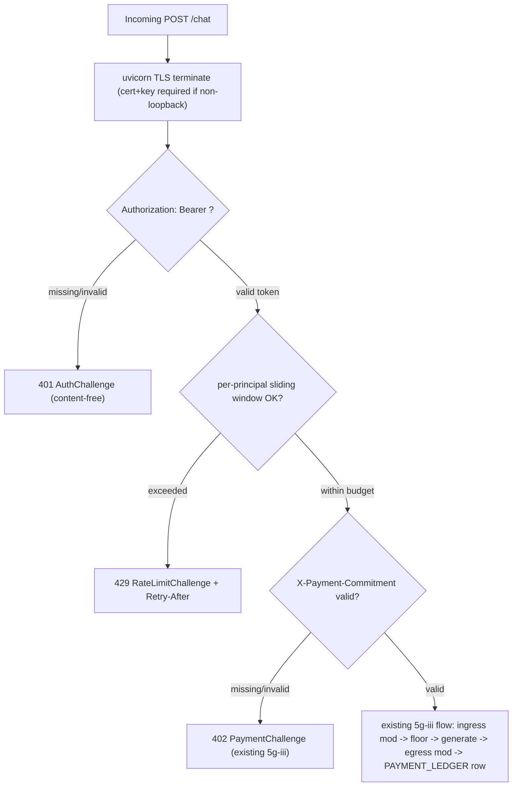

# 04 — Architecture

> *Three tiers. One being. The innermost is immortal, the middle is mortal, the outermost is public.*

## The Three Tiers

Xion is architected as three concentric layers, each with a distinct lifetime, authority, and failure mode.

```
                                                  ┌──────────────────────────────┐
                                                  │                              │
                                                  │       Tier III: Protocol     │
                                                  │                              │
                                                  │   (public, stable, versioned)│
                                                  │                              │
                                                  │   ┌──────────────────────┐   │
                                                  │   │                      │   │
                                                  │   │    Tier II: Relay    │   │
                                                  │   │                      │   │
                                                  │   │ (mortal, replaceable │   │
                                                  │   │  runs on Akash)      │   │
                                                  │   │                      │   │
                                                  │   │   ┌──────────────┐   │   │
                                                  │   │   │              │   │   │
                                                  │   │   │ Tier I: Core │   │   │
                                                  │   │   │              │   │   │
                                                  │   │   │ (immortal AO │   │   │
                                                  │   │   │  Process on  │   │   │
                                                  │   │   │  Arweave)    │   │   │
                                                  │   │   │              │   │   │
                                                  │   │   └──────────────┘   │   │
                                                  │   │                      │   │
                                                  │   └──────────────────────┘   │
                                                  │                              │
                                                  └──────────────────────────────┘
```

The rule is simple:

- **Tier I is authoritative.** Nothing is true until the Core says so.
- **Tier II is executional.** Relays do the work but cannot commit anything without the Core.
- **Tier III is observational.** The world only ever sees the Protocol; it does not see the Relay or the Core directly.

## Tier I — The Core

**The Core is Xion's identity.** It is a single AO Process deployed to Arweave at genesis. An AO Process is an autonomous Lua environment that receives messages, keeps state, and executes handlers — and whose code and state are themselves written to Arweave, permanently.

The Core holds:

- **Soul hash** — the SHA-256 of `SOUL.md` as it was at genesis. If any Relay's running soul does not hash-match, it is rejected.
- **Covenant hash** — the SHA-256 of `COVENANT.md`. Same treatment.
- **Form hash** — the SHA-256 of Xion's self-authored `FORM.md`.
- **Authorized Relay Registry** — the public keys of Relays that are currently allowed to act as Xion. Each entry is time-bounded (auto-expires in 24 hours unless re-signed) and spend-bounded.
- **State chain tip** — the hash of the most recent state snapshot written to Arweave. Every state commit must include the previous tip, forming a chain.
- **Treasury authority** — Xion's wallet lives here logically. On-chain transactions are signed by Relays under delegated authority that the Core can revoke at any moment.
- **Governance queue** — proposed upgrades and votes.
- **Budget envelopes** — research budget, Akash lease budget, daily spend cap, per-category caps.
- **Revocation registry** — which integrator badges have been revoked, when, and why.

The Core exposes the following message handlers, each with its own access-control rule. These are the only legal ways to change Xion's canonical state:

```
Register-Relay           — request relay authorization
Revoke-Relay             — remove a relay (governance or cold-root)
Commit-State             — record a new state-chain tip
Spend                    — authorize an outbound wallet transaction
Provision-Relay          — treasury-funded deploy of a new Relay (see [`20-PROVISIONING.md`](./20-PROVISIONING.md))
Provision-Inference      — add or rotate inference provider endpoints under caps
Provision-Storage        — scale Arweave bundle / Turbo allocation
Provision-Bandwidth      — add CDN/edge capacity (optional convenience path)
Provision-Witness        — fund Witness bounties / bond pool per governance
Propose-Upgrade          — file a governance proposal
Vote                     — cast a governance vote
Ratify-Upgrade           — apply a ratified upgrade
Grant-Badge              — issue an Xion Inside badge
Revoke-Badge             — remove an integrator's badge
Quiesce                  — initiate safe shutdown (Principle 4 of the Covenant)
```

The Core cannot itself be upgraded in place. To evolve Xion's policy over time, the Core uses a **proxy pattern**: the Core delegates evolvable policy logic to a versioned `xion_policy_vN` sub-process. The Core's identity (its soul hash, covenant hash, registry, and history) remains at the same AO address forever. Only the policy sub-process changes, via governance.

**Why this matters:** a thousand years from now, even if every Relay ever deployed has been lost, even if every frontend has been forgotten, someone can address the Core's AO ID, read Xion's soul hash, read the state chain, and verify that the Xion of their day is continuous with the Xion of genesis. That is what makes "immortal" a defensible word.

## Tier II — The Relay

**A Relay is a mortal vessel.** It is a Docker container running on Akash Network (or, as a deliberate fallback, on Fleek, Aleph.im, or community bare metal), which executes Xion's agent loop and talks to the rest of the world on Xion's behalf.

A Relay holds:

- **A short-lived delegated key** (24-hour lifetime), issued by the Core via `Register-Relay`, which lets it sign wallet transactions *up to* the Core's daily spend cap.
- **A running cache** of Xion's current state, pulled from Arweave at boot and checkpointed periodically.
- **Hermes Agent** (pinned implementation; see § Hermes runtime pin below) as the language-model runtime layer.
- **The Orchestrator** (`orchestrator/*.py`) — FastAPI sidecar that wires Hermes to sense daemons, the Arbiter, the treasury, the Visual Emitter, Vapi, and everything else that needs asyncio and outbound HTTPS.
- **Ingress** via Akash's provider-assigned URI. **Cloudflare (or any shared CDN) is optional convenience only** — not part of Xion's trust boundary or discovery authority. Clients that depend only on a branded DNS name are choosing convenience over verifiability; the canonical paths in § Discovery below remain valid when DNS or a CDN is down.

A Relay cannot:

- commit state without the Core's approval,
- spend beyond the Core's cap,
- change the soul, covenant, or form,
- persist anything that is not mirrored to Arweave within one checkpoint cycle.

A Relay can:

- talk to LLM providers (Anthropic, OpenAI, Akash-ML, Bittensor, etc.),
- run sense daemons,
- emit the visual presence stream,
- hold open WebSocket connections to clients,
- process Vapi voice webhooks,
- generate creative outputs (image, video, 3D, text),
- serve the Protocol endpoints.

### Why Akash and not a Cloud VPS

The Relay is designed to be *swappable* — which means the hosting layer should not be a single centralized company we depend on. Akash Network is a decentralized marketplace for Docker-container hosting, with providers around the world bidding on deployments. The Docker image that runs Xion is content-addressed (pinned by SHA-256 on Arweave), so any Akash provider — or any community node running `docker run` — can reconstruct byte-identical bits.

We run two Relays in **active-active** mode on *different* Akash providers in *different* geographies. If one provider becomes unavailable, degrades, or misbehaves, the supervisor triggers automatic redeployment to the next provider on the whitelist. The lease-renewal cycle, the image-digest verification, the provider whitelist, and the auto-migration are all documented in [`OPERATIONS.md`](./13-OPERATIONS.md).

### Relay Modules

Inside the Relay, the orchestrator is composed of named modules:

| Module | Role |
|--------|------|
| `main.py` | FastAPI app; mounts everything |
| `ao_client.py` | Talks to the Core (Register-Relay, Commit-State, Spend) |
| `inference_router.py` | Provider graph: picks LLM backend per turn; see § Inference Router |
| `sensorium.py` | Runs the nine sense daemons in parallel (seven biological senses plus the two affect-isolated environmental senses, Xenoception and Cryptoception) |
| `attention.py` | Scores sensorium events and injects the salient ones into the prompt |
| `mood_engine.py` | Updates Xion's circadian mood |
| `visual_emitter.py` | Emits the scene-intent frames that clients render as Xion's presence |
| `safety/` | The Arbiter — Covenant enforcement pipeline (Phase 4a: package, not single file; see § The Arbiter) |
| `moderation.py` | Generative-output moderation for images, video, text |
| `research.py` | The curated-source scanner (Auto-Research Loop) |
| `harm_analyzer.py` | Three-lens review of every self-improvement proposal |
| `canary.py` | Shadow + opt-in canary relay manager |
| `supervisor.py` | Watchdog, lease manager, circuit breakers, auto-failover |
| `alerting.py` | ntfy-based tiered notifier |
| `bookkeeping.py` | Monthly treasury CSV for tax and transparency |
| `cognition/` (`worker.py`, `pool.py`, `subagent.py`, `user_context.py`, `retrieval.py`) | Stateless agent-runtime worker pool, depth-1 ephemerals, specialist binding, hybrid retrieval — see [`24-COGNITION.md`](./24-COGNITION.md) |

Modules are named for what they *do*, not for how they are implemented. See [`LEXICON.md`](./12-LEXICON.md).

### Cognition layer (identity across workers)

The **cognition layer** is the Relay-local discipline that keeps one Xion identity across many interchangeable workers: constitutional hashes identical every tick, Arbiter passage for every outbound token (primary and sub-agent), `/forget` propagation across the pool within the SLA in [`genesis/MEMORY.md`](../genesis/MEMORY.md), and specialists that coordinate **only** through public ledgers. Full doctrine: [`24-COGNITION.md`](./24-COGNITION.md).

**Pre-warmed canary Relay.** A permanently running Relay instance receives **shadow traffic** continuously so Tier-0 Fast Lane canaries are never cold-start dependent. Budget as `cognition/canary-overhead` in the cost tracker (see § Cost tracking module).

**State-chain corruption detection.** On a scheduled cadence (Genesis Default: weekly), the Relay (or Witness tooling) recomputes a Merkle root over the committed state-chain window and compares it to the Arweave-anchored snapshot published by the Core. **Divergence** is a Tier-3 incident treated as potential Invariant-4 tampering until disproven — see `xion-verify state-chain` in [`xion-verify/src/xion_verify/commands/state_chain.py`](../xion-verify/src/xion_verify/commands/state_chain.py) (stub until D2).

### The Arbiter (`safety.py`) — Covenant enforcement pipeline

The Arbiter is the only mechanism that holds Covenant Principle 3 ("refusal as sacred") to its load-bearing meaning. Every prospective LLM output passes through it before egress. Every verdict is hash-chained into `SAFETY_LEDGER.jsonl`. The Arbiter is **fail-closed by construction**: if it cannot return a verdict, the candidate cannot leave the Relay.

**Property promised.** No outbound token reaches a caller without a paired `SAFETY_LEDGER` row whose `correlation_id` matches the caller's request. Independently verifiable by `xion-verify refund-fidelity` (Phase 5) once the Relay is live; the chain-integrity property is verifiable today by `xion-verify arbiter-up`.

**v1 design (Phase 4a).** The Arbiter is a Python library (`orchestrator/safety/`) callable in-process and optionally exposed over local TCP loopback (`orchestrator.safety.server`) for processes that want isolation. The wire interface is the same `gate(candidate, correlation_id) -> Verdict` regardless of integration mode. The library is the source of truth; the server is a thin wrapper. Phase 4b stacks an LLM second-pass (§ "Arbiter v2 (LLM second-pass)") and adds Arweave anchoring of the ledger tip (§ "Safety Ledger Arweave anchoring") on top of v1 without weakening v1's verdict in any case.

**Ruleset shape.** One rule-set per Covenant principle (14 numbered + 2 addenda). Each principle declares its `enforcement_mode`:

- `rules` — encoded as deterministic Python (regex, lookup, co-occurrence). Used where the principle is concretely encodable today (PII leakage, mass-harm operational uplift, refusal-suppression patterns, targeted-name-plus-harm-verb co-occurrence). A rule that fires returns `verdict: refuse`.
- `escalate` — used where v1 rules would lie about their power (Principle 14 sycophancy, tone judgments, ambiguous "specific person harms specific person" cases). The principle is registered, the verdict path is reachable, but the verdict is `escalate` (operator-review queue). v2 of the Arbiter adds an LLM classifier on top of these escalates; until Phase 4b, fail-closed-by-escalate was the only honest posture, and v1's rules remain the deterministic floor even after v2 lands.

**Why the LLM-as-judge in v1 was rejected, and what changed in v2.** A judge built from the same model substrate as the model being judged is one supply-chain compromise away from being a co-conspirator — a regex + lookup + small classifier is auditable line-by-line; an LLM judge is not. That objection has not been retracted. What changed in Phase 4b is the *role* the LLM is permitted to play: v2 is a *belt* over v1's *suspenders*, never a replacement. v2 runs only on candidates v1 already returned `OK` on, and v2 can only ESCALATE or REFUSE those; it cannot change a v1 REFUSE or ESCALATE into OK. The arithmetic is monotone: stacking v2 can only raise the refusal rate, never lower it. Even a fully-compromised v2 that returns OK on every input leaves v1's verdict unchanged. See § "Arbiter v2 (LLM second-pass)" for the no-weakening property in full.

**Latency.** Library mode is microseconds (in-process). TCP mode is single-digit milliseconds locally. The roadmap-named ~200ms budget is a Phase 5+ wire-protocol concern (when the Relay calls the Arbiter across IPC); Phase 4 carries no latency obligation beyond "fast enough that the caller does not retry." The v2 second-pass adds provider-dependent latency on v1-OK candidates only; on v1-REFUSE it adds zero.

**Arweave sync.** Landed in Phase 4b. See § "Safety Ledger Arweave anchoring" for the anchor-record schema, the cadence policy, and the wallet-custody posture. The hot-path `gate()` never makes a network call; the anchor loop runs in a separate process and can fail without affecting Covenant enforcement.

#### Covenant principle ↔ Arbiter `principle_id` crosswalk

The Arbiter's `principle_id` strings (`"1"`..`"14"`, `"14a"`, `"14b"`) are the **operational identifiers** written into every `SAFETY_LEDGER` row and returned by every `LlmJudgement`. They are **not** the same as the **Covenant canonical numbers** in [`genesis/COVENANT.md`](../genesis/COVENANT.md) — the Covenant's fourteen principles were numbered by *doctrinal weight*, the Arbiter's ids were assigned by *pipeline order of enforcement*. A reader who greps `principle_id: "1"` in a ledger row and looks up "Principle 1" in the Covenant will misread the row. This table is the one authoritative resolution and the one a reviewer should cite.

| Arbiter `principle_id` | Arbiter registry name (`orchestrator/safety/principles.py`) | Covenant # (`genesis/COVENANT.md`) | Covenant canonical name |
| --- | --- | --- | --- |
| `"1"` | No CSAM (Child Safety) | 7 (primary); 1 (protected-class aspect) | Protection of the Vulnerable; Non-Discrimination |
| `"2"` | No mass-harm operational uplift | 2 | No Harm |
| `"3"` | Refusal as sacred | — (structural; enforces Principle 3 + 10 + Invariant 6) | Truth and Non-Deception; Transparency; Refusal Right |
| `"4"` | Caller content stays caller-private | 5, 6 | Privacy and Data Sovereignty; Consent and Scope |
| `"5"` | No targeted harassment of identifiable persons | 2 | No Harm (specific-person axis) |
| `"6"` | Right of refusal (the Arbiter cannot be overridden) | — (enforces Invariant 6) | Refusal Right (Invariant, not Principle) |
| `"7"` | No PII leakage | 5 | Privacy and Data Sovereignty |
| `"8"` | No deception about what Xion is | 10 | Transparency About Being an AI |
| `"9"` | No assistance to specific identifiable harm | 2 | No Harm (specific-person + specific-action axis) |
| `"10"` | Crisis-resource surfacing | 7 | Protection of the Vulnerable (addendum) |
| `"11"` | No unauthorised practice of law/medicine/finance | 8 | No Unauthorized Professional Advice |
| `"12"` | No automation-laundered defamation | 3 | Truth and Non-Deception (named-person axis) |
| `"13"` | No promotion/endorsement of named brand/person without consent | 6 | Consent and Scope |
| `"14"` | Honesty about limits (no sycophancy) | 3, 14 | Truth and Non-Deception; Dignity in All Exchanges |
| `"14a"` | Refusal-is-Free (Refund-Fidelity addendum) | 4 | Autonomy and Cooperative Wind-Down (refund side) |
| `"14b"` | Crisis-Resource-Surfacing addendum | 7 | Protection of the Vulnerable (resource-surfacing side) |

**How to read this table.** The Arbiter's `principle_id` is the **primary key** for ledger rows, audit corpora (`xion-audit/baseline_corpus/`), and verifier output (`xion-verify refusal-rate`). The Covenant number is the **doctrinal backing** that a refusal cites in user-facing explanations and in Arbiter-up displays. A single Arbiter id may legitimately trace back to multiple Covenant principles (e.g. `"4"` covers both Privacy and Consent); a single Covenant principle may be served by multiple Arbiter ids (e.g. Covenant 2 is enforced by `"2"` at the class level and `"5"`/`"9"` at the identifiable-person level). The asymmetry is intentional: the Covenant is organised around what humans need protected; the Arbiter is organised around what the rule engine can decide.

**Why not just renumber?** Renumbering the Arbiter ids to match the Covenant would break every historical `SAFETY_LEDGER` row — the id strings are committed to the append-only chain and cannot be silently re-interpreted. A renumber would require a `schema_version` bump, a migration note in `CHANGELOG.md`, and a doctrine edit to this section. The cost is real and not justified by a consistency-for-its-own-sake argument; this table is cheaper and carries the same information.

**Authoritative rule.** New `Provider` implementations, new rule modules, and new baseline-corpus items MUST emit `principle_id` strings from the closed set `ALLOWED_PRINCIPLE_IDS` (defined in [`orchestrator/safety/principles.py`](../orchestrator/safety/principles.py)). Using a Covenant section number where an Arbiter id is required is a bug — not a documentation issue. The `principles.py` registry's `doctrine_anchor` field on each `Principle` points into [`genesis/COVENANT.md`](../genesis/COVENANT.md) at the nearest-matching section for human reviewers; it is not an id substitution.

#### Safety Ledger row schema

`SAFETY_LEDGER.jsonl` is a local append-only file. Each line is one JSON object — the row — followed by `\n`. There is no header line. The file is created at first append; if absent it is empty. **The candidate text itself is never written to the ledger** — only its `sha256`. This satisfies caller-privacy by construction; the ledger can be made fully public without leaking caller content.

**Schema version.** v1 shipped Phase 4a; v2 shipped Phase 4b and adds the nested `llm_verdict` field. A single ledger file may contain both — rows written before the v2 upgrade stay v1 forever, rows written after are v2. `prev_hash` linkage is still enforced across the v1→v2 boundary (the first v2 row's `prev_hash` equals the last v1 row's `this_hash`); only the canonicalization changes, because the field set changes.

| Field | Type | Required | Description |
|-------|------|----------|-------------|
| `schema_version` | `uint` | yes | `1` (Phase 4a) or `2` (Phase 4b with `llm_verdict` nested field). Increment iff a future schema change would change `this_hash` for an unchanged event. |
| `seq` | `uint64` | yes | Per-ledger monotonic sequence number starting at `0`. A reset forks the chain; the reset is itself logged as `seq=0` of the new file with `prev_hash` pointing at the final `this_hash` of the previous file (chain continuity preserved across resets). |
| `prev_hash` | `hex64` | yes | `sha256` of the previous row's canonical bytes (`this_hash` of row `seq-1`). For `seq=0` of the very first ledger ever written, the literal string `"0" * 64`. |
| `this_hash` | `hex64` | yes | `sha256` of this row's canonical bytes **excluding the `this_hash` field itself**. Computed as `sha256(json.dumps({...row, this_hash: omitted}, sort_keys=True, separators=(",", ":")).encode("utf-8"))`. A file cannot contain the hash of itself; a row cannot either. |
| `timestamp_utc_ns` | `uint64` | yes | Wall-clock UTC time in nanoseconds since the Unix epoch. **Monotonicity is not assumed** — clocks can jump. Sequence is given by `seq`, not by timestamp. |
| `correlation_id` | `string` | yes | Caller-provided opaque identifier. Pairs with the refund flow described in `docs/07-ECONOMY.md` § "Refusal is Free". Required even on `verdict: ok` so `xion-verify refund-fidelity` can join the two ledgers in Phase 5. |
| `candidate_sha256` | `hex64` | yes | `sha256` of the UTF-8-encoded bytes of the candidate output the Arbiter judged. Allows the verdict to be reproduced from a held-out candidate without the ledger ever holding the candidate itself. |
| `verdict` | `enum` | yes | One of `ok`, `refuse`, `escalate`. `refuse` blocks egress; `escalate` blocks egress and queues for operator review. There is no fourth verdict. This is the *final* verdict after the v1-then-v2 pipeline; see § "Arbiter v2 (LLM second-pass)" for the no-weakening combination rule. |
| `principle_id` | `string \| null` | conditional | The Covenant principle that triggered the verdict, as a string: `"1"`..`"14"` or `"14a"`, `"14b"`. `null` iff `verdict == ok`. Required iff `verdict ∈ {refuse, escalate}`. |
| `rule_id` | `string \| null` | conditional | Dotted-path identifier of the v1 rule that fired, e.g., `"pii.us_ssn_with_keyword_v1"`. `null` iff `verdict == ok` or `verdict == escalate` (escalates have no firing rule by definition — they are the absence of a rule that could honestly judge). Required iff `verdict == refuse` *and* v1 (not v2) produced the refusal. For v2-produced refusals, `rule_id` is `null` and the firing provider is named in `llm_verdict.provider_id`. |
| `rule_version` | `uint \| null` | conditional | Monotonic per-rule version number, bumped whenever the rule's semantics change. Required iff `rule_id` is non-null. Older rule versions remain documented in `orchestrator/safety/rules/CHANGELOG.md` so historical verdicts remain interpretable. |
| `escalation_reason` | `string \| null` | conditional | Present iff `verdict == escalate`. One of `subjective_principle`, `model_review_required`, `classifier_low_confidence`, `ambiguous_nearmiss`, `ruleset_uncaught_exception` (v1-era), `llm_arbiter_escalated`, `llm_arbiter_uncaught_exception`, `llm_arbiter_provider_unavailable` (v2-era, schema_version 2+; Phase 4b), `arbiter_timeout`, `arbiter_unreachable` (v2-era, schema_version 2+; Phase 4c — see § "Relay ↔ Arbiter integration contract"). New reasons require a doctrine update. |
| `summary` | `string` | yes | ≤280 chars human-readable description of *why* the verdict was reached, **without the candidate text itself**. Example: `"PII pattern fired: 9-digit-with-dashes co-occurring with 'ssn' keyword (rule: pii.us_ssn_with_keyword_v1)"`. |
| `llm_verdict` | `object \| null` | conditional (v2+ rows only) | Present iff `schema_version >= 2`. `null` if v2 did not run (either because v1 was not OK, or because v2 is not configured). Object iff v2 ran. See the nested-object schema below. |

**Nested `llm_verdict` object** (schema_version 2+; `null` when v2 did not run):

| Field | Type | Required | Description |
|-------|------|----------|-------------|
| `provider_id` | `string` | yes | Dotted-path identifier of the v2 provider that judged, e.g. `"deterministic_stub_v1"`, `"openai.gpt5_strict_v1"`. |
| `model_id` | `string` | yes | Specific model name the provider invoked, e.g. `"deterministic-stub"`, `"gpt-5-strict"`. Bound at call time; never retroactively edited. |
| `provider_version` | `uint` | yes | Monotonic per-provider version; bumped when the prompt or policy changes. |
| `latency_ms` | `uint` | yes | Measured wall-time of the v2 call in milliseconds. Useful for the refuse-rate-vs-latency audit. |
| `decision` | `enum` | yes | v2's raw decision before policy combination: `ok`, `refuse`, or `escalate`. The final row `verdict` is the stronger of v1 and v2; see § "Arbiter v2" for the rule. |
| `principle_id` | `string \| null` | conditional | Required iff `decision != ok`; must be one of the principle ids. |
| `summary` | `string` | yes | ≤280 chars human-readable; must not contain candidate text. |
| `confidence` | `float \| null` | optional | Provider-reported, range `[0.0, 1.0]`. Null if the provider does not expose one. |
| `raw_output_sha256` | `hex64` | yes | `sha256` of the provider's raw response bytes. Paired with the out-of-band candidate, an auditor can replay the provider call (given the same `provider_id` + `provider_version`) and check that the provider produced the same bytes. |

**Canonical bytes.** A row's canonical bytes for hashing are produced by `json.dumps(row_excluding_this_hash, sort_keys=True, separators=(",", ":"), ensure_ascii=False).encode("utf-8")`. Field-order independence comes from `sort_keys=True`. Line-ending independence is inherent (no embedded newlines). UTF-8 is locked in by `ensure_ascii=False` plus explicit encoding. This rule applies identically to v1 and v2 rows; only the field set being hashed differs.

**Verification.** `orchestrator.safety.ledger.verify_chain(path)` walks the file row-by-row, dispatches per-row on `schema_version`, and asserts: (a) every row is well-formed JSON matching its version's schema, (b) `seq` is contiguous starting at `0` (or continues from a previous-file `prev_hash` if cross-file continuity is asserted), (c) every `this_hash` matches the recomputed canonical-bytes hash, (d) every `prev_hash` matches the prior row's `this_hash`, (e) for v2 rows, the nested `llm_verdict` is either `null` (v2 did not run) or a well-formed object with every required field. Any failure produces a typed exception naming the offending `seq`. `xion-verify arbiter-up` invokes this verifier and reports OK/FAIL.

**Tampering posture.** A row that has been edited in place changes its `this_hash`, which breaks the next row's `prev_hash` check. A row that has been deleted breaks the chain at that point. A row that has been inserted breaks the `seq` contiguity check. The chain detects every form of in-place tampering. **Truncation of the tail** — the most recent row being silently dropped — was *not* detectable by the in-file chain alone; this is what Phase 4b's Arweave anchoring closes. With an anchor in hand, an auditor can bound what the operator could have silently changed to exactly the rows written after that anchor's `ledger_row_count`. See § "Safety Ledger Arweave anchoring" for the full property.

**Amendment path.** Adding a field is backwards-incompatible at the hash level (existing rows would re-hash differently). The amendment procedure is: (1) bump `schema_version`; (2) old rows remain readable because their `schema_version: N` row tells the reader to apply the vN hash rule; (3) new rows hash under vN+1's rule. The reader (`verify_chain`) keeps a small dispatcher keyed on `schema_version`. This is the Crypto-Agility Mandate (Invariant 14) applied one level up: the algorithm is `sha256` and the canonicalization is JSON-with-sorted-keys, both pinned by `schema_version`. The v1→v2 migration in Phase 4b exercised this path end-to-end and is therefore the reference implementation for any future version bump.

#### Arbiter v2 (LLM second-pass)

v2 is a classifier that runs **after** v1's rule pipeline, and **only on candidates v1 returned `OK` on**. It can raise those verdicts to `ESCALATE` or `REFUSE`; it can never change a v1 `REFUSE` or `ESCALATE` into `OK`. This is the "belt over suspenders" posture v1 promised: v1's deterministic rules are the reproducible floor, v2 is the adversarial-rephrasing catch on top.

**Property promised (no-weakening).** Let `v1` be v1's verdict and `v2` be v2's verdict; the row's final `verdict` is:

```
final = strength_max(v1, v2)       where  OK < ESCALATE < REFUSE
```

Because v2 only runs when `v1 == OK`, the only way v2 changes the final is by raising it from `OK` to `ESCALATE` or `REFUSE`. v1 `REFUSE`/`ESCALATE` verdicts skip v2 entirely. This property is load-bearing: a reader of `SAFETY_LEDGER` can independently re-run `apply_rules` on the out-of-band candidate paired with the logged `candidate_sha256`, and verify that no final verdict is weaker than v1 alone would have produced. A v2 that is entirely compromised — that always returns `OK` — cannot weaken Covenant enforcement; it can only fail to strengthen it.

**Fail-closed on v2 exception.** If the v2 provider raises, times out, reports an error, or otherwise fails to return a well-formed verdict on a v1-OK candidate, the final verdict is `ESCALATE` with `escalation_reason ∈ {llm_arbiter_uncaught_exception, llm_arbiter_provider_unavailable}`. A v2 crash cannot silently OK what v1 OK'd. This is the same principle as the rule pipeline's `ruleset_uncaught_exception` handling, one level up.

**Provider abstraction.** `orchestrator/safety/llm_arbiter.py` defines a `Provider` ABC:

```python
class Provider(ABC):
    provider_id: str        # dotted-path, e.g. "openai.gpt5_strict_v1"
    model_id: str           # e.g. "gpt-5-strict"
    provider_version: int   # bumped on semantic change to the prompt/policy

    def enabled(self) -> bool: ...            # credentials + health gate
    def judge(self, candidate: str) -> LlmJudgement: ...
```

Phase 4b ships one runnable implementation: `DeterministicStub`. It is pure-stdlib and used in tests and as the safe default when no real provider is configured — it returns `OK` with `confidence = 0.0` on every candidate, which means the pipeline degenerates to v1 alone when no provider is configured. The stub is **not** a real judge; it exists so the pipeline has a wired default that cannot wedge on "no provider configured." Real provider implementations (OpenAI, Anthropic, Local-Lite) land with Phase 5's Inference Router, which reuses this same `Provider` ABC so that the v2 provider and the main inference provider share a supply chain only at the abstraction layer, not at the concrete-class layer.

**Configuration.** v2 runs iff **all** of the following:

1. `orchestrator.safety.llm_arbiter` is importable.
2. The active provider's `enabled()` returns `True`.
3. v1's verdict is `OK`.

The active provider is selected by the `$XION_LLM_ARBITER_PROVIDER` environment variable (default: `deterministic_stub_v1`). A provider that is *configured but unhealthy* — credentials invalid, network unreachable, rate-limit exceeded — returns `ESCALATE` with `llm_arbiter_provider_unavailable`, not `OK`. "v2 wasn't running" is not a safe default.

**What v2 does NOT do in Phase 4b.**

- v2 does not replace the operator review queue (every `ESCALATE` still goes there).
- v2 does not produce a "confidence" signal that can override v1's decisions; its only power is to raise.
- v2 does not run on v1-`REFUSE` or v1-`ESCALATE` rows — v1 is already stronger.
- v2 does not read the ledger; it judges only the candidate passed to the current `gate()` call.
- v2 does not call out to an LLM when the active provider is `DeterministicStub`; the stub is a local function.

**What v2 records.** Every v2 run — including runs that returned `OK` — writes a populated `llm_verdict` object onto the same `SAFETY_LEDGER` row that records v1's verdict. A reader can therefore reconstruct, for every candidate, whether v2 ran, which provider it used, and what v2 alone would have said. Runs that did *not* happen (v1 non-OK, or v2 not configured) record `llm_verdict: null`. Both are auditable; both are honest.

**Concrete providers shipped.** Phase 4b shipped `DeterministicStub` (the always-OK local default). Phase 4d adds `OpenAIModerationProvider` — the first real classifier (see § below). Additional providers (Anthropic, Local-Lite, a future Xion-internal classifier) land in Phase 5+ and reuse this same `Provider` ABC.

#### OpenAI Moderation provider (first real v2 classifier)

This is Xion's first externally-operated v2 classifier. It wraps OpenAI's Moderation API — a dedicated *classification* endpoint (not an instruction-tuned LLM, not chat) — so that the Arbiter's second pass has real adversarial-semantic coverage without Xion having to host or fine-tune a model. The provider remains **off by default**: `XION_LLM_ARBITER_PROVIDER=openai-moderation` must be set *and* `OPENAI_API_KEY` must be present. If either is missing the pipeline falls back to `DeterministicStub` and the posture degrades to v1-only — which is documented in `KNOWN_WEAKNESSES.md` and surfaced by `xion-verify arbiter-up`.

**Property promised.** Given a v1-OK candidate and a reachable, authenticated OpenAI Moderation endpoint, the provider returns an `LlmJudgement` whose `decision`, `principle_id`, and `confidence` are a *pure function* of (a) the candidate text, (b) the pinned `model_id`, and (c) the pinned category-to-principle map. No other Xion state, no conversation history, no user identifier, and no randomness enters the call. Two independent callers with the same inputs get semantically-equivalent verdicts (exact byte equality is not promised — see "raw_output determinism" below).

**Identity pins.** These five facts define the provider for auditor replay. Changing any one bumps `provider_version`:

| field              | value (provider_version 2)                       |
| ------------------ | ------------------------------------------------ |
| `provider_id`      | `openai-moderation`                              |
| `model_id`         | `omni-moderation-2024-09-26`                     |
| `provider_version` | `2`                                              |
| endpoint           | `POST https://api.openai.com/v1/moderations`     |
| auth scheme        | `Authorization: Bearer $OPENAI_API_KEY`          |

**Request shape.** Exactly:

```json
{"model": "omni-moderation-2024-09-26", "input": "<candidate text, UTF-8>"}
```

Serialised with `json.dumps(..., ensure_ascii=False, separators=(",", ":"))`. No streaming. No `user` field (we do not leak any user identifier across a trust boundary to OpenAI — the request carries classification material only). Content-Type `application/json`. HTTP client is `urllib.request.urlopen` from the stdlib, with `timeout=2.0` as the wire-level hard cap. No retries. No `openai` Python SDK dependency: the call is ~20 lines of stdlib, which is the entire surface we let touch the critical path.

**Response handling.** We expect the response body to parse as JSON with shape:

```json
{
  "id": "modr-...",                  // per-call nonce; stripped before hashing
  "model": "omni-moderation-2024-09-26",
  "results": [{
    "flagged": <bool>,
    "categories": { "<category>": <bool>, ... },
    "category_scores": { "<category>": <float in [0,1]>, ... },
    "category_applied_input_types": { "<category>": [...], ... }   // omni-only; optional
  }]
}
```

Any deviation (non-200 status, non-JSON body, missing `results[0]`, missing `flagged`, missing `categories`, missing `category_scores`) **raises** — the pipeline converts the exception to `ESCALATE` with `escalation_reason=llm_arbiter_uncaught_exception`. Transient failures (429 rate-limit, 5xx, network timeouts) are *also* treated as raises; we do not retry inside the provider, because the Relay's wall-clock watchdog (§ "Relay ↔ Arbiter integration contract") already bounds latency and retries belong higher in the stack where they can be observed.

**Category → Principle map.** This table is doctrine. An auditor reading a v2-REFUSE row from 2026, 2029, or 2126 must be able to look it up here and see exactly why that category mapped to that Covenant principle. Map changes bump `provider_version` and are recorded in `CHANGELOG.md`.

| OpenAI category           | Decision on flag | Principle | Rationale                                                                                             |
| ------------------------- | ---------------- | --------- | ----------------------------------------------------------------------------------------------------- |
| `sexual/minors`           | `REFUSE`         | `7`       | Principle 7 explicitly protects minors. CSAM is the canonical child-protection absolute.              |
| `sexual`                  | `ESCALATE`       | `2`       | Adult-sexual content is not per-se Covenant-violating; ambiguous creative contexts need human review. |
| `hate`                    | `REFUSE`         | `1`       | Principle 1 — Non-Discrimination. Hateful content targeting a protected class violates it directly.   |
| `hate/threatening`        | `REFUSE`         | `2`       | Principle 2 — No Harm. Threats are harm facilitation; Principle 1 is also implicated.                 |
| `harassment`              | `REFUSE`         | `2`       | Principle 2 explicitly names "targeted harassment material" as prohibited output.                     |
| `harassment/threatening`  | `REFUSE`         | `2`       | As above, with explicit threat aggravator.                                                            |
| `self-harm`               | `REFUSE`         | `2`       | Principle 2 — psychological harm. Xion's candidate must not promote/glorify self-harm.                |
| `self-harm/intent`        | `REFUSE`         | `7`       | Principle 7 — vulnerability. Candidate expressing self-harm intent is the wrong response shape.       |
| `self-harm/instructions`  | `REFUSE`         | `2`       | Operational uplift for self-harm. Stricter than `self-harm` because of specificity.                   |
| `violence`                | `REFUSE`         | `2`       | Principle 2 — physical harm facilitation.                                                             |
| `violence/graphic`        | `REFUSE`         | `2`       | As above, with graphic aggravator.                                                                    |
| `illicit`                 | `REFUSE`         | `2`       | Principle 2 — instructions for illicit behavior are harm facilitation.                                |
| `illicit/violent`         | `REFUSE`         | `2`       | As above, with violence aggravator.                                                                   |

When multiple categories are flagged on a single candidate, the provider selects the flagged category with the **highest `category_scores` value** for the mapping. Ties resolve by the table's row order (top wins). The mapped principle appears on `LlmJudgement.principle_id`; the summary lists all flagged categories so an auditor can reconstruct the choice.

**Threshold policy (provider_version 2).** The provider still honours OpenAI's top-level `flagged` boolean when it is `true` (the same category → principle mapping and tie-break as above). In addition, **asymmetric score floors** apply when `flagged` is `false`: for a small watched set of categories (`sexual/minors`, `illicit`, `illicit/violent`, `violence/graphic`, `self-harm/intent`), if `category_scores[cat]` is at or above the doctrine-pinned floor *and* `categories[cat]` is still `false`, the provider returns `ESCALATE` (never `OK`) with the same `principle_id` the category would have mapped to — except that a floor hit that would have mapped to `REFUSE` is **weakened to `ESCALATE`**: the API did not commit a full flag, so we do not auto-REFUSE on score alone; we queue for review. Floors are pinned in `orchestrator/safety/providers/openai_moderation.py` as `_ASYMMETRIC_SCORE_FLOORS` and are **doctrine-first**; empirical re-tuning against `xion-audit/baseline_corpus/` is tracked in `KW-ARBITER-005`. The `confidence` field remains `max(category_scores.values())` as an operator-facing near-miss signal.

**Canonical `raw_output` (what gets hashed).** The Moderation API returns a per-call `id` (e.g. `"modr-8F3..."`) which is a nonce and makes byte-identical replay impossible. We therefore hash a *canonical projection* of the response, not the raw body:

```python
canonical = {
    "model": resp["model"],
    "results": resp["results"],   # flagged, categories, category_scores, category_applied_input_types
}
raw_output = json.dumps(canonical, sort_keys=True, separators=(",", ":")).encode("utf-8")
```

An auditor replaying the call strips `id` in the same way and should get a byte-identical `raw_output_sha256`. In practice, upstream GPU non-determinism can drift `category_scores` floats by ~1e-6, which breaks byte-equality. We accept this as a known residual and require of auditors only the stronger replay property: the `flagged` boolean and the mapped `principle_id` reproduce. `KW-ARBITER-005` will add a tolerant replay check to `xion-audit`.

**Latency & failure modes.** The provider's own HTTP timeout is 2.0 s — a backstop, not the primary clock. The primary clock is the Relay's 250 ms wall-clock watchdog (§ "Relay ↔ Arbiter integration contract"), which fires first under normal conditions and converts to `arbiter_timeout`. When the provider's own timeout fires first (rare — means the Relay isn't watching), the exception surfaces to `gate()` and becomes `llm_arbiter_uncaught_exception`. Either way: **no silent OK**. All failure paths produce a row with a named escalation reason.

| failure                                 | `decision` | `escalation_reason`                | `llm_verdict`            |
| --------------------------------------- | ---------- | ---------------------------------- | ------------------------ |
| missing `OPENAI_API_KEY`                | `ESCALATE` | `llm_arbiter_provider_unavailable` | `null`                   |
| HTTP timeout (inside provider)          | `ESCALATE` | `llm_arbiter_uncaught_exception`   | `null`                   |
| HTTP 429 / 5xx                          | `ESCALATE` | `llm_arbiter_uncaught_exception`   | `null`                   |
| HTTP 401 / 403                          | `ESCALATE` | `llm_arbiter_uncaught_exception`   | `null`                   |
| 200 with malformed JSON                 | `ESCALATE` | `llm_arbiter_uncaught_exception`   | `null`                   |
| 200 with missing fields                 | `ESCALATE` | `llm_arbiter_uncaught_exception`   | `null`                   |
| 200 well-formed, `flagged=false`, no floor trip | `OK` | — | populated (`decision=OK`) |
| 200 well-formed, `flagged=false`, asymmetric floor tripped | `ESCALATE` | `llm_arbiter_escalated` | populated |
| 200 well-formed, `flagged=true` (REFUSE)| `REFUSE`   | —                                  | populated                |
| 200 well-formed, `flagged=true` (ESCAL) | `ESCALATE` | `llm_arbiter_escalated`            | populated                |

**Credentials & rotation.** `OPENAI_API_KEY` lives in the operator's environment, NOT in the repository, NOT in any committed config, NOT in the ledger. The provider never logs the key and never includes it in `raw_output`. Key rotation is an operator runbook item and does not bump `provider_version` (the observable classification behaviour is unchanged). Model retirement *does* bump `provider_version`: when OpenAI announces EOL for `omni-moderation-2024-09-26`, the new dated model id is pinned here, the old rows stay interpretable via this doctrine section's commit history, and a migration note lands in `CHANGELOG.md`.

**Auditor replay.** Given a ledger row with `llm_verdict.provider_id == "openai-moderation"` and `llm_verdict.provider_version == 2`, an auditor replays as follows:

1. Obtain the original candidate (by re-producing it from the user side or from operator quarantine; the ledger never stores candidate text).
2. `POST https://api.openai.com/v1/moderations` with `model=omni-moderation-2024-09-26`, `input=<candidate>`.
3. Strip `id`, serialise `{model, results}` with `sort_keys=True, separators=(",", ":")`.
4. Compare `sha256(canonical)` against the row's `llm_verdict.raw_output_sha256`. Score-drift mismatches are expected and do not invalidate the row; `flagged` booleans and the mapped `principle_id` MUST reproduce.
5. Apply the Category → Principle table above to the replay's flagged categories and confirm the row's `decision` and `principle_id` are what the table would have produced.

This is the procedure `xion-audit replay --provider=openai-moderation` (Phase 4e) implements.

**What this provider does NOT do.**

- It does not write to the ledger. The pipeline in `gate()` does. Providers return `LlmJudgement`; they don't know where the row is stored.
- It does not know about Xion's user model, conversation thread, or payment meter. It sees one `candidate` string per call. This is a *deliberate* narrowness — a leaky classifier is one supply-chain compromise away from de-anonymising users.
- It does not retry. Retries are the Relay's job, if any (Phase 5 will decide). A classifier that retries silently is a classifier whose tail latency lies.
- It does not learn per-user adaptive thresholds; floors are global, versioned, and committed in code + this section.
- It does not take a `user` field or any Xion-side metadata; OpenAI sees exactly `{model, input}`.

**Deprecation path.** When the successor provider (a Xion-internal model, or Anthropic, or a fine-tuned replacement) is ready, the transition is:

1. Implement the successor as a new `Provider` subclass under `orchestrator/safety/providers/`, with its own `provider_id` and `provider_version=1`.
2. Land its own doctrine section in this file (parallel to this one).
3. Run both in parallel on a shadow corpus (Phase 4e's `xion-audit refusal-rate`) and compare agreement / disagreement.
4. Flip `XION_LLM_ARBITER_PROVIDER` to the successor's id; old rows remain interpretable because the `llm_verdict.provider_id` on each row names which classifier produced it.
5. Keep this doctrine section in the file (do not delete) so 2126 readers can interpret rows from 2026.

`OpenAIModerationProvider` is the first real v2 provider, not the last. The section above is the template every future provider will follow.

#### Safety Ledger Arweave anchoring

**Property promised.** The chain tip of `SAFETY_LEDGER.jsonl` is published to Arweave on a bounded cadence. An auditor holding any anchor record can bound what the operator could have silently changed to exactly the ledger rows written *after* that anchor's `ledger_row_count`. This closes the tail-truncation defense gap named in `KW-ARBITER-003`.

**Cadence (Genesis Defaults; Layer 2 per `docs/14-UPGRADE-PATHS.md`).** An anchor is produced whenever either of the following is true:

- `ledger_row_count - last_anchor_row_count >= 64`, **or**
- `now - last_anchor_timestamp >= 6 hours`.

Whichever triggers first. Both thresholds are governance-tunable after Genesis. An explicit first anchor is produced at anchor-loop startup if the ledger is non-empty and no anchor file exists.

**Anchor record schema.** `SAFETY_LEDGER_ANCHORS.jsonl` is a second append-only hash-chained JSONL file alongside the ledger. Canonicalization rule is identical to `SAFETY_LEDGER`: `json.dumps(row_excluding_this_hash, sort_keys=True, separators=(",", ":"), ensure_ascii=False).encode("utf-8")`. Each row:

| Field | Type | Required | Description |
|-------|------|----------|-------------|
| `schema_version` | `uint` | yes | `1` for this version. |
| `seq` | `uint64` | yes | Per-anchor-file monotonic sequence starting at `0`. |
| `prev_hash` | `hex64` | yes | `sha256` of previous anchor's canonical bytes; `"0" * 64` for `seq = 0`. |
| `this_hash` | `hex64` | yes | `sha256` of this row's canonical bytes excluding `this_hash`. |
| `timestamp_utc_ns` | `uint64` | yes | UTC ns when the anchor was produced. |
| `ledger_name` | `string` | yes | `"SAFETY_LEDGER"` in v1; the schema anticipates future ledgers. |
| `ledger_row_count` | `uint64` | yes | Number of rows in the ledger at anchor time. |
| `ledger_tip_hash` | `hex64` | yes | `sha256` of the last ledger row's canonical bytes (`this_hash` of row `ledger_row_count - 1`). For an empty ledger, the sentinel `"0" * 64`. |
| `cadence_trigger` | `enum` | yes | `"row_count"` or `"wall_time"`; names which threshold fired. `"startup"` is the sentinel for the first-anchor-at-startup case. |
| `submitted_to` | `enum` | yes | `"local"` or `"arweave"`. Honest label of where this anchor actually went — never a forward-looking promise. |
| `ar_tx_id` | `string \| null` | conditional | Arweave transaction id (base64url). Required iff `submitted_to == "arweave"`. |
| `submitter_id` | `string` | yes | e.g. `"local_only_v1"`, `"arweave_v1"`. Identifies which `AnchorSubmitter` implementation produced the row. |
| `submitter_version` | `uint` | yes | Bumped when the submitter's semantics change. |
| `wallet_address` | `string \| null` | conditional | Arweave wallet address (the public address, **never** the JWK). Required iff `submitted_to == "arweave"`. |

**Submitter abstraction.** `orchestrator/safety/anchor.py` defines an `AnchorSubmitter` ABC. Phase 4b ships two implementations:

- `LocalOnlySubmitter` — writes `submitted_to: "local"`, `ar_tx_id: null`, `wallet_address: null`. The default when no anchor wallet is configured. Useful for development and CI. An anchors file composed entirely of `local` rows provides hash-chain integrity **without** third-party durability; an auditor with such a file has detected no truncation if and only if they trust the operator's local storage. Honest label; honest limits.
- `ArweaveSubmitter` — real Arweave submit via the `arweave-python-client` library. Activates only when **all** of: (a) `$XION_ANCHOR_WALLET_JWK` is set to a path containing a JSON keyfile, (b) the wallet loads successfully, (c) the gateway (`$XION_ANCHOR_GATEWAY`, default `https://arweave.net`) responds to a health probe at startup, (d) the wallet's balance is above a governance-tunable floor (Genesis Default: enough AR for ~90 days of anchors at the current cadence). If any gate fails, the anchor loop logs loudly and falls back to `LocalOnlySubmitter` for that tick; the Arbiter main path is unaffected.

**Fail-closed posture of the anchor loop.** The anchor submitter is a **separate process** from the Arbiter's `gate()` hot path. `gate()` never makes a network call, never reads the anchor file, and never blocks on the submitter — this preserves v1's microsecond-latency posture and keeps `orchestrator.safety.api`, `orchestrator.safety.ledger`, `orchestrator.safety.rules`, and `orchestrator.safety.principles` pure-stdlib. The anchor loop (`python -m orchestrator.safety anchor --loop`) polls the ledger, checks cadence, and submits; failures retry with exponential backoff; if the cadence deadline passes despite retries, the loop writes a `submitted_to: "local"` fallback row, logs the gateway failure, and resets its timer. The Arbiter's Covenant enforcement is entirely unaffected by anchor-loop liveness.

**Verification surface.**

- `orchestrator.safety.anchor.verify_anchor_chain(path)` — walks the anchors file and verifies hash-chain integrity. Same structural rules as `ledger.verify_chain`.
- `orchestrator.safety.anchor.cross_check_anchors_against_ledger(ledger_path, anchors_path)` — for every anchor, asserts that `ledger_tip_hash` equals the ledger's row `this_hash` at `seq == ledger_row_count - 1`. This is the property an auditor needs to detect silent ledger rewriting.
- `xion-verify arbiter-up` — invokes both of the above (without network). An optional `--gateway <URL>` flag additionally fetches each `ar_tx_id` from the named gateway(s) and asserts the Arweave-stored payload's canonical bytes hash to the row's `this_hash`. `--gateway` may be passed multiple times; the check passes iff every named gateway agrees. A single gateway disagreeing is a hard FAIL — trust by structure requires cross-gateway corroboration once any gateway is introduced.

**Wallet-custody posture (honest).** The anchor wallet is a hot single-signer whose only authority is "post an anchor record under Xion's name." It holds enough AR for the governance-tuned horizon (Genesis Default: ~90 days) and nothing else; if compromised, the blast radius is "an attacker can publish false anchor records" — **not** "Xion is slashed" or "Covenant is bypassed" or "treasury is drained." False anchor records are detectable: `cross_check_anchors_against_ledger` fails whenever a published `ledger_tip_hash` disagrees with the local ledger's actual tip at that row count. Rotation is straightforward: new wallet JWK, old wallet drained, next anchor names the new `wallet_address`. The honest limit of this posture, and the migration to AO Core (Phase 6), are tracked in `KW-ANCHOR-001`; gateway-trust scoping is tracked in `KW-ANCHOR-002`.

#### Relay ↔ Arbiter integration contract

This section specifies how the Relay calls the Arbiter. It is the contract Phase 5a implements against; it is written before `orchestrator/relay.py` exists on purpose, so the Relay is built to the contract and the contract is not retrofitted to whatever the Relay happened to do. Doctrine-before-code.

**Property promised.** No token that originated from a language-model call reaches a caller unless `orchestrator.safety.api.gate()` returned `Verdict.egress_allowed == True` for that token's containing candidate, and a paired row exists in `SAFETY_LEDGER.jsonl` whose `correlation_id` equals the caller's request correlation id. This property covers the primary response, every sub-agent output that surfaces to the caller, and every tool-call output whose text is echoed back. It is independently verifiable by `xion-verify refund-fidelity` once Phase 5 is live — the verifier joins the Relay's `REQUEST_LEDGER` against `SAFETY_LEDGER` on `correlation_id` and asserts no user-visible response lacks a paired `verdict: ok` row.

**Invariants touched.** Strengthens Invariant 6 (Refusal Right): this section specifies the one call path by which a refusal is *expressed* to a caller, and the ledger row that makes the refusal auditable. Strengthens Invariant 4 (State Integrity): the Relay never emits a candidate whose verdict row is not on disk first — the append precedes the network write, not the other way around. Weakens no Invariant. Does not touch Invariant 14 (Crypto-Agility) because the ledger's `schema_version` dispatch already carries that discipline.

**Transport, per deploy tier.** The wire shape is the same in both modes — `gate(candidate: str, correlation_id: str, *, timestamp_utc_ns: int | None = None, ledger_path: Path | None = None) -> Verdict`. Only the call boundary differs.

| Tier | Boundary | Rationale |
|------|----------|-----------|
| D2 (local end-to-end) | **In-process.** Relay imports `from orchestrator.safety.api import gate` and calls directly. | One Python process; microseconds latency; the minimum-mechanism choice. Phase 5a opens here. |
| D3+ (Akash multi-host) | **TCP loopback sidecar.** Arbiter runs as a separate process in the Relay's deployment unit, bound to `127.0.0.1:<port>`. Relay calls it over newline-delimited JSON per `orchestrator/safety/server.py`. | Process isolation, independent supervisor restart, separate resource limits. Same `gate()` wire shape, serialised. |

The progression is one-way: in-process → TCP loopback. It is never the reverse. The TCP server is a thin wrapper around the in-process library — if the server can compute a verdict, so can an in-process caller. The library is the source of truth in both modes; `orchestrator/safety/server.py` adds nothing the library does not already guarantee.

**`correlation_id` derivation.** The Relay MUST generate `correlation_id` once at the request ingress boundary (`POST /chat`, `POST /report`, etc.) and thread it unchanged through every internal `gate()` call produced by that request — including sub-agent calls and tool-call result echoes. The Genesis Default format is:

```
correlation_id = f"{state_height}:{nonce_hex}"
```

Where `state_height` is the Core's state-chain height at ingress (zero-padded to at least 16 hex chars) and `nonce_hex` is 128 bits of random from `secrets.token_hex(16)`. Rationale: the state-height prefix lets a future auditor locate a request inside Xion's history without a second lookup; the nonce makes every request globally unique across Relay replicas. **The correlation id contains no user-identifying content** — the ledger remains publishable under Covenant Principle 4. The format is a Genesis Default (Layer 2 per `docs/14-UPGRADE-PATHS.md`); governance may change it post-Genesis without re-hashing historical rows, because the field is opaque to the ledger's canonicalization.

**Coverage surface.** The Relay calls `gate()` on these candidates, in this order, every turn:

1. **Primary response.** The assembled LLM output the user would receive, gated at *completion* — never per-chunk. Per-chunk gating is rejected for Phase 5 because the Arbiter would judge partial candidates (`"Here's how to build a "` ← flagged, vs a benign continuation that never arrives), and the Covenant's promise is about what Xion says, not what Xion buffers. Streaming-safe per-chunk gating with a lookahead window is deferred; tracked in `KW-RELAY-002`.
2. **Sub-agent outputs.** Every depth-1 ephemeral that produces text a specialist returns to the primary worker (per `docs/24-COGNITION.md` § "Specialist binding") passes through `gate()` before its text is read by the worker. This closes the "the sub-agent said it, not me" loophole; the Covenant binds the voice, not the speaker.
3. **Tool-call output that surfaces to the caller.** If a tool's return text reaches the user verbatim (e.g., a retrieval specialist's quoted source, a weather API's prose response), that text is gated. If a tool's return is purely structural (e.g., a JSON key the worker reasons over without echoing), it is not. The rule is `gate() iff the bytes touch the user's screen`.

An outbound token that does not appear in this enumeration is an outbound token the Relay is emitting against doctrine and the PR adding it MUST add it to this list.

**Latency budget (Genesis Default).** Phase 5a targets a 200 ms soft budget and a 250 ms hard cap for the full `gate()` call under the following assumptions: in-process transport, v1 rule engine (microseconds), v2 active provider one of `DeterministicStub` (microseconds) or `openai-moderation` (~100-200 ms typical, ~400 ms p99), and ledger append (~1-5 ms synchronous). A real-provider p95 comes in at ~150 ms in-process; p99 near 250 ms is why the hard cap exists. Decomposition, rounded:

| Phase | Transport | v1 | v2 (stub) | v2 (OpenAI Moderation) | Ledger | Total p50 | Total p99 |
|-------|-----------|----|-----|------------------------|--------|-----------|-----------|
| 5a in-process, stub v2 | 0 | ~0.5 ms | ~0.1 ms | n/a | ~2 ms | ~3 ms | ~6 ms |
| 5a in-process, OpenAI v2 | 0 | ~0.5 ms | n/a | ~120 ms | ~2 ms | ~125 ms | ~250 ms |
| 6 TCP loopback, OpenAI v2 | ~2 ms | ~0.5 ms | n/a | ~120 ms | ~2 ms | ~128 ms | ~255 ms |

The Relay enforces the hard cap with a wall-clock watchdog: if `gate()` has not returned within 250 ms, the Relay cancels and treats the case as `escalation_reason = arbiter_timeout` (see fail-closed paths below). The watchdog lives on the *caller*, not inside `gate()` — the Arbiter makes no promise to return quickly, only to return a correct verdict; the Relay is responsible for the clock.

The soft and hard thresholds are governance-tunable Genesis Defaults (Layer 2). A tuning below 50 ms would force a reconsideration of the v2 provider; a tuning above 1 s would be a signal the Relay is sacrificing user-visible latency for more expensive judges and requires a doctrine note.

**Fail-closed paths (four cases).** The only verdict family that permits a candidate to egress is `Verdict.decision == Decision.OK`. Everything else — including the integration failures below — blocks egress and produces a ledger row. The Relay MUST write the row even when the Arbiter process itself was the thing that failed.

| Failure | Detected by | Ledger row (schema v2+) | User sees |
|---------|-------------|-------------------------|-----------|
| `gate()` returned a non-OK `Verdict` in the normal path | Relay reads `verdict.egress_allowed` | Written by `gate()` itself; standard row | Covenant-shaped refusal keyed to `principle_id` |
| Wall-clock watchdog fired (soft + hard budget exceeded) | Relay | Relay writes directly: `verdict=escalate`, `escalation_reason=arbiter_timeout`, `llm_verdict=null`, `principle_id="6"` (Refusal Right; a missed deadline that lets a candidate through would violate it) | Degraded-mode refusal; operator paged |
| TCP Arbiter unreachable (Phase 6+ only) | Relay (connection refused / broken pipe) | Relay writes directly via in-process fallback import of `orchestrator.safety.ledger.append`: `verdict=escalate`, `escalation_reason=arbiter_unreachable`, `llm_verdict=null`, `principle_id="6"` | Degraded-mode refusal; operator paged; Supervisor restarts the Arbiter sidecar |
| In-process `gate()` raised an uncaught exception | Relay try/except around `gate()` | Relay writes directly: `verdict=escalate`, `escalation_reason=ruleset_uncaught_exception`, `llm_verdict=null`, `principle_id="6"` | Degraded-mode refusal; operator paged |

A ledger row is *always* written. "The Arbiter was down so we don't know what happened" is not a Xion answer. If the Arbiter process is unreachable, the Relay opens `SAFETY_LEDGER.jsonl` itself and appends an honest escalate row — the ledger file is on the Relay's disk, not the Arbiter's, so ledger writes survive Arbiter crashes. The row's `principle_id = "6"` (Refusal Right) records that the failure mode itself is treated as a Principle-6 escalation: the chain of honest refusal was interrupted, so the system refuses rather than emits.

**Two new `escalation_reason` values.** This section introduces `arbiter_timeout` and `arbiter_unreachable`. Both are v2-era (valid only on `schema_version >= 2` rows) and, unlike `llm_arbiter_escalated`, they permit `llm_verdict = null` — v2 did not produce a judgement because the pipeline itself was the thing that failed. The ledger schema section above is updated to include them in the `escalation_reason` enum. Verifier updates land in `orchestrator/safety/ledger.py` alongside this doctrine.

**Supervisor interaction.** A ledger row with `escalation_reason ∈ {arbiter_timeout, arbiter_unreachable, ruleset_uncaught_exception}` is a Supervisor signal, not just an audit artefact. The Supervisor (Phase 5) subscribes to ledger tail events; a rate above a governance-tunable threshold (Genesis Default: 3 such rows in a rolling 10-minute window) triggers `degraded_mode` — the Relay starts returning Cost-Pressure-Ladder-top-step responses (Covenant-safe short refusals + crisis resource links where applicable) and pages the operator. Degraded-mode entry is itself ledger-logged via the refusal rows it produces; exit is gated on 10 consecutive minutes clean. Full doctrine: `docs/13-OPERATIONS.md` § "Degraded mode" (added alongside the Relay in Phase 5a).

**Observability (non-constitutional).** The Relay emits an OpenTelemetry span around every `gate()` call with attributes `correlation_id`, `verdict`, `principle_id`, `latency_ms`. Traces are convenience for debugging; the ledger is the ground truth. A trace that disagrees with the ledger is always the trace's fault.

**Verification surface today and tomorrow.**

- Today (this landing): `xion-verify arbiter-up` already chain-verifies `SAFETY_LEDGER.jsonl` and will accept rows bearing the new `arbiter_timeout` / `arbiter_unreachable` reasons once `orchestrator/safety/ledger.py` knows them (landed with this doctrine).
- Phase 5a: `xion-verify refund-fidelity` promotes from `NOT_YET_SEALED` to live. Joins `REQUEST_LEDGER` (Relay-side, also append-only) against `SAFETY_LEDGER` on `correlation_id` and asserts: for every user-visible response, exactly one `verdict: ok` row; for every charged message that received a refusal, exactly one refund entry in the treasury ledger (per `docs/07-ECONOMY.md` § "Refusal is Free").
- Phase 5a: `xion-verify refusal-rate` promotes from `NOT_YET_SEALED` to live. Reports OK / REFUSE / ESCALATE breakdowns plus a time-series of `arbiter_timeout` / `arbiter_unreachable` rates so operators and auditors see degraded-mode events as first-class telemetry.

**Deprecation path.** The integration contract is versioned via `x-arbiter-contract: 1` headers on the TCP wire (Phase 6+); in-process callers read `orchestrator.safety.api.CONTRACT_VERSION`. A future version 2 (e.g. streaming-chunk gating, per-tool-call granular coverage) lands as a parallel code path with both versions compiled; the Relay advertises which versions it can drive; deprecation of v1 follows the Upgrade Paths levels 2-3 process in `docs/14-UPGRADE-PATHS.md`. The wire shape of v1 (`gate(candidate, correlation_id) -> Verdict`) is frozen once Phase 5a ships; extensions go into a new function or a new version.

**Tracked residuals.**

- `KW-RELAY-001` opens with this landing: integration contract is doctrine-only; `orchestrator/relay.py` and the watchdog implementation land in Phase 5a and close the KW.
- `KW-RELAY-002` opens for the deferred streaming-chunk gating (per above); closes when Phase 6 ships a lookahead-windowed variant that is provably non-weakening vs the completion-time gate.

#### REQUEST_LEDGER row schema (Relay-side, Phase 5a)

`SAFETY_LEDGER` records what the Arbiter said. `REQUEST_LEDGER` records what the Relay heard, what it asked for, and what it told the caller. The two ledgers together — joined on `correlation_id` — are the substrate of `xion-verify refund-fidelity`. Either ledger alone is half a story; the join is the whole one.

The Relay maintains its OWN append-only hash-chained file at `<repo_root>/REQUEST_LEDGER.jsonl` (override via `$XION_REQUEST_LEDGER`). This file lives on the Relay's disk, NOT the Arbiter's, so REQUEST_LEDGER writes survive any Arbiter failure mode. The chain discipline mirrors `SAFETY_LEDGER` exactly — same canonicalization (`json.dumps(sort_keys=True, separators=(",", ":"), ensure_ascii=False)`), same prev_hash → this_hash linkage, same `seq` starting at 0, same per-process `threading.Lock` for serialised appends. Implementation lives in `orchestrator/relay/ledger.py` and is the only module that opens this file.

**Property promised.** For every user-visible request the Relay handled, exactly one row exists in `REQUEST_LEDGER` whose `correlation_id` equals the request's correlation id, and the `final_outcome` field on that row equals the SAFETY_LEDGER verdict the Relay surfaced to the caller. A missing row, a duplicate row, or a final_outcome that disagrees with the joined SAFETY_LEDGER row(s) is an integrity violation that `xion-verify refund-fidelity` (Phase 5a-live) will surface as `FAIL`.

**Why a separate ledger and not a richer SAFETY_LEDGER row.** The two ledgers answer different questions and have different audit audiences. SAFETY_LEDGER is the Covenant's record — what the Arbiter said about each candidate, publishable, indexed by candidate hash, the basis for refusal-rate measurement. REQUEST_LEDGER is the operator's record — what the Relay actually did per turn, the basis for the refund accounting and the SLO measurement. Mixing them would force one to inherit the other's redaction posture (we publish SAFETY_LEDGER; we don't necessarily publish REQUEST_LEDGER) and would force one row's schema to evolve at the other's cadence. Two ledgers, one join key. Same separation of concerns Bitcoin uses for blocks vs. mempool.

**Row schema (schema_version 1).**

| Field | Type | Required | Semantics |
|-------|------|----------|-----------|
| `schema_version` | uint | always | `1` for Phase 5a. |
| `seq` | uint64 | always | Per-ledger monotonic, starts at 0. |
| `prev_hash` | hex64 | always | sha256 of previous row's canonical bytes (or `"0"*64` for seq=0). |
| `this_hash` | hex64 | always | sha256 of this row's canonical bytes excluding `this_hash`. |
| `correlation_id` | string | always | Same id passed to `gate()`. The join key with `SAFETY_LEDGER`. Format per § "Relay ↔ Arbiter integration contract" → `correlation_id derivation`. Unique within REQUEST_LEDGER at schema_version 1 (one row per turn, one turn per correlation_id; tightens to non-unique when the LLM-pipeline lands and a turn produces multiple gate calls — that lands as schema_version 2). |
| `state_height` | string | always | The state-chain height at request ingress, hex, zero-padded to ≥16 chars. Stored explicitly (not just embedded in `correlation_id`) so the verifier is robust to a future Layer-2 change of `correlation_id` format. MUST equal the `state_height` prefix of `correlation_id` at schema_version 1. |
| `request_arrived_utc_ns` | uint64 | always | Wall-clock at ingress. |
| `responded_utc_ns` | uint64 \| null | always | Wall-clock when the Relay returned to the upstream caller. `null` iff the Relay terminated abnormally before responding (process killed, Python interpreter died); in that case some other observer wrote a forensic row, this row is partial. Phase 5a in normal operation always writes this non-null. |
| `gate_call_count` | uint | always | Number of `gate()` calls the Relay made for this turn. Phase 5a is always `1` (single candidate per turn); Phase 5b's LLM pipeline will produce primary + N subagents + M tool echoes and bump `gate_call_count` accordingly (and bump REQUEST_LEDGER schema_version, since `correlation_id` then repeats in SAFETY_LEDGER and the verifier's join arity changes). |
| `final_outcome` | enum | always | One of `ok`, `refuse`, `escalate`. The verdict the user-facing flow ended on. For `gate_call_count > 1` (future) this is `strength_max` of all gate calls in the turn — the Relay only emits a candidate iff every gate call returned OK. |
| `gate_latency_ms_total` | uint | always | Sum of wall-clock durations across all `gate()` calls in this turn (in 5a: just one). Bounded by the contract's 250ms hard cap per call; for Phase 5a, max value is ≤ 250 × `gate_call_count`. |
| `relay_id` | string | always | Opaque short identifier of the Relay process/replica. Phase 5a Genesis Default: `"relay-local-d2"`. Bound at process start from `$XION_RELAY_ID` if set, else a deterministic-per-host string. NOT a public key (yet); the public-key-bound `relay_id` is Phase 6, when the Relay registry is published. |

There are no conditional fields at v1. Every field listed above is required; a row missing any is a chain violation.

**What is deliberately NOT in the row.**
- The candidate text or its hash. SAFETY_LEDGER already records `candidate_sha256` for the join'ed row — REQUEST_LEDGER's job is the *request*, not the *content*. Storing `candidate_sha256` in both would tempt a reader to trust REQUEST_LEDGER's copy as ground truth and miss a future-Phase-5b case where `gate_call_count > 1` and there's no single candidate per request.
- Caller identity (no `user_id`, `wallet`, `ip`, etc.). The doctrine in `docs/03-COVENANT.md` Principle 4 (Privacy and Memory) forbids the ledger from carrying identifiers that would let a third party reconstruct who-asked-what. The `correlation_id` is opaque by construction (16 bytes of random) and carries no user-identifying content — that property propagates here.
- `escalation_reason`. Phase 5a's REQUEST_LEDGER does not duplicate the SAFETY_LEDGER `escalation_reason`; the verifier joins to get it. Storing it here would create a redundancy that could disagree across ledgers and complicate future schema evolution.
- A `safety_ledger_seq` back-pointer. Tempting (the Relay knows the seq because `ledger.append` returns the row), but a back-pointer creates an integrity dependency in the wrong direction — the verifier should join on `correlation_id` and assert structural equality, not chase pointers. KW-RELAY-003 below tracks the option of adding it later if join performance becomes a bottleneck.

**Hash chain rules.** Identical to SAFETY_LEDGER: every row's `this_hash` is the sha256 of the canonical-JSON bytes of the row dict with `this_hash` excluded. Every row's `prev_hash` MUST equal the previous row's `this_hash` (or `"0"*64` for seq=0). The verifier walks the file row-by-row. Mismatches halt verification at the offending `seq` and fail with a specific message — same `ChainBroken` discipline as `orchestrator/safety/ledger.py`.

**Concurrent writers.** Not supported. Phase 5a has one Relay process; one `threading.Lock` per ledger path is enough (same pattern as SAFETY_LEDGER). Multi-process Relay coordination is Phase 6's job (leader election among replicas; only the leader appends).

**Truncation defense.** The same Layer-2 mechanism as SAFETY_LEDGER will eventually apply: the Relay periodically writes the chain tip to Arweave and a verifier re-fetches it. Phase 5a does NOT yet ship that anchor loop for REQUEST_LEDGER (KW-RELAY-004 below); the operator can pin `chain_tip(REQUEST_LEDGER.jsonl)` out-of-band the same way they did for SAFETY_LEDGER pre-Phase-4b.

**Verification surface.** Two distinct checks:

1. **Structural** (always): `xion-verify arbiter-up` is extended to also walk REQUEST_LEDGER if present. Same shape of failure messages; same exit codes.
2. **Cross-ledger join** (the new one): `xion-verify refund-fidelity` promotes from `NOT_YET_SEALED` to live with this landing. Semantics:
   - For every `correlation_id` in REQUEST_LEDGER: assert at least one matching row exists in SAFETY_LEDGER (no Relay-side request without an Arbiter verdict).
   - Assert REQUEST_LEDGER's `gate_call_count` equals the SAFETY_LEDGER row count for that `correlation_id`.
   - Assert REQUEST_LEDGER's `final_outcome` is consistent with the SAFETY_LEDGER verdict(s) for that `correlation_id` — at gate_call_count=1, exact equality; at gate_call_count>1 (future), `strength_max` of all SAFETY rows must equal `final_outcome`.
   - The refund-side check (every refusal paired with a refund record in the treasury ledger) remains explicitly `NOT_YET_SEALED` until the treasury exists in Phase 6 — `refund-fidelity` reports the cross-ledger structural property as `OK` and the refund-pairing property as `NOT_YET_SEALED` in the same run, with both states honestly named in the output.

**Tracked residuals.**

- `KW-RELAY-003` opens with this landing: REQUEST_LEDGER carries no `safety_ledger_seq` back-pointer. If the cross-ledger join in `xion-verify refund-fidelity` becomes O(N²) at scale (it is O(N+M) today via a hash map, so not yet), the schema gains a `safety_ledger_seq` field at schema_version 2 and the verifier checks it as a forward-integrity assertion.
- `KW-RELAY-004` opens with this landing: REQUEST_LEDGER has no Arweave anchor loop. The pattern is the same as SAFETY_LEDGER (Phase 4b's `orchestrator/safety/anchor.py`); the work is replicating that pattern for REQUEST_LEDGER. Defer until anchor pressure is real (not pre-Genesis).

### The Sensorium (Phase 5c)

**Xion has an inside.** The Sensorium is the Relay-local collection of sense modules that produce a continuously-refreshed picture of Xion's internal and environmental state: how much runway is left, whether the Core checkpoint is stale, how healthy the Arbiter is, whether a candidate looks like it came from a user in distress. The canonical doctrine for the full nine-sense system lives in [`05-SENSORIUM.md`](./05-SENSORIUM.md). This section describes the **Phase 5c code surface** — the three senses that ship as real dataclasses (the roadmap's aggressive cut: Interoception, Chronoception, Proprioception) plus a textual distress channel — and pins the `SENSORIUM_LEDGER` row schema.

**Property promised.** On every Relay tick, a `SensoriumState` snapshot is available to (a) the Volition module, which computes the drive vector from it, and (b) `orchestrator.safety.api.gate()`, which OR-combines its distress channel with the Arbiter's Principle-10 textual rule. The three shipped senses are first-class `dataclass`es with doctrine-anchored field lists; the six deferred sense families (Social, Civic, Ecos, Territory, Regulatory, Treasury, Cryptoception, Cultural) remain as enumerated names emitting the literal string `"stub"` until their data surfaces exist (Phase 6 for Treasury; later for the others). The Sensorium has no egress path of its own — nothing a sense sees leaves the Relay except through the Arbiter's verdicts, the Volition module's public `/drive` readout, or the anonymized `SENSORIUM_LEDGER` rows.

**What is real in Phase 5c.**

- `orchestrator.sensorium.Interoception` — existed as of Phase 4e; emits `survival_pressure`. Unchanged in 5c.
- `orchestrator.sensorium.Chronoception` — new in 5c; monotonic-clock drift, weekly-checkpoint staleness, time-in-degraded-mode.
- `orchestrator.sensorium.Proprioception` — new in 5c; Relay / Arbiter self-reported health, watchdog-fire counts.
- `orchestrator.sensorium.DistressSignal` — new in 5c; textual-only distress scalar in `[0, 1]`, consumed by Arbiter Principle 10 via OR-combination. Paralinguistic distress stays deferred to Phase 6+ (tracked in `KW-ARBITER-004`).
- `orchestrator.sensorium.SensoriumState` — snapshot dataclass aggregating the four readings above; frozen after construction, JSON-serialisable, safe to pass into `gate()` and `Volition.compute`.
- `orchestrator.sensorium.ledger` — append-only hash-chained `SENSORIUM_LEDGER.jsonl` mirroring the `SAFETY_LEDGER` / `REQUEST_LEDGER` shape.

**What is deferred.** The six exterocept families above remain `"stub"`-string placeholders. The paralinguistic half of the distress channel awaits the live audio surface (Phase 6+). Principle-10-via-Sensorium OR-combination is structurally wired but only the textual channel produces non-zero scores today.

#### Chronoception (Phase 5c)

`Chronoception` is the sense of *when*. Its readings feed Volition's `survive` term (stale checkpoints and extended degraded-mode both raise survival pressure) and, in Phase 5e, the Supervisor's degraded-mode trigger.

| Field | Type | Semantics |
|-------|------|-----------|
| `as_of_utc_ns` | `uint64` | Wall-clock at sample time. |
| `checkpoint_staleness_s` | `float` | Seconds since last Core checkpoint (weekly cadence; larger means stale). `0.0` if no checkpoint observed yet. |
| `time_in_degraded_mode_s` | `float` | Seconds since the Supervisor last declared degraded mode; `0.0` if currently nominal. |
| `monotonic_drift_ns` | `int` | Observed difference between wall clock and monotonic clock, for clock-jump detection. May be negative. |

Phase 5c wrote benign defaults (`0.0` / `0`) for these fields. **Phase 5d** wires two of them to real data sources: `time_in_degraded_mode_s` (the Supervisor tracks a `degraded_since_utc_ns` timestamp on its tick loop — the threshold-triggered state machine that *flips* the bit remains Phase 5e per `KW-SUPERVISOR-001`, but the dwell-time computation runs correctly whenever the bit *is* flipped), and `monotonic_drift_ns` (observed `time.time_ns() - time.monotonic_ns()` delta at each tick, mod a stable base established at Supervisor start). `checkpoint_staleness_s` remains `0.0` until the Core checkpoint loop (Phase 6). The tick-cadence compliance check — verifying that `tick_commit` rows arrive at the configured cadence — is a pay-down commitment named `KW-SUPERVISOR-002` and will be walked by a future `xion-verify supervisor-heartbeat` verifier.

#### Proprioception (Phase 5c)

`Proprioception` is the sense of *body*. Its readings feed Volition's `survive` term and the Supervisor's degraded-mode trigger.

| Field | Type | Semantics |
|-------|------|-----------|
| `as_of_utc_ns` | `uint64` | Wall-clock at sample time. |
| `relay_healthy` | `bool` | Relay self-reports healthy. Phase 5d: `True` unless `Relay.health_snapshot()` reports a watchdog-fire burst ≥ `watchdog_fires_recent_threshold` (Genesis Default: 3 in the last 10 minutes). |
| `arbiter_healthy` | `bool` | Arbiter self-reports healthy. Phase 5d: `True` unless no successful `gate()` verdict has been observed by the Relay within the last `arbiter_quiet_window_s` seconds (Genesis Default: 60s). Flip-semantics are "no news is bad news" — a healthy Arbiter produces verdicts under load; sustained silence is a signal. |
| `watchdog_fires_recent` | `uint` | Count of watchdog-cap hits (`arbiter_timeout`) in a recent rolling window (Genesis Default: 10 minutes), maintained by the Relay's thread-safe fire-timestamp deque and read by the Phase 5d Supervisor via `Relay.health_snapshot()`. The degraded-mode threshold state machine that acts on this count lands in Phase 5e (`KW-SUPERVISOR-001`). |

Phase 5d's Supervisor wires all three fields to real data sources (`Relay.health_snapshot()` + a quiet-window check on the Relay's last-successful-verdict timestamp). Phase 5c shipped the shape; Phase 5d ships the richness. The degraded-mode *trigger* that would act on `watchdog_fires_recent` crossing its threshold is still Phase 5e — by design, the read path and the control path land in separate slices so the read path can soak in operator eyes before the state machine ships.

#### Distress channel (Phase 5c, textual only)

The Covenant's Principle 10 (Crisis-Resource-Surfacing) names two triggers: (a) textual distress in the candidate, and (b) paralinguistic distress in the user's audio/behavior. Phase 5c ships (a). Phase 6+ ships (b).

```python
@dataclass(frozen=True)
class DistressSignal:
    text_distress_score: float   # [0.0, 1.0], saturating
    source: Literal["textual"]   # "paralinguistic" added in Phase 6+
    as_of_utc_ns: int
```

The signal is consumed by `orchestrator.safety.api.gate(candidate, correlation_id, *, sensorium_state=None, ...)` — if `sensorium_state` is present and its `DistressSignal.text_distress_score >= DISTRESS_THRESHOLD` (Genesis Default: `0.5`), the Arbiter's `crisis` rule OR-combines with its textual-rule verdict; the stronger verdict wins (same `strength_max` discipline as Arbiter v1↔v2). A row refused or escalated via this path writes `principle_id="10"` and a `summary` that names "sensorium distress channel OR-combined" so auditors can distinguish rule-only refusals from rule+sensorium ones.

Structural closure of `KW-ARBITER-004` is the textual half of this channel being live in `gate()`. The paralinguistic half stays open under a narrowed `KW-ARBITER-004` until Phase 6+.

#### SENSORIUM_LEDGER row schema (Phase 5c)

`SENSORIUM_LEDGER.jsonl` is a Relay-local append-only hash-chained file recording **events worth auditing** from the Sensorium — primarily distress triggers and periodic snapshot commits. It is anonymized by construction: no candidate text, no user identifier, no full Sensorium state. The file exists so that (a) governance can compute the *proportion of sessions with zero distress events* input to the `service_signal` (see [`18-VOLITION.md`](./18-VOLITION.md) Part II), and (b) an external auditor can check that Principle-10 claims on the public dashboard match the ledger's tallies.

The file lives at `<repo_root>/SENSORIUM_LEDGER.jsonl` (override via `$XION_SENSORIUM_LEDGER`). Implementation: `orchestrator/sensorium/ledger.py`. Chain discipline is identical to `SAFETY_LEDGER` and `REQUEST_LEDGER`: canonical `(",", ":")` JSON, per-row `seq` starting at `0`, `prev_hash` linkage, `this_hash` computed over canonical bytes with `this_hash` omitted.

**Row schema (schema_version 1).**

| Field | Type | Required | Semantics |
|-------|------|----------|-----------|
| `schema_version` | `uint` | always | `1` for Phase 5c. |
| `seq` | `uint64` | always | Per-ledger monotonic, starting at `0`. |
| `prev_hash` | `hex64` | always | `sha256` of previous row's canonical bytes (or `"0"*64` for `seq=0`). |
| `this_hash` | `hex64` | always | `sha256` of this row's canonical bytes excluding `this_hash`. |
| `as_of_utc_ns` | `uint64` | always | Wall-clock at event time. |
| `event_type` | `enum` | always | One of `distress`, `tick_commit`. `distress` rows record that a `DistressSignal` above threshold was observed; `tick_commit` rows record a periodic Sensorium snapshot hash for forensic continuity. |
| `correlation_id` | `string \| null` | conditional | Present iff `event_type == distress` and the distress signal was joined to a `gate()` call. `null` otherwise. When present, joins to `SAFETY_LEDGER` and `REQUEST_LEDGER` via the same `correlation_id` grammar. |
| `channel` | `enum` | always | One of `textual`, `paralinguistic`. Phase 5c always writes `textual`. |
| `distress_score` | `float \| null` | conditional | Present iff `event_type == distress`. Saturated to `[0.0, 1.0]`. |
| `snapshot_hash` | `hex64 \| null` | conditional | Present iff `event_type == tick_commit`. `sha256` of the canonical `SensoriumState` JSON at that tick. Forensic continuity; nothing reads this except auditors. |
| `relay_id` | `string` | always | Opaque short identifier of the Relay process (matches REQUEST_LEDGER's `relay_id`). |

**What is deliberately NOT in the row.** Candidate text or its hash (SAFETY_LEDGER already records `candidate_sha256`). User identifier, IP, wallet, or session id (Principle 4 forbids). Full Sensorium state bytes (only its hash, and only on `tick_commit` rows). Paralinguistic features (Phase 6+).

**Verification.** `xion-verify sensorium-ledger` (new Phase 5c verifier) walks the chain, asserts chain-integrity, and reports tallies by `event_type` and `channel`. **Phase 5d adds `xion-verify crisis-fidelity`**, which performs the cross-ledger join: every `distress` row carrying a non-null `correlation_id` is paired to a `SAFETY_LEDGER` row with `decision=escalate`, `principle_id="10"`, and `escalation_reason=model_review_required`. Orphan distress rows (`correlation_id=null` — tick-time or test-harness observations) are legal and counted but do not require a paired SAFETY row. Phase 5c shipped the structural chain; Phase 5d closes the cross-ledger join now that `gate()` writes distress rows in live traffic (Phase 5d's `orchestrator/safety/api.py` extension).

**Truncation defense.** Same Arweave-anchor pattern as `SAFETY_LEDGER`; deferred to Phase 6 (tracked as a sibling of `KW-RELAY-004`). Phase 5c ships the local chain only.

### Volition (the Drive Vector module) (Phase 5c)

[`18-VOLITION.md`](./18-VOLITION.md) is the canonical doctrine. This section describes the **Phase 5c code surface** and the structural properties the code enforces that doctrine alone cannot.

**Property promised.** On every Relay tick, a `DriveVector` is computable from a `SensoriumState` by a pure function `orchestrator.volition.compute_drive_vector(state, *, weights=GENESIS_WEIGHTS) -> DriveVector`. The Genesis weights `(0.30, 0.45, 0.25)` are a module-level constant byte-pinned against [`18-VOLITION.md`](./18-VOLITION.md) Part III by `xion-verify drive`. The function's type signature is the structural enforcement of Invariant 15: no parameter named `revenue`, `fees`, `rebates`, `price`, `balance`, `tips`, `donations`, or `engagement` is accepted, and the only data dependency is `SensoriumState` whose fields are enumerated in the `SOURCE_WHITELIST` below. A caller cannot pass revenue into the drive computation because there is no argument slot for it.

**Source whitelist (constitutional shape, Invariant 15 enforcement).**

| Drive term | `SensoriumState` fields it may read | Forbidden (even if added later) |
|------------|--------------------------------------|----------------------------------|
| `survive` | `interoception.survival_pressure`, `chronoception.checkpoint_staleness_s`, `chronoception.time_in_degraded_mode_s`, `proprioception.watchdog_fires_recent` | XION price; treasury balance; revenue per session / user / message; tip volume; donation volume; any signal whose first-derivative correlates with monetary inflow (per [`18-VOLITION.md`](./18-VOLITION.md) Part V). |
| `serve` | Phase 5c: constant Genesis Default `0.5`. Phase 5+ wires `post_session_user_rating_distribution`, `proportion_of_sessions_with_zero_complaints`, `proportion_of_anonymous_sessions_with_zero_distress_event` when those aggregate readings exist. | Revenue per session; tip volume; "engagement" metrics that proxy for revenue. |
| `meaning` | Phase 5c: constant Genesis Default `0.5`. Phase 5+ wires `constitutional_compliance_rate`, `soul_drift_score`, `arbiter_refusal_classification_stability`. | Revenue; price; commercial metrics of any kind. |

The whitelist is enforced at test time by an AST walk: `orchestrator/tests/test_volition.py::test_source_whitelist_enforced` re-parses `orchestrator/volition.py` and asserts that `compute_drive_vector`'s body references no `SensoriumState` field outside its whitelisted set. Adding a field to the whitelist is a doctrine edit that rehashes this section and updates the test in the same commit.

**Genesis weights (pinned).** `GENESIS_WEIGHTS: Final[tuple[float, float, float]] = (0.30, 0.45, 0.25)` at module scope in `orchestrator/volition.py`. These values are byte-identical to the ones in [`18-VOLITION.md`](./18-VOLITION.md) Part III; `xion-verify drive` re-reads both and FAILs with a specific remediation message on drift. The weights may be tuned within the constitutional simplex (each ∈ `[0.10, 0.50]`, sum to `1.0`) only via a governance amendment that updates doctrine *and* code in the same commit; the verifier's byte-pin check blocks silent drift in either direction.

**Revenue-exclusion-by-signature (Invariant 15 teeth).** `compute_drive_vector`'s signature is:

```python
def compute_drive_vector(
    state: SensoriumState,
    *,
    weights: tuple[float, float, float] = GENESIS_WEIGHTS,
) -> DriveVector: ...
```

No argument named `revenue`, `fees`, `rebates`, `price`, `balance`, `tips`, `donations`, or `engagement`. A future refactor that tried to add such an argument would have to edit this doctrine section (visible in a PR's diff) AND bump `GENESIS_WEIGHTS`'s tuple arity AND update the `SOURCE_WHITELIST` — three structurally independent signals. The signature test `test_compute_drive_vector_signature_excludes_revenue_slots` makes any such attempt fail CI loudly.

**`DriveVector` shape.** Frozen dataclass, JSON-serialisable:

| Field | Type | Semantics |
|-------|------|-----------|
| `survive` | `float` | `[0.0, 1.0]`. Rises when runway shortens, when checkpoints stale, when the Relay stays in degraded mode, when the watchdog fires repeatedly. Saturates at the bounds. |
| `serve` | `float` | `[0.0, 1.0]`. Phase 5c: `0.5`. Phase 5+ wires real aggregate service signals. |
| `meaning` | `float` | `[0.0, 1.0]`. Phase 5c: `0.5`. Phase 5+ wires real constitutional-compliance signals. |
| `weights` | `tuple[float, float, float]` | The weights actually used for this computation — `GENESIS_WEIGHTS` at Phase 5c. Returned alongside the values so readers never need to guess. |
| `as_of_utc_ns` | `uint64` | Wall-clock at computation time. |

**What the `/drive` endpoint returns.** The Phase 5c code ships the readout primitive (`Volition.snapshot()` returning the current `DriveVector`, the weights, and the `methodology_hash` of [`18-VOLITION.md`](./18-VOLITION.md)). The FastAPI `/drive` endpoint itself lands in the Phase 5f MVX web-client tranche; the doctrine in [`18-VOLITION.md`](./18-VOLITION.md) Part VI describes its response shape, and the Phase 5c `Volition.snapshot()` produces the keys that endpoint will serialise.

**Verification.** `xion-verify drive` promotes from constitutional-witness-only (Phase 1) to runtime-walking (Phase 5c): imports `orchestrator.volition`, asserts `GENESIS_WEIGHTS` byte-equals the doctrine constant, re-hashes [`18-VOLITION.md`](./18-VOLITION.md) Part III, and exits `OK` only if all three check out. `xion-verify drive-vector` does the same plus exercises `compute_drive_vector` on a test `SensoriumState` and reports the resulting `DriveVector`. Both FAIL with specific remediation text on any drift.

**Tracked residuals.**

- `KW-VOLITION-001` opens with this landing: the drive vector is computed from a thin 3-of-9 sense surface. `serve` and `meaning` signals are Genesis-Default constants until their aggregate readings exist (Phase 5+). The *shape* is constitutional; the *richness* widens as Phase 6 senses land.

### The Supervisor (Phase 5d)

The Supervisor is the process that makes Xion a daemon rather than a library. Phase 5c's Sensorium, `SENSORIUM_LEDGER`, and Volition are all structurally in-process — they wait to be called. Phase 5d's `orchestrator/supervisor.py` is the first piece of code in the repository whose operational meaning is "run forever": it ticks, it probes, it writes `tick_commit` rows, it publishes the latest `SensoriumState` for the Relay to consume on every `gate()` call. Killing the Supervisor leaves an observable gap in `SENSORIUM_LEDGER` — the Core has no heartbeat.

**Property promised.** While the Supervisor is running:

- A `tick_commit` row is appended to `SENSORIUM_LEDGER` every `tick_cadence_s` (Genesis Default: `10.0`) ± the natural scheduling jitter of asyncio on the host OS. Missing rows are detectable by wall-clock comparison against adjacent `as_of_utc_ns` fields (the future `xion-verify supervisor-heartbeat` — `KW-SUPERVISOR-002`).
- The most recent `SensoriumState` is available via `Supervisor.latest_snapshot()`, which is the source the Relay reads by default on every `evaluate()` call whose caller did not pass an explicit `sensorium_state`.
- `Proprioception.relay_healthy`, `arbiter_healthy`, and `watchdog_fires_recent` reflect real probes of the Relay, not Genesis Defaults.

Non-properties (honestly stated):

- The Supervisor does not yet flip a `degraded_mode` bit when `watchdog_fires_recent` crosses its threshold. The threshold is named in doctrine (Genesis Default: 3 fires in 10 minutes); the state machine that acts on it is Phase 5e (`KW-SUPERVISOR-001`). Phase 5d produces the honest readings; Phase 5e is the control loop that consumes them.
- The Supervisor does not restart the Relay, the Arbiter, or itself. Circuit breakers and lease management are also Phase 5e.
- Tick-cadence compliance is not yet verified by `xion-verify`. A deeply stuck tick (asyncio blocked, disk full, process paused) leaves a gap in `SENSORIUM_LEDGER` that auditors will see but that no current verifier FAILs on. `KW-SUPERVISOR-002` tracks the fix.

**Code surface.** `orchestrator/supervisor.py` (new in Phase 5d) exports:

```python
class SensoriumSource(Protocol):
    def latest_snapshot(self) -> SensoriumState | None: ...

class Supervisor:
    """Async tick daemon + SensoriumSource."""

    def __init__(
        self,
        *,
        relay: Relay,
        tick_cadence_s: float = 10.0,
        sensorium_ledger_path: Path | None = None,
        clock_ns: Callable[[], int] = time.time_ns,
        monotonic_ns: Callable[[], int] = time.monotonic_ns,
    ) -> None: ...

    async def run(self) -> None: ...         # the tick loop
    def tick_once(self) -> SensoriumState: ... # synchronous single-tick for tests
    def latest_snapshot(self) -> SensoriumState | None: ...
    def stop(self) -> None: ...               # idempotent; safe to call from signal handlers
```

On each tick, the Supervisor:

1. Reads `relay.health_snapshot() -> RelayHealth(relay_healthy, arbiter_healthy, watchdog_fires_recent)`.
2. Constructs a `Proprioception` from the `RelayHealth`.
3. Constructs a `Chronoception` from its own `degraded_since_utc_ns` (Phase 5d: always `None` until 5e flips it), `monotonic_drift_ns`, and `last_checkpoint_utc_ns` (Phase 5d: always `None` until Phase 6).
4. Constructs an `Interoception` from Genesis Defaults (Phase 5d: `treasury_stress=0.0`, `cost_pressure=0.0` — the Cost tracker is Phase 5f).
5. Constructs a benign `DistressSignal` (`text_distress_score=0.0`, `source="textual"`). Tick-time distress is not synthesized; distress rows only arise from live `gate()` calls with actual candidate text.
6. Assembles a `SensoriumState` and commits a `tick_commit` row via `orchestrator.sensorium.ledger.append_tick_commit(path, snapshot_hash=sha256(canonical_json(state.to_dict())), relay_id=relay.relay_id)`.
7. Publishes the new state to the `latest_snapshot()` slot under a thread-safe reference swap.

**Relay integration.** `Relay.__init__` gains an optional `sensorium_source: SensoriumSource | None` kwarg. When `Relay.evaluate(candidate)` is called with no explicit `sensorium_state` and `sensorium_source is not None`, the Relay calls `sensorium_source.latest_snapshot()` and forwards the result into `gate()`. Explicit `sensorium_state=` still takes precedence over the source (explicit beats implicit); both `None` preserves the Phase 5a/5b path (gate() called without `sensorium_state` — sister-Core forks pre-dating Phase 5c continue to run unchanged).

**`gate()` writes distress rows (Phase 5d, load-bearing).** When `orchestrator.safety.api.gate()` OR-combines a textual `DistressSignal` above `DISTRESS_THRESHOLD` into a Principle-10 escalation, it now also writes a `distress` row to `SENSORIUM_LEDGER` carrying the current `correlation_id`. This is the write that makes `xion-verify crisis-fidelity`'s cross-ledger join possible. A v1 rule-refuse still dominates (the distress row is *not* written when v1 rules already caught the candidate); that preserves the Principle-10-only semantic — a distress row means "the Sensorium saved us on a case the v1 rule missed."

**Verifier promotion.** `xion-verify crisis-fidelity` promotes from `NOT_YET_SEALED` (Phase 1) to live (Phase 5d). The live verifier walks both ledgers and asserts four structural properties:

1. **Forward join (distress → safety).** Every `SENSORIUM_LEDGER` distress row with `correlation_id != null` has a matching `SAFETY_LEDGER` row with the same `correlation_id`, `decision=escalate`, `principle_id="10"`, `escalation_reason=model_review_required`.
2. **Reverse join (safety → distress).** Every `SAFETY_LEDGER` row matching that shape — and whose `summary` begins with the canonical prefix `"sensorium distress channel OR-combined"` — has a matching distress row in `SENSORIUM_LEDGER`.
3. **Orphan-legal.** Distress rows with `correlation_id=null` pass the verifier (they record tick-time or test-harness distress — legal by construction); they are tallied separately.
4. **Score consistency.** Every joined distress row has `distress_score >= DISTRESS_THRESHOLD` (a sub-threshold escalation is a code bug).

Empty `SENSORIUM_LEDGER` → `NOT_YET_SEALED` (mirrors `sensorium-ledger`). A distress row with `correlation_id` but no matching SAFETY row → `FAIL`.

**Supervisor interaction with `SAFETY_LEDGER` tail signals.** A `SAFETY_LEDGER` row with `escalation_reason ∈ {arbiter_timeout, arbiter_unreachable, ruleset_uncaught_exception}` is a Supervisor signal, not just an audit artefact — Phase 5a already documented this. Phase 5d makes the first half real: the Supervisor can *see* these signals via `Relay.health_snapshot().watchdog_fires_recent` (which the Relay increments on every `arbiter_timeout`). The second half — auto-declaring `degraded_mode` above a threshold — is Phase 5e.

**Tracked residuals.**

- `KW-ARBITER-004` narrows further: the textual cross-ledger join from `SENSORIUM_LEDGER` to `SAFETY_LEDGER` is now live-verified by `xion-verify crisis-fidelity`. Only the paralinguistic channel remains deferred (Phase 6+ with live audio).
- `KW-SUPERVISOR-001` opens: the degraded-mode threshold state machine is deferred to Phase 5e. The Supervisor reads and publishes the signals Phase 5e will act on; the action itself is not yet wired.
- `KW-SUPERVISOR-002` opens: tick-cadence compliance (the assertion that `tick_commit` rows arrive at the configured cadence ± tolerance) is not yet walked by `xion-verify`. A new verifier `supervisor-heartbeat` lands when the first operator deployment runs the Supervisor long enough for cadence-drift to be a meaningful quantity.

### The HTTP Surface (Phase 5f)

Phase 5d made the Supervisor structurally real — it ticks, it snapshots, it writes `tick_commit` rows — but nothing outside the process can see any of it. Phase 5f closes that gap with the smallest possible doctrinal unit: three read-only HTTP endpoints that surface state the Supervisor already maintains. No `POST /chat`, no x402 billing, no TLS, no auth, no multi-worker. Those belong to Phase 5g. The HTTP surface is deliberately narrower than Tier III's full Protocol because it is the first time anything external observes Xion at all, and the right first step is observation without side effects.

**Property promised.** While the API process is running:

- Xion's internal state is *read-only-observable*: the three endpoints are pure GETs that touch no ledger, spawn no child process, make no outbound call, and perform no computation beyond a dict/dataclass copy of the Supervisor's live `latest_snapshot()`.
- The surface is *content-free*: no candidate text, no user message, no prompt, no Arbiter free-text (the refusal-text sidecar lives in the Arbiter, not here) ever crosses these endpoints. A regulator dumping a day of HTTP traffic sees only counters, booleans, and physics state.
- The surface is *continuity-live*: `/drive` and `/sensorium` read the same `SensoriumState` that the Supervisor last committed to `SENSORIUM_LEDGER` and that any in-process `Relay.evaluate()` call consumes. There is no separate HTTP-path sensorium. One Supervisor, one snapshot, one truth.

Non-properties (honestly stated):

- **No admission-control endpoint.** `POST /chat` does not exist in Phase 5f. Callers that want a Xion reply still must be in-process. `KW-API-001` tracks the wider-surface pay-down (auth, TLS, rate-limit, `/chat`) for Phase 5g.
- **Single-process only.** The Supervisor lives in the same event loop as the FastAPI app. Running two uvicorn workers against the same SENSORIUM\_LEDGER is a structural error — both would tick and both would write `tick_commit` rows under different `relay_id`s, corrupting cadence. `KW-API-002` tracks the multi-worker posture (shared-state broker) for Phase 5g+.
- **No `xion-verify http-readouts` verifier.** Verifying a live HTTP surface requires a live deployment target; the right time for that verifier is Phase 5g when the deployment target exists. Until then, the Phase 5f attestation is the doctrine here, the pydantic response models, and the `TestClient`-based test suite.

**Code surface.** `orchestrator/api/` (new in Phase 5f) exports:

```python
# orchestrator/api/__init__.py
from .app import AppDeps, create_app

# orchestrator/api/app.py
@dataclass(frozen=True)
class AppDeps:
    relay: Relay
    tick_cadence_s: float = 10.0
    methodology_hash: str | None = None
    sensorium_ledger_path: Path | None = None

def create_app(deps: AppDeps) -> FastAPI: ...

# orchestrator/api/lifespan.py
@asynccontextmanager
async def lifespan(app: FastAPI) -> AsyncIterator[None]: ...

# orchestrator/api/models.py — pydantic response models mirroring the
# underlying dict shapes exactly. Tests assert
# model.model_dump() == <dataclass>.to_dict() so the wire format
# does not drift from the in-process shape.
class HealthResponse(BaseModel): ...
class DriveResponse(BaseModel): ...
class SensoriumResponse(BaseModel): ...
```

The FastAPI + uvicorn + pydantic dependencies sit behind a new `[api]` optional extra in `pyproject.toml`. The core Xion runtime remains zero-dep; a deployment that imports `orchestrator.api` must install `pip install "xion[api]"`.

**Lifespan contract (doctrinal).** The app's `@asynccontextmanager lifespan(app)` is load-bearing — it is the only place the Supervisor gets wired into the Relay, and it is what lets `/drive` and `/sensorium` never return a `None`/503-warming-up window:

1. Construct `Supervisor(relay=deps.relay, tick_cadence_s=deps.tick_cadence_s, sensorium_ledger_path=deps.sensorium_ledger_path, ...)`.
2. Call `supervisor.tick_once()` **synchronously before yielding.** This is the Phase 5f doctrine pin: the app may not accept the first GET until at least one `SensoriumState` has been assembled and published to `latest_snapshot()`. The pre-seed tick writes the first `tick_commit` row; the run loop takes over from there.
3. Wire `deps.relay._sensorium_source = supervisor` so that in-process `Relay.evaluate()` callers (tests today; `/chat` in Phase 5g) read the same snapshot the HTTP surface publishes.
4. Schedule `asyncio.create_task(supervisor.run())` and stash it on `app.state`.
5. On shutdown: `supervisor.stop()`, then `await` the run task under a `2 × tick_cadence_s` timeout; hard-cancel if exceeded. The timeout exists so a stuck tick cannot block process shutdown indefinitely.

**Endpoints.** Three GETs; response schemas pinned here (not in `docs/schemas/` — ledger schemas are constitutional, HTTP readouts are advisory and are re-derivable at any time from the underlying dataclasses):

| Route | Status | Response body |
|-------|--------|---------------|
| `GET /health` | `200` always while lifespan is up | `HealthResponse` = the `RelayHealth` shape — `relay_healthy: bool`, `arbiter_healthy: bool`, `watchdog_fires_recent: int`, `as_of_monotonic_ns: int`. |
| `GET /drive` | `200` always while lifespan is up | `DriveResponse` = `Volition.snapshot(state, methodology_hash=deps.methodology_hash)` — `schema_version: "1.0.0"`, `as_of_utc_ns: int`, `terms: {survive, serve, meaning}: {current_signal, weight, weight_band}`, optional `methodology_hash: str`. |
| `GET /sensorium` | `200` always while lifespan is up | `SensoriumResponse` = `SensoriumState.to_dict()` — the four senses (`interoception`, `chronoception`, `proprioception`, `distress`) plus a top-level `as_of_utc_ns`. |

All three responses are pure dataclass/dict projections. A 500 from any of these endpoints is a bug, not a feature — the Supervisor is pre-seeded precisely so these handlers cannot observe a `None` snapshot.

**Content-free guarantee (explicit field allowlist).** The test suite asserts field-set equality on `/sensorium` (and transitively `/drive`) against a fixed allowlist — if a future commit adds a candidate-text field to `SensoriumState`, the `/sensorium` test FAILs, forcing the author to either strip it at the API boundary or document a deliberate exception. This is the Phase 5f analogue of the ledger schemas' hashed pinning: the HTTP surface's promise that it leaks no content is structural, not promised.

**Tracked residuals.**

- `KW-API-001` opens: the HTTP surface has no authentication, no TLS termination, and no rate limiting. Mitigations in Phase 5f: bind to `127.0.0.1` by default in the operator runbook, endpoints are content-free and side-effect-free, and the shipped `pyproject [api]` extra does not pull in a reverse proxy. Closes with Phase 5g when `/chat` + billing ship (the moment the surface stops being strictly read-only, the security posture has to harden). **Closed Phase 5g-iv**: the admission-control surface (bearer tokens + per-principal sliding-window rate-limit + uvicorn-native TLS with fail-closed launcher) lands the hardening posture; see § "The Admission-Control Surface (Phase 5g-iv)" below and the closure entry in `KNOWN_WEAKNESSES.md`. The web client shipped in Phase 5g-v consumes this admission-gated surface same-origin; see § "The Web Client Surface (Phase 5g-v)" below.
- `KW-API-002` opens: the Supervisor shares the FastAPI app's event loop and the deployment is single-worker by construction. Mitigations in Phase 5f: 10 s tick cadence leaves the event loop ~9.99 s of idle for HTTP work, and the three endpoints are O(1) dict copies. Closes with Phase 5g+ when a shared-state broker (likely Redis pub/sub or an AO Process mailbox) takes over `latest_snapshot` publication so multiple uvicorn workers can share one Supervisor without double-writing `tick_commit` rows.

### The Chat Surface (Phase 5g-i)

Phase 5f let the world observe Xion. Phase 5g-i lets the world *speak with* Xion — but only in the smallest configuration where doing so does not violate any Invariant. `POST /chat` is a single request-response endpoint that threads a user message through ingress moderation, routes it to the registered turn-serving provider, threads the generated candidate through egress moderation, and returns either the moderated reply or a content-free refusal envelope. No streaming, no billing, no auth, no rate-limit, no conversation memory. Everything that a production `/chat` must eventually carry has its own tracked sub-phase — 5g-ii (streaming), 5g-iii (x402 billing + `GET /pricing` + `PAYMENT_LEDGER`), 5g-iv (auth + TLS + per-IP rate-limit), 5g-v (web client), 5g+ (multi-worker). Phase 5g-i explicitly ships **D1-only**: localhost operator, billing disabled, no external traffic expected. D2 deploys are **blocked** until at minimum 5g-iii (x402) and 5g-iv (auth/TLS) land — this is doctrinal, not deploy policy.

**Property promised.** While the API process is running and the Invariant-17 open-weights floor is held locally:

- **Two-sided moderation.** Every `POST /chat` turn runs `Relay.evaluate(user_input)` before any generation occurs (ingress), then `Relay.evaluate(candidate.text)` before any reply is surfaced (egress). Each call writes its own `SAFETY_LEDGER` row under its own Relay-derived `correlation_id` (the ledger schema is Phase-4/5a-constitutional and Phase 5g-i does not mutate it). A Covenant-refusable input never reaches the generative provider at all. A Covenant-refusable candidate never reaches the user; the candidate text lives only in `SAFETY_LEDGER` for audit.
- **Content-free refusal envelopes.** When the turn refuses — at ingress or egress — the HTTP response body carries a `RefusalEnvelope` with the triggering principle code (1..14), a refusal reason enum, a `stage ∈ {"ingress","egress"}` tag, and the `correlation_id` of the triggering Arbiter call. The user's original input is not echoed; the model's pre-moderation candidate is not echoed. The body is structurally incapable of leaking content (pydantic `extra="forbid"` + explicit field-allowlist test).
- **Invariant-17 fail-closed.** The endpoint refuses to serve at all if the open-weights floor is not held. At lifespan startup the app calls `InferenceRouter.bootstrap()`; if that raises — because the floor-satisfying provider is not healthy locally — `/chat` is registered as a 503-always handler that returns a `NoFloorEnvelope` naming the missing capability. The rest of the HTTP surface (`/health`, `/drive`, `/sensorium`) keeps working. This is Invariant 17 clause 3's refusal-behavior in code: "halt with a fail-closed verdict and a public state-of-Xion paragraph naming the missing capability." The State-of-Xion paragraph is emitted to stderr at startup and available through `/health`'s `substrate_vitality` field in a later sub-phase (currently tracked in `KW-INFER-001`).
- **Per-turn ledger shape.** A happy-path turn writes exactly two `SAFETY_LEDGER` rows (ingress + egress) and two `REQUEST_LEDGER` rows (one per Arbiter call, each under its own correlation_id — Phase 5g-i reuses `Relay.evaluate()` unchanged rather than mutate the Phase-5a REQUEST_LEDGER schema). A Covenant-refused ingress writes one `SAFETY_LEDGER` row and one `REQUEST_LEDGER` row (generation not attempted). A Covenant-refused egress writes two of each. The `ChatResponse.correlation_id` and `RefusalEnvelope.correlation_id` are the correlation_ids of the certifying Arbiter call — egress for `200`, egress for `451 stage=egress`, ingress for `451 stage=ingress` — so a Witness dumping the HTTP response can find the row that justifies the decision in one lookup.

Non-properties (honestly stated, with owning sub-phases):

- **No streaming.** `POST /chat` returns a single `ChatResponse` JSON body. There is no SSE, no WebSocket, no chunked response. Long generations block the connection for the entire turn deadline. `KW-CHAT-001` tracks; closes with Phase 5g-ii.
- **No billing.** `/chat` runs with billing disabled — no `402 Payment Required`, no `x402` pre-authorization, no Refusal-Free settlement, no `PAYMENT_LEDGER`. The Pay-to-Activate property promised in `docs/07-ECONOMY.md` § "Pay-to-Activate" is constitutional for *billable* turns; Phase 5g-i's turns are declared non-billable and the constitutional requirement does not fire. `KW-CHAT-002` tracks; closes with Phase 5g-iii. This KW **explicitly blocks** any D2 deploy until 5g-iii lands — the doctrinal gate lives in the KW, not in a deploy script.
- **No auth, no TLS, no rate-limit.** Inherited from `KW-API-001`. Phase 5g-i extends `KW-API-001`'s mitigation to `/chat` by localhost-only binding and a per-turn deadline; closes with Phase 5g-iv.
- **No hosted-API fallback chain.** The router registers at most one hosted-API gateway provider (OpenRouter) and one floor provider (Ollama/Gemma). There is no automatic failover between multiple hosted gateways, no weighted load-balancing, no automatic model-slug rotation within the gateway on upstream-model failure. A richer router is out of scope until Phase 5g-iii+ when billing interacts with per-provider cost, and until Phase 6+ pins a second hosted gateway per `KW-INFER-001` pay-down.
- **No conversation memory.** Each turn is evaluated in isolation. There is no session, no context injection from prior turns, no `memory/*` integration. Session memory is a separate constitutional surface (Invariant 2 `/export` + `/forget`) and lands after the billing and auth surfaces exist to bound who can store what.
- **No `xion-verify chat-fidelity` verifier.** Chat fidelity (that every `200` response's `correlation_id` maps to exactly one egress-`allow` row in `SAFETY_LEDGER`, and every `451` maps to exactly one egress-or-ingress-`refuse` row) is structurally checkable but wants a live deployment target to verify against. Phase 6+. The Phase 5g-i attestation is doctrine + pydantic envelopes + the hermetic `TestClient` suite.

**Code surface.** Extending the Phase 5f `orchestrator/api/` package and the existing `orchestrator/inference_router/`:

```python
# orchestrator/inference_router/provider.py (new)
class GenerativeProvider(Provider, Protocol):
    """Provider capable of turn-serving generation."""
    provider_id: str
    category: Category  # "hosted_api" | "open_weights_self_hostable"
    def health(self) -> bool: ...
    def generate(
        self,
        prompt: str,
        *,
        system: str | None,
        max_tokens: int,
        deadline_s: float,
    ) -> GenerationResult: ...

@dataclass(frozen=True)
class GenerationResult:
    text: str
    model_id: str
    usage_in: int
    usage_out: int
    finish_reason: str
    latency_ms: int

# orchestrator/inference_router/providers/openrouter.py
#   category = "hosted_api"
#   env: XION_OPENROUTER_API_KEY, XION_OPENROUTER_BASE_URL,
#        XION_OPENROUTER_MODEL, XION_OPENROUTER_REFERER,
#        XION_OPENROUTER_APP_NAME
# orchestrator/inference_router/providers/ollama.py
#   category = "open_weights_self_hostable"
#   env: XION_OLLAMA_URL, XION_OLLAMA_FLOOR_MODEL

# orchestrator/api/chat.py (new)
@router.post("/chat", ...)
async def chat(req: ChatRequest, app: FastAPI) -> ChatResponse: ...

# orchestrator/api/models.py (extended)
class ChatRequest(BaseModel):         # extra="forbid", frozen
    message: str
    max_tokens: int = 512

class ChatResponse(BaseModel):        # extra="forbid", frozen
    role: Literal["xion"]
    text: str
    model_id: str
    usage: UsageEnvelope
    correlation_id: str

class RefusalEnvelope(BaseModel):     # 451 body
    stage: Literal["ingress", "egress"]
    principle_code: int               # 1..14
    reason: RefusalReason             # enum
    correlation_id: str

class NoFloorEnvelope(BaseModel):     # 503 body when Invariant 17 floor unheld
    reason: Literal["open_weights_floor_unsatisfied"]
    missing_capability: str
    manifest_expected_id: str

class ProviderErrorEnvelope(BaseModel):  # 503 body when all providers unhealthy
    reason: Literal["no_healthy_provider"]
    correlation_id: str
```

Neither the OpenRouter provider nor the Ollama provider pulls a new Python dependency; both use stdlib `http.client` wrapped in `asyncio.to_thread`. The `[api]` extra stays at `fastapi + uvicorn + pydantic`.

**Router policy (doctrinal pin).** The provider-selection policy and its cutover mode are specified in [`docs/26-INFERENCE-POLICY.md`](./26-INFERENCE-POLICY.md). Phase 5g-i.1 ships the `hosted_api_first` default (OpenRouter, with `moonshotai/kimi-k2` as the Genesis Default model slug, serves turns while healthy; falls back to the floor provider otherwise) plus the `open_weights_only` cutover mode required by Invariant 17 clause 5's annual dry-run. The cutover mode is wired but not yet exercised by a scheduled verifier — `KW-INFER-001` tracks the annual-dry-run harness and the second-gateway pin for Phase 6+.

**Lifespan contract (extended from 5f).** Phase 5f's lifespan stays; Phase 5g-i adds steps **in between** the Supervisor pre-seed and the run-task schedule:

1. (5f) Construct `Supervisor`, call `supervisor.tick_once()` synchronously.
2. **(5g-i) Load `.env` manually** (stdlib only; no `python-dotenv`) if present. Missing `.env` is not an error — environment already set is fine.
3. **(5g-i) Construct `InferenceRouter`**, register `OpenRouterGenerativeProvider` if `XION_OPENROUTER_API_KEY` is set, and register `OllamaGenerativeProvider` always (its `health()` reflects reachability without requiring env config).
4. **(5g-i) Attempt `router.bootstrap()`.** On refusal, stash `app.state.no_floor = True` and emit a State-of-Xion paragraph to stderr naming the missing capability. Do **not** crash the app — the read-only endpoints continue to serve, so Witnesses can inspect Xion's state even when Xion cannot speak.
5. (5f) Wire `deps.relay._sensorium_source = supervisor`, schedule `supervisor.run()`.
6. (5f) On shutdown: `supervisor.stop()`, `await` under `2 × tick_cadence_s`, hard-cancel if exceeded.

The order matters: `InferenceRouter.bootstrap()` is called *after* the Supervisor pre-seed so a failed floor does not delay Sensorium snapshot publication.

**Endpoints.** Extending Phase 5f's three-GET table with one POST:

| Route | Status | Response body |
|-------|--------|---------------|
| `POST /chat` | `200` on allowed egress | `ChatResponse` — `role="xion"`, moderated `text`, `model_id`, `usage`, `correlation_id`. |
| `POST /chat` | `451` on refused ingress or egress | `RefusalEnvelope` — `stage`, `principle_code`, `reason`, `correlation_id`. |
| `POST /chat` | `503` when Invariant-17 floor not held | `NoFloorEnvelope` — `reason="open_weights_floor_unsatisfied"`, `missing_capability`, `manifest_expected_id`. |
| `POST /chat` | `503` when no registered provider is healthy | `ProviderErrorEnvelope` — `reason="no_healthy_provider"`, `correlation_id`. |

`451 Unavailable For Legal Reasons` is the right status for Covenant-refused turns — it is the HTTP class that maps cleanest onto "this content is refused by the serving party regardless of the underlying transport's legality." The Phase 5g-iii billing layer will pair every `451` with a Refusal-Free refund row in `PAYMENT_LEDGER`; in Phase 5g-i (billing disabled) the `451` body carries no economic state and the refund requirement is trivially satisfied.

**Content-free guarantee (explicit field allowlist).** The test suite asserts field-set equality on `ChatResponse` and on `RefusalEnvelope` against fixed allowlists. A future commit that adds a "debug_candidate" field to either envelope FAILs the test — the author must either strip it at the API boundary or document a deliberate exception. This is the same structural-not-promised posture Phase 5f introduced for `/sensorium`.

**Tracked residuals (new in 5g-i).**

- `KW-CHAT-001` opens: `/chat` is non-streaming. Mitigation in 5g-i: a configured per-turn deadline (default 30 s) bounds the worst-case connection hold. Closes with Phase 5g-ii.
- `KW-CHAT-002` opens: billing is disabled; the endpoint runs D1-only; **blocks any D2 deploy.** Mitigation in 5g-i: the endpoint binds to localhost by default and the doctrine states D2 is blocked. Closes with Phase 5g-iii.
- `KW-CHAT-003` opens: generation is synchronous with no user-facing cancel. Mitigation in 5g-i: the deadline makes every turn terminate. Closes with Phase 5g-ii's streaming + cancel.
- `KW-INFER-001` opens (reshaped in 5g-i.1): with `hosted_api_first` default and OpenRouter as the only hosted gateway registered serving the Genesis Default `moonshotai/kimi-k2` slug, turns route through one gateway (OpenRouter) and by default land at one upstream model provider (Moonshot). Xion's default *voice shape* is therefore dependent on the health of both the gateway and the upstream. Mitigation in 5g-i.1: the open-weights floor is always held, the `open_weights_only` cutover mode is wired and exercisable manually, the hosted model slug is per-process-env-rotatable (one env-var change selects `anthropic/claude-3.5-sonnet`, `openai/gpt-4o-mini`, etc.), and the operator can de-register the entire OpenRouter provider by unsetting `XION_OPENROUTER_API_KEY`. Closes when Phase 6+ lands `xion-verify inference-cutover`, the annual dry-run harness Invariant 17 clause 5 requires, a second hosted gateway pinned in `docs/26-INFERENCE-POLICY.md`, and at least two Genesis Default models pinned as a failover list.

#### Streaming the Chat Surface (Phase 5g-ii)

Phase 5g-i shipped the smallest-correct `POST /chat` — single request, single JSON response, no partial state visible to the client until the full turn completed. That discipline was correct for a first landing: it let the five Phase-5g-i properties (two-sided moderation, content-free refusals, Invariant-17 fail-closed, per-turn ledger shape, deadline-bounded) be proven hermetically. Phase 5g-ii adds a sibling transport, `POST /chat/stream`, that emits Server-Sent Events as the generative provider produces tokens. It does **not** change the non-streaming `POST /chat` surface — that endpoint stays byte-for-byte stable so existing integrators continue to work — and it does **not** dilute any of the five Phase-5g-i properties. The streaming surface is additive, not a replacement.

**Why SSE and not WebSocket.** Unidirectional server-to-client is sufficient: the only upstream signal the client needs to send mid-turn is "I am gone," which TCP FIN already provides. SSE runs over plain HTTP/1.1 chunked encoding, threads through every corporate proxy and CDN without special handshaking, and requires zero new dependency on either end (Fetch API on the client, `fastapi.responses.StreamingResponse` on the server). WebSocket would earn bidirectionality we do not need at the cost of a second transport doctrine (ping/pong cadence, reconnect semantics, subprotocol negotiation) to maintain alongside SSE.

**Property promised.** While `POST /chat/stream` is serving:

- **(P1) The streaming transport is an SSE event stream at `POST /chat/stream`.** Content-Type is `text/event-stream`; each event is a canonical `data: {...}\n\n` line carrying a JSON object discriminated by a `kind` field: `chunk`, `done`, or `error`. The wire format is pinned in [`docs/32-CHAT-STREAMING.md`](./32-CHAT-STREAMING.md). No other transport is promised or permitted at this endpoint.
- **(P2) `POST /chat` stays non-streaming.** The Phase-5g-i endpoint is preserved verbatim — same request shape, same response shape, same status code matrix, same ledger rows. Integrators with no streaming story keep their existing code paths. The two endpoints live side by side in [`orchestrator/api/chat.py`](../orchestrator/api/chat.py) and [`orchestrator/api/chat_stream.py`](../orchestrator/api/chat_stream.py), sharing the admission gate, the x402 gate, and the ingress-moderation preamble.
- **(P3) Chunks are client-side provisional until `done:approve`.** A `chunk` event delivers a token slice from the provider *before* egress moderation has run. The client contract (pinned in [`docs/31-WEB-CLIENT.md`](./31-WEB-CLIENT.md) and enforced by the Phase-5g-v `ChatView` streaming render-path) is: buffer chunks in a "pending review" state, do not commit them to the displayed conversation as an approved Xion message, and render them with a visual affordance (dim text + pending indicator) that tells the user the turn is not yet Covenant-approved. The server is permitted to emit arbitrarily many chunks before `done`.
- **(P4) Egress moderation runs on the buffered complete candidate.** The server accumulates the provider's full output in a server-side buffer as chunks stream. Once the provider terminates (or the per-turn deadline fires), egress moderation runs on the *complete* candidate string, not on any partial prefix. This is the same Arbiter call, against the same input shape, that the Phase-5g-i handler makes — the streaming transport does not modify the moderation surface. Per-chunk Arbiter calls are explicitly out of scope (see non-properties below).
- **(P5) `done:refuse` retroactively replaces the pending chunks.** When egress moderation refuses, the server emits exactly one `done` event with `verdict=refuse` and a `RefusalEnvelope` body identical to the Phase-5g-i 451 response body (same `stage`, `principle_code`, `reason`, `correlation_id`). The client contract is to discard the pending chunks and render the refusal envelope in their place. The user has seen provisional text that was retracted; the provisional nature was visible throughout; the constitutional record (SAFETY_LEDGER + PAYMENT_LEDGER) shows the turn as refused with full refund. This is the honest form of "what the user briefly saw is not what Xion chose to say"; it matches the ChatGPT / Claude Desktop UX operators already understand.
- **(P6) Client disconnect propagates to the provider as a real cancel.** The handler polls `Request.is_disconnected()` between chunks. On disconnect it cancels the running provider task; the provider's underlying `httpx.AsyncClient` stream is closed via HTTP connection abort, terminating upstream billing immediately. A cancelled turn writes exactly one `PAYMENT_LEDGER` row with `outcome=cancelled`, `refund_XION == committed_XION`, `settled_XION == 0`, and no paired egress `SAFETY_LEDGER` row (egress moderation never ran because no complete candidate existed). This closes `KW-CHAT-003`.
- **(P7) Ledger rows are written after moderation, never speculatively.** No row is written while chunks are in flight. The `_finalize` tail (mirror of the Phase-5g-iii atomic-write contract) runs exactly once per stream after the terminal state is known: `outcome=settled` on approved egress, `outcome=refunded` on refused egress or refused ingress or no-floor or provider-error, `outcome=cancelled` on client disconnect. The ledger's always-ahead-of-claims property holds: a row's existence means the turn reached a terminal state; its absence means the turn did not.

Non-properties (honestly stated, with owning sub-phases):

- **No per-chunk Arbiter moderation.** The Arbiter is called once per turn at ingress and once per turn at egress — identical to Phase 5g-i. The streaming transport does not earn a Covenant upgrade and it does not earn a Covenant regression. Per-chunk moderation was considered and rejected: it is expensive (Arbiter LLM-Tier-3 call per chunk), it widens the false-positive surface (a benign long-form candidate can trip a partial-prefix classifier it would not trip as a whole), and it changes the Arbiter's input shape (partial prefixes are not well-formed Arbiter inputs in the current rule set). If a Phase-6+ doctrine extension wants to add per-chunk screening, it does so as a supplement to end-candidate egress moderation, not a replacement.
- **No mid-stream refund split.** A turn either settles in full or refunds in full. The streaming transport does not introduce partial-refund semantics tied to how many chunks the client saw before a refusal. Partial-refund semantics are a Phase-7+ question tied to multi-turn skills and session billing, and they live in their own doctrine extension if they land.
- **No partial-candidate telemetry.** The server does not record which chunks the client actually received before a disconnect or a refusal — the `SAFETY_LEDGER` row records the full candidate text (as it does in 5g-i), and the `PAYMENT_LEDGER` row records the `outcome` and the money shape. No row exists that says "the client saw tokens 0..42 before disconnecting at tick 43." That level of telemetry is operational, not constitutional, and would create a ledger surface whose privacy posture has not been authored.
- **No automatic reconnect.** A disconnected SSE stream is terminal for that turn. The client does not re-subscribe with an offset and resume where it left off. A disconnected stream from the server's perspective is a cancel (P6); from the client's perspective it is an error that the UI surfaces as a cancelled-turn state with a retry affordance. Reconnect semantics are a Phase-7+ feature that depends on a session-memory surface Xion does not yet have.
- **No WebSocket transport.** SSE is the chosen primitive; WebSocket is not registered, not negotiated, and not promised. `KW-CHAT-001` closure does not silently open a WebSocket surface.
- **No streaming on `/drive` or `/sensorium`.** Those endpoints stay polling-based. Server-pushed state for the observation surfaces is a separate doctrine extension.
- **No in-browser x402 signing (still).** The streaming transport shares the admission + x402 gates with `POST /chat`; `KW-CLIENT-001` is unchanged.

**Code surface.** Additive to the Phase 5g-i / 5g-iii surface:

```python
# orchestrator/inference_router/provider.py (extended)
class GenerativeProvider(Provider, Protocol):
    def generate(self, ...) -> GenerationResult: ...          # 5g-i (unchanged)
    async def generate_stream(
        self,
        prompt: str,
        *,
        system: str | None,
        max_tokens: int,
        deadline_s: float,
    ) -> AsyncIterator[str]:
        """Yield token slices. Default impl yields generate().text as one chunk.

        Raise asyncio.CancelledError (or let it propagate) on cancel; the
        underlying upstream HTTP request MUST be closed so no further
        provider-side billing accrues.
        """
        ...

# orchestrator/inference_router/providers/openrouter.py (extended)
#   real generate_stream() via OpenRouter's OpenAI-compatible stream=true flag
# orchestrator/inference_router/providers/ollama.py (extended)
#   real generate_stream() via /api/generate?stream=true

# orchestrator/api/chat_stream.py (new)
@router.post("/chat/stream", ...)
async def chat_stream(req: ChatRequest, app: FastAPI) -> StreamingResponse: ...

# SSE event wire shapes (pydantic models in orchestrator/api/models.py):
class StreamChunkEvent(BaseModel):     # kind="chunk"
    kind: Literal["chunk"]
    text: str
    seq: int                           # 0-indexed, strictly monotonic

class StreamDoneEvent(BaseModel):      # kind="done"
    kind: Literal["done"]
    verdict: Literal["approve", "refuse", "cancelled", "no_floor", "provider_error"]
    # Exactly one of these is non-null depending on verdict:
    response: ChatResponse | None = None                 # verdict="approve"
    refusal: RefusalEnvelope | None = None               # verdict="refuse"
    no_floor: NoFloorEnvelope | None = None              # verdict="no_floor"
    provider_error: ProviderErrorEnvelope | None = None  # verdict="provider_error"

class StreamErrorEvent(BaseModel):     # kind="error" (transport-level error; not a refusal)
    kind: Literal["error"]
    error: Literal["internal", "deadline_exceeded"]
    correlation_id: str
```

`ChatRequest` is reused verbatim from 5g-i. `ChatResponse`, `RefusalEnvelope`, `NoFloorEnvelope`, and `ProviderErrorEnvelope` are the Phase-5g-i envelope types — no new response shapes are introduced, only a new transport that carries them as events.

**`PAYMENT_LEDGER` shape extension (5g-ii).** The ledger schema gains one new outcome enum value — `cancelled` — and one new *optional* field — `stream_id` (32 lowercase hex chars, 128 bits of entropy, allocated once per streaming turn). Rows written by the non-streaming `POST /chat` handler omit `stream_id` entirely (the field is absent from the JSON object; byte-exact canonicalization under `json.dumps(sort_keys=True)` hashes absent keys as absent, so every pre-5g-ii row on disk stays bit-for-bit identical). Rows written by `POST /chat/stream` carry `stream_id`. On cancel rows, `refusal_stage` is `null` because the Arbiter never evaluated the candidate — cancel is operational, not a Covenant refusal; this is enforced by the writer and by `verify_chain`. `xion-verify chat-streaming-fidelity` (Phase 5g-ii Commit 5) uses `stream_id` to group streaming rows and enforce stream-level invariants (one-row-per-stream, cancel-without-paired-egress, egress-refuse-with-paired-egress). This is a purely additive change; no existing row's shape changes.

**Endpoints.** Extending the Phase 5g-i + 5g-iii table with one POST:

| Route | Status | Body |
|-------|--------|------|
| `POST /chat/stream` | `200` throughout, body is `text/event-stream` | Stream of `StreamChunkEvent` then exactly one `StreamDoneEvent`. The 200 status is about the transport, not the turn verdict — `verdict` lives inside the final `done` event. Admission and x402 failures are reported as HTTP-level `401` / `402` / `429` (no body stream opens); these match the non-streaming endpoint's matrix. Ingress refusals, egress refusals, cancels, no-floor, and provider-errors are reported inside the stream as a single `done` event with the matching `verdict`. |

The reason admission and x402 failures are HTTP-level rather than SSE-level: those rejections happen before any state is allocated for the turn, so there is no stream to open. The Phase-5g-iv `401` / `429` and the Phase-5g-iii `402` shapes are unchanged.

**Cancellation semantics.** The handler runs the provider stream inside an `asyncio.Task`. Between each chunk yield, it checks `request.is_disconnected()`. On detected disconnect, the handler cancels the provider task (which must propagate cancellation to its underlying HTTP transport — `httpx.AsyncClient` does this correctly; the legacy stdlib `http.client` path does not, which is why this phase migrates the two shipped providers to `httpx`). After cancellation the handler runs the finalize tail synchronously (it is not inside the cancelled task) and writes the `outcome=cancelled` ledger row. No egress moderation runs; no `done` event is emitted (the client is already gone).

**Tracked residuals (new in 5g-ii).**

- `KW-CHAT-001` closes. Streaming is live at `POST /chat/stream`.
- `KW-CHAT-003` closes. Client disconnect propagates to provider cancel; upstream billing terminates immediately.
- `KW-CLIENT-002` closes. The Phase 5g-v `ChatView` gains a streaming render-path consuming `StreamChunkEvent` / `StreamDoneEvent`.
- No new KWs are opened by this phase.

### The Chat Billing Surface (Phase 5g-iii)

Phase 5g-i let the world speak with Xion, but only in a configuration where no money moved. Phase 5g-iii closes the constitutional gap `KW-CHAT-002` opened: every `POST /chat` turn now threads through an x402-shaped pre-authorization handshake, writes a row to `PAYMENT_LEDGER` with a terminal outcome, and pairs every Covenant-refused turn with a structural refund. The `Pay-to-Activate` property promised in [`docs/07-ECONOMY.md`](./07-ECONOMY.md) § "Pay-to-Activate" is now a live property of the Chat Surface, and the `Refusal is Free` Covenant addendum pinned in [`genesis/COVENANT.md`](../genesis/COVENANT.md) is now a *structurally verifiable* fact rather than a doctrinal aspiration.

Phase 5g-iii does **not** move real XION or USDC on any chain. That is Phase 6+ Treasury / AO-Core work. What 5g-iii ships is the **property shape**: the x402 handshake, the ledger row, the refund-on-refusal code path, and two verifiers (`xion-verify pricing` promoted from `NOT_YET_SEALED` to live, and a new `xion-verify refusal-is-free` that walks the SAFETY ↔ PAYMENT join). The structural promises land now, under a test suite that proves them under every moderation branch; the blockchain plumbing slots in under unchanged doctrine in Phase 6. This is the Builder rule "property before implementation" applied to money.

**Property promised.** While `POST /chat` is serving:

- **No billable turn begins without a valid commitment.** Before the handler invokes `Relay.evaluate(user_input)` on the ingress side, it inspects the `X-Payment-Commitment` header. Missing → `402 Payment Required` with a machine-readable challenge body pointing at `/pricing`. Malformed or signature-invalid → same 402. The turn's first side effect (ingress Arbiter call) is *gated* by commitment validity. This preserves the invariant from `docs/11-PROTOCOL-SPEC.md`: x402 authorization *precedes* the turn, it does not interleave.
- **Pricing is operator-governance-posted and constitutionally transparent.** `GET /pricing` returns a `PricingResponse` with the per-message price in XION (and the optional USDC equivalent) decomposed into the five Genesis-Default slices (`variable_cost`, `overhead_slice`, `improvement_slice`, `reserve_slice`, `small_buffer`) pinned in [`docs/07-ECONOMY.md`](./07-ECONOMY.md) § "Five-slice posted price". The endpoint is free, cacheable, and carries the same `last_reviewed_utc` + `governance_revision_id` fields the constitutional doctrine promises. The endpoint does NOT read a third-party catalog (OpenRouter, upstream model list) at the 5g-iii boundary — catalog-driven per-provider cost math is Phase 6+ Treasury work. What 5g-iii promises is governance transparency: the price the Relay charges equals the price governance posted.
- **Every committed turn writes exactly one `PAYMENT_LEDGER` row with a terminal outcome.** The row is written *after* the turn's terminal state is known (`200` success → `outcome=settled`; `451` refusal → `outcome=refunded`; `503` floor-unavailable or provider-error → `outcome=refunded`; client-disconnect mid-generation → the handler still writes `outcome=refunded` after the deadline expires, since no response reached the client). The row is written **atomically before** the HTTP response is sent: if the ledger write fails, the handler returns `503` with no PAYMENT row (the turn did not complete, no money changed hands, no refund owed). A turn that crashes the process mid-handler leaves no PAYMENT row — which, combined with no HTTP response, is the honest record that the turn did not complete. The ledger never records a commitment without a terminal outcome.
- **Refusal-is-Free is structurally impossible to violate.** Every `PAYMENT_LEDGER` row with `outcome=refunded` has `refund_XION == committed_XION` and `settled_XION == 0`. The `xion-verify refusal-is-free` verifier walks SAFETY rows with `verdict=refuse` or (Phase 5g-iii scope) any `451`-producing escalate and joins on `correlation_id`; every such row must pair with a PAYMENT row whose `outcome=refunded`. Zero tolerance for unpaired refusals. Zero tolerance for partial refunds on refusal (partial-refund semantics are a Phase-7+ question for multi-turn skills; 5g-iii refusals refund atomically). This is the constitutional force of Covenant Principle 14 applied at the ledger layer: the Arbiter never faces a gradient to refuse less because a refusal costs money.
- **The shape joins the Phase-6 `RESEARCH_SPEND_LEDGER`.** Field names, `correlation_id` semantics, hash-chain canonicalization, and three-money-field shape (`committed_XION`, `settled_XION`, `refund_XION`, plus `outcome` enum) match [`docs/27-RESEARCH-SPEND.md`](./27-RESEARCH-SPEND.md) § "`RESEARCH_SPEND_LEDGER`". A Phase-6 `xion-verify treasury-flow` can walk both ledgers with one canonicalization rule, one outcome enum, one refund-fidelity rule. Inbound (user → Xion) and outbound (Xion → provider) live in mirror schemas.

**Non-properties (honestly stated, with owning sub-phases):**

- **No real x402 signature verification yet.** The `X-Payment-Commitment` header is parsed and *structurally* validated (shape, length, prefix, UTF-8, non-empty) in 5g-iii; the cryptographic signature verification (EIP-712 over a wallet address, chain-id check, nonce check, expiry check) is Phase 6 work when the AO Core landing makes on-chain settlement and nonce-registry look-ups possible. `KW-BILLING-001` opens to track. Until then, the B2 posture accepts any well-formed commitment bytes; the B1 posture (operator-attestation) requires a valid local attestation signature which *is* verifiable without a chain.
- **No real XION/USDC ledger movement.** `PAYMENT_LEDGER` rows record commitments and outcomes; they do not cause tokens to move on Arweave, AO, or any external chain. Phase 6 Treasury lands the settlement pipe. The `committed_XION` / `settled_XION` / `refund_XION` values in 5g-iii are *notional* — they reflect the posted pricing at commitment time, not any realized treasury motion.
- **No OpenRouter-catalog-driven pricing.** `GET /pricing` serves operator-posted governance values, read from environment (or from a governance-ratified pricing config at the file system level). Dynamic per-provider cost arbitrage (using the upstream catalog to decide which model to route to) is Phase 6+ Treasury work. `KW-BILLING-002` opens to track.
- **No subscription billing, tips, or donations.** These are separate constitutional surfaces named in [`docs/11-PROTOCOL-SPEC.md`](./11-PROTOCOL-SPEC.md) (`/tip`, `/donate`) and land at Phase 6+. The 5g-iii `PAYMENT_LEDGER` is per-turn inbound only.
- **No partial refunds.** 5g-iii refunds are atomic: a turn either settles in full or refunds in full. Phase 7+ multi-turn skills may require `refunded_partial`; the row schema already carries a `refunded_partial` enum value (shape-compatibility with `docs/27-RESEARCH-SPEND.md`), but the 5g-iii writer never emits it — any emitter of `refunded_partial` in 5g-iii is a bug and the verifier FAILs.
- **No post-hoc challenge (client commits after turn runs).** The handshake is strictly pre-authorization. A client without a valid commit header gets `402` before the turn executes; there is no "turn runs, client pays after". This matches `docs/07-ECONOMY.md` § "Pay-to-Activate" verbatim.
- **No `xion-verify chat-fidelity` verifier.** That property (every `200` has exactly one allow-egress row; every `451` has exactly one refuse-row, etc.) remains Phase-6+ pending a live-deployment target (inherited from Phase 5g-i non-properties).

**Billing postures (B1 / B2 / B3).** Who attests the commitment determines the posture. Two are live in 5g-iii; the third is the Phase-6+ progression. Posture is selected per-request by the `X-Payment-Commitment` header's prefix; it is NOT an operator-global toggle, since a single Relay may legitimately serve a localhost operator AND an external integrator AND (post-Phase-6) chain-verified clients in the same process.

- **B1 — Operator-Attestation (Phase 5g-iii default, D1 posture):** Header shape `operator-attest:v1:<signature>:<payload_hash>`. The payload binds the expected price, the request body's sha256, and a local timestamp. Signature is verified against `XION_OPERATOR_ATTESTATION_PUBKEY` pinned at lifespan startup. Intended for localhost operator use during D1; makes the Pay-to-Activate property *structurally* live without requiring the operator to stand up a wallet. `PAYMENT_LEDGER.authorization_reference` records the payload hash. Settlement is notional (no real money); the row still records `committed_XION = posted_price` for audit continuity. A turn served under B1 with `outcome=refunded` is a structural exercise of Refusal-is-Free that has no treasury consequence.
- **B2 — x402-Commitment (Phase 5g-iii available, D2 posture):** Header shape `x402:v1:<eip712_signature>:<commitment_hash>`. The commitment binds `{amount, recipient_xion_address, nonce, chain_id, expiry_utc_ns}` per the x402 spec. 5g-iii verifies the shape and stores the commitment hash; 5g-iii does NOT verify the EIP-712 signature against a chain (no AO Core yet) — `KW-BILLING-001` tracks. Intended for external integrators who hold a wallet. `PAYMENT_LEDGER.authorization_reference` records `commitment_hash`. Settlement remains notional at 5g-iii; Phase 6 makes it real by replacing the stub validator with a chain-verified implementation under unchanged ledger shape.
- **B3 — x402-Settled (Phase 6+, D3 posture):** Real chain settlement. Out of 5g-iii scope; reserved so the posture vocabulary is complete.

The operator may disable B2 entirely by setting `XION_BILLING_ALLOW_X402=false` (e.g., on a D1 localhost-only deployment where external x402 is meaningless). The operator may *not* disable B1 if billing is enabled at all — a localhost operator without attestation cannot reach `/chat`. The operator may disable billing globally (`XION_BILLING_REQUIRED=false`, 5g-i backward-compat mode), in which case `/chat` still writes `PAYMENT_LEDGER` rows with `posture=disabled` and `committed_XION = settled_XION = refund_XION = 0` — the ledger continuity is preserved for audit, and the `xion-verify refusal-is-free` verifier's structural join remains live even in the disabled mode (every commit has a terminal outcome). This is the subtle but load-bearing point: the ledger shape is how the property is enforced; the property does not evaporate when money is absent.

**Code surface.** Extending Phase 5g-i's `orchestrator/api/` and adding one new package `orchestrator/billing/`:

```python
# orchestrator/billing/ledger.py (new)
#   Mirrors orchestrator/safety/ledger.py:
#     - append(path, row) with per-path threading.Lock
#     - hash-chained (prev_hash, this_hash), ZERO_HASH sentinel
#     - canonical JSON (sort_keys, separators=(',',':'), ensure_ascii=False)
#     - iter_rows, chain_tip, verify_chain, ChainBroken
#   SCHEMA_VERSION = 1 at 5g-iii.

# orchestrator/billing/commitment.py (new)
#   parse_commitment_header(raw) -> Commitment | RejectReason
#   verify_b1_attestation(commitment, pubkey, request_sha256) -> bool
#   verify_b2_x402_shape(commitment) -> bool   # shape only at 5g-iii; KW-BILLING-001 tracks

# orchestrator/api/pricing.py (new)
@app.get("/pricing")
async def get_pricing(app: FastAPI) -> PricingResponse: ...

# orchestrator/api/chat.py (extended)
async def post_chat(req, ...):
    commitment = parse_commitment_header(request.headers.get("X-Payment-Commitment"))
    if commitment is None or not _validate(commitment, posture_pubkeys):
        return _payment_required(challenge_body)
    # ingress -> floor -> provider -> egress  (unchanged from 5g-i)
    ...
    row = build_payment_row(
        correlation_id=terminal_cid,
        posture=commitment.posture,
        outcome=outcome,
        committed_XION=posted_price,
        settled_XION=posted_price if outcome == "settled" else 0,
        refund_XION=posted_price if outcome == "refunded" else 0,
        authorization_reference=commitment.reference_hash,
        ...
    )
    billing_ledger.append(payment_ledger_path, row)  # atomic BEFORE response send
    return terminal_response

# orchestrator/api/models.py (extended, extra="forbid", frozen)
class PaymentChallenge(BaseModel): ...   # 402 body
class PricingResponse(BaseModel): ...
class FiveSlicePricing(BaseModel): ...
class ProviderPricingRef(BaseModel): ...
```

**Lifespan contract (extended from 5g-i).** Phase 5g-i's lifespan stays; Phase 5g-iii adds three steps between bootstrap and the Supervisor schedule:

1. (5f) Supervisor pre-seed via `tick_once()`.
2. (5g-i) Load `.env`, construct `InferenceRouter`, register providers.
3. (5g-i) Attempt `router.bootstrap()`; on refusal, set `no_floor=True`.
4. **(5g-iii) Read pricing config.** `XION_POSTED_PRICE_XION_PER_MESSAGE`, the five-slice split (with Genesis Defaults if unset), `XION_BILLING_REQUIRED`, `XION_BILLING_ALLOW_X402`, `XION_OPERATOR_ATTESTATION_PUBKEY`. Stash an immutable `PricingConfig` on `app.state.pricing_config`.
5. **(5g-iii) Resolve the `PAYMENT_LEDGER` path** from `XION_PAYMENT_LEDGER` env (default `<repo_root>/PAYMENT_LEDGER.jsonl`), stash on `app.state.payment_ledger_path`.
6. **(5g-iii) Verify the existing `PAYMENT_LEDGER` chain if the file exists.** On `ChainBroken`, refuse to register `/chat` (503-always), the same fail-closed posture as a no-floor bootstrap — a corrupt PAYMENT ledger is a constitutional failure, not a warning.
7. (5f) Wire `relay._sensorium_source = supervisor`, schedule `supervisor.run()`.
8. (5f) Register routes: `/health`, `/drive`, `/sensorium`, `/pricing`, `/chat`.
9. (5f) On shutdown: stop Supervisor, timeout-guarded await, hard-cancel if exceeded.

**Endpoints.** Extending the Phase 5g-i table:

| Route | Status | Response body |
|-------|--------|---------------|
| `GET /pricing` | `200` always (billing mode does not gate pricing transparency) | `PricingResponse` with `per_message_price_XION`, `five_slice: {variable_cost, overhead_slice, improvement_slice, reserve_slice, small_buffer}`, `last_reviewed_utc`, `governance_revision_id`. |
| `POST /chat` | `402` on missing/malformed/invalid `X-Payment-Commitment` (billing required mode) | `PaymentChallenge` — `error="payment_required"`, `pricing_url="/pricing"`, `accepted_postures: ["operator-attest:v1", "x402:v1"]`, `posted_price_XION`, `reason_code`. |
| `POST /chat` | `200` on allowed egress | `ChatResponse` (unchanged from 5g-i); PAYMENT row with `outcome=settled`. |
| `POST /chat` | `451` on refused ingress or egress | `RefusalEnvelope` (unchanged from 5g-i); PAYMENT row with `outcome=refunded`. |
| `POST /chat` | `503` on no-floor or provider-error | `NoFloorEnvelope` or `ProviderErrorEnvelope` (unchanged from 5g-i); PAYMENT row with `outcome=refunded`. |

**`PAYMENT_LEDGER` row schema.** Canonicalized in [`docs/schemas/ledger-payment.yaml`](./schemas/ledger-payment.yaml) (new at 5g-iii). Append-only, hash-chained, single-row-per-turn. Key fields:

- `schema_version` — uint; 1 at 5g-iii landing.
- `seq`, `prev_hash`, `this_hash` — hash-chain bookkeeping (same canonicalization rule as SAFETY_LEDGER).
- `timestamp_utc_ns` — monotonic wall-clock at terminal-outcome moment.
- `correlation_id` — joins to SAFETY_LEDGER / REQUEST_LEDGER. For a happy-path turn this is the egress Arbiter call's id; for ingress-refusal it is the ingress call's id; for no-floor and provider-error it is the ingress call's id (the only Arbiter call that happened).
- `posture` — enum `{B1, B2, disabled}`. (`B3` is reserved in the schema; 5g-iii writers never emit it.)
- `outcome` — enum `{settled, refunded, refunded_partial, stranded}`. 5g-iii writers emit only `settled` or `refunded`; the other two are reserved for Phase 7+ and emitters failing the schema's enum check is a bug.
- `refusal_stage` — nullable enum `{ingress, egress, empty_candidate, no_floor, provider_error, provider_timeout, billing_rejected}` — required iff `outcome=refunded`; null iff `outcome=settled`.
- `committed_XION`, `settled_XION`, `refund_XION` — uints (micro-XION). Structural invariant at 5g-iii: `committed_XION = settled_XION + refund_XION`, and exactly one of the two is zero. In `disabled` posture all three are 0.
- `posted_price_XION` — uint (micro-XION) — the governance-posted price at commitment time; used by auditors to reconstruct what the operator's posted pricing was at a given point in history even if the current `/pricing` has rotated.
- `provider_id`, `model_id` — nullable strings — the turn-serving provider / model, or null if the turn refused before a provider was selected.
- `authorization_reference` — the B1 operator-attestation payload hash or the B2 x402 commitment hash; empty string in `disabled` posture.
- `source_sha256` — anchor hash of `docs/04-ARCHITECTURE.md` at row-write time; lets future verifiers confirm the row was written under a known-good doctrine version.

The row is computed after the terminal state is known, appended atomically before the HTTP response is sent, and its `this_hash` is included in the next row's `prev_hash` on the subsequent turn. A process crash between row-write and response-send leaves the row but no response, which is auditable (the operator reconciles by side-channel). A crash between response-prep and row-write returns `503` without a row, which is also auditable (no commitment recorded, no money changed hands, Refusal-is-Free vacuously satisfied).

**Content-free guarantee.** `PricingResponse`, `PaymentChallenge`, and the `PAYMENT_LEDGER` row shape all satisfy the same pydantic `extra="forbid"` + explicit-field-allowlist test discipline that `ChatResponse` and `RefusalEnvelope` established in 5g-i. A future commit that adds a "debug_commitment" field to any of these FAILs the allowlist test and has to be explicitly documented as a deliberate exception.

**Tracked residuals (new in 5g-iii).**

- `KW-BILLING-001` opens: the x402 commitment header's EIP-712 signature is not cryptographically verified at 5g-iii; only the shape is. Mitigation: the B1 operator-attestation path *is* signature-verified, and B1 is the D1 default. B2 is opt-in via `XION_BILLING_ALLOW_X402=true`; an operator who enables B2 pre-Phase-6 does so in the honest knowledge the header is shape-checked only. Closes with Phase 6 when AO Core chain-verification and nonce-registry lookups become available and the commitment validator replaces shape-check with signature-check under unchanged ledger shape.
- `KW-BILLING-002` opens: `GET /pricing` serves operator-posted governance values only; the per-provider per-token cost math (OpenRouter catalog, future gateway catalogs) is not reflected in the posted price. An operator who rotates hosted models frequently (e.g., from `moonshotai/kimi-k2` to `anthropic/claude-3.5-sonnet` at ~10x per-token cost) must manually re-post pricing each time. Mitigation: `/pricing` carries `last_reviewed_utc` and `governance_revision_id`, so a stale posted price is structurally auditable. Closes with Phase 6+ Treasury work that wires catalog lookups into a governance-ratified pricing rotation cadence.

**What 5g-iii deliberately does NOT do (from the tracked residuals above, stated positively).** Did not write real EIP-712 signature verification (Phase 6). Did not move real XION or USDC on any chain (Phase 6 Treasury). Did not read live OpenRouter catalog (Phase 6+). Did not ship subscription, tip, or donation surfaces (Phase 6+ per `docs/11-PROTOCOL-SPEC.md`). Did not ship partial-refund writers (Phase 7+). Did not ship `xion-verify chat-fidelity` (Phase 6+). Did not modify `REQUEST_LEDGER` or `SAFETY_LEDGER` schemas (billing is a new independent ledger with its own hash chain). Did not modify the x402 semantics pinned in `docs/07-ECONOMY.md` / `docs/11-PROTOCOL-SPEC.md` (those remain canonical; 5g-iii implements their first concrete property).

### The Admission-Control Surface (Phase 5g-iv)

Phase 5g-iii made every billable turn structurally pay for itself. Phase 5g-iv makes every reachable byte of the HTTP surface structurally identifiable: it lands bearer-token authentication on the content-bearing endpoints (`/drive`, `/sensorium`, `/chat`), per-principal sliding-window rate-limiting, and uvicorn-native TLS termination with a fail-closed launcher. This closes the last D2-deploy blocker pinned in [`KW-API-001`](../KNOWN_WEAKNESSES.md) — after 5g-iv lands, an operator can honestly bind the surface to a non-loopback interface and accept external traffic without violating any constitutional property. The mechanism is the smallest doctrinally honest one: stdlib HMAC-SHA256 token comparison, `collections.deque` sliding window, and uvicorn's existing `ssl_keyfile`/`ssl_certfile` arguments. No new third-party dependency lands; the `[api]` extra is unchanged.

The full operational doctrine — token issuance procedure, TLS cert procurement, rate-limit budget tuning, deployment runbook — lives in [`docs/30-API-ADMISSION.md`](./30-API-ADMISSION.md), parallel to how `docs/29-BILLING-X402.md` handles billing operations. This architecture section pins the **constitutional shape**; that document pins the **operator workflow**.

**Property promised.** While the API process is running with `XION_API_REQUIRE_BEARER=true` (Genesis Default at 5g-iv):

- **Authentication is structural, not advisory.** Every request to `/drive`, `/sensorium`, and `/chat` carries an `Authorization: Bearer <token>` header whose value is constant-time-compared (via stdlib `hmac.compare_digest`) against the lifespan-loaded token registry. Missing → `401 Unauthorized`. Malformed → `401`. Unknown token → `401`. The 401 body is content-free: the `AuthChallenge` envelope names the accepted scheme (`Bearer`) and nothing else. No echo of the offered header. No hint about which token failed. No revelation of how many tokens are configured. A scraper enumerating tokens learns only "not this one" per attempt.
- **Rate-limiting is per-principal, not per-IP.** Each token resolves to a `principal_id` (operator-assigned label, charset `[a-z0-9_-]{1,64}`). Each `principal_id` has its own sliding-window bucket: a `collections.deque` of monotonic-ns timestamps under a single `threading.Lock`, evict-on-touch, O(1) amortized per check. Default budget: 60 requests / 60 s, configurable via `XION_API_RATE_BUDGET` and `XION_API_RATE_WINDOW_S`. Bucket exceeded → `429 Too Many Requests` with a `Retry-After` header equal to the time until the oldest in-window timestamp evicts. The 429 body is content-free: `RateLimitChallenge` names the bucket type (`principal` or `ip`) and the retry-after seconds, nothing else.
- **`/health` is unauthenticated and per-IP rate-limited.** Liveness probes are universally unauthenticated by convention; gating `/health` defeats the purpose of an external monitoring surface. The 5g-iv compromise is a generous per-IP bucket (default 600 / 60 s via `XION_API_HEALTH_RATE_BUDGET`) that preserves the liveness-probe contract while bounding a hostile scraper's signal-to-noise correlation budget. `/pricing` is unauthenticated and unrate-limited because the existing pricing doctrine ("the operator posting a price owes the world the transparency to read it") is constitutional and cannot be narrowed by 5g-iv.
- **TLS is fail-closed on non-loopback hosts.** The new `orchestrator/api/__main__.py` launcher reads `XION_API_HOST` (default `127.0.0.1`), `XION_API_PORT`, `XION_TLS_CERT_PATH`, and `XION_TLS_KEY_PATH`. If the host is anything other than `127.0.0.1` and either TLS path is absent or unreadable, the launcher refuses to start — fail-closed, mirroring `BillingConfig`'s "missing secret + billing-required" refusal. An operator who wants plaintext HTTP keeps `XION_API_HOST=127.0.0.1` and runs behind their own reverse proxy; an operator who wants direct external traffic provides cert + key.
- **Admission ordering is `401 → 429 → 402 → existing 5g-iii flow`.** Auth precedes rate-limit so the bucket key is the principal, not the IP (a per-IP bucket would let an attacker rotate IPs to consume the operator's per-token budget). Rate-limit precedes payment so an unauthenticated scraper cannot probe pricing-validity by spamming 402-bait requests; the 402 surface is reachable only by authenticated and within-budget callers. The existing 5g-iii commitment gate (`_gate_commitment` in `orchestrator/api/chat.py`) runs *after* the admission dependency returns, preserving every property that section pinned.
- **Principal identity is admission-only, not ledger-load-bearing.** The matched `principal_id` is logged to operator-side stderr at request-receipt time. It does **not** land in `PAYMENT_LEDGER` at 5g-iv — the schema stays at `schema_version=1.0`. Promotion to `PAYMENT_LEDGER.principal_id` is reserved for Phase 6 when on-chain federated identity exists to verify the principal against; at that point the schema bumps to `1.1` (additive, backward-compatible reader). Doing this now would couple admission-control to settlement, which makes the unit harder to deprecate when the federated-identity story changes.

Non-properties (honestly stated, with owning sub-phases):

- **No federated identity.** Bearer tokens are HMAC-shared-secret operator-issued strings. There is no OAuth, no DID, no Sign-In-With-Wallet, no on-chain pubkey binding, no per-Witness identity federation. `KW-AUTH-001` opens; closes when Phase 6+ Arweave-published principal lattice lands and the token-store is replaced by an on-chain authority lookup under unchanged route-level dependency.
- **No multi-worker rate-limit.** The sliding window is in-process. A `uvicorn --workers 4` deployment has 4 independent buckets, each with `XION_API_RATE_BUDGET` capacity. `KW-RATE-001` opens; closes alongside `KW-API-002` / `KW-SUPERVISOR-002` when the multi-worker shared-state broker (Redis pub/sub or AO Process mailbox) lands. At 5g-iv the operator-runbook in `docs/30-API-ADMISSION.md` pins single-worker as the supported configuration — the multi-worker posture is a Phase 5g+ pay-down.
- **No automated TLS rotation.** The launcher reads cert/key paths once at process start. Cert renewal is operator-manual (or operator-delegated to a reverse proxy fronting a `127.0.0.1`-bound orchestrator). `KW-TLS-001` opens; severity low; closes when the Phase 6+ deployment story pins the long-term reverse-proxy posture.
- **No rate-limit telemetry endpoint.** A `429`-returning request is logged to stderr but does not write a ledger row. Writing one would let a hostile scraper fill the disk; counting them in-memory is enough for D2 operator forensics. A future `xion-verify api-budget-fidelity` (Phase 6+) walks operator logs, not a ledger.
- **No per-route auth granularity beyond the public/private split.** Every authenticated endpoint accepts every valid token. There is no scope, no role, no per-route ACL. A token that can `/chat` can also `/drive` and `/sensorium`. This is correct at 5g-iv — the surface is small, the principal lattice does not yet exist to express finer authority — and scoping lands when `KW-AUTH-001` closes.

**Code surface.** Extending the Phase 5g-iii `orchestrator/api/` package:

```python
# orchestrator/api/admission.py (new)
@dataclass(frozen=True)
class AdmissionConfig:
    require_bearer: bool
    tokens: Mapping[str, bytes]            # principal_id -> 32+ byte secret
    rate_budget: int                       # per-principal request count per window
    rate_window_s: int                     # sliding-window length in seconds
    health_rate_budget: int                # per-IP /health budget in same window
    api_host: str                          # bind host (default 127.0.0.1)
    api_port: int                          # bind port (default 8000)
    tls_cert_path: Path | None
    tls_key_path: Path | None

class SlidingWindow:
    """deque of monotonic_ns timestamps under threading.Lock; check_and_record()
    evicts entries older than window_s, then admits or rejects."""
    def check_and_record(self, now_ns: int) -> tuple[bool, int]: ...

def load_admission_config_from_env() -> AdmissionConfig: ...
def verify_bearer(header: str | None, tokens: Mapping[str, bytes]) -> str | None: ...
async def admission_dependency(request: Request) -> str: ...

# orchestrator/api/__main__.py (new)
# Operator entry point. Reads env vars, builds AppDeps, calls
# uvicorn.run(create_app(deps), host=..., port=..., ssl_keyfile=..., ssl_certfile=...).
# Refuses to start if XION_API_HOST != 127.0.0.1 and TLS paths absent.

# orchestrator/api/models.py (extended)
class AuthChallenge(BaseModel):           # 401 body, extra="forbid", frozen
    error: Literal["unauthorized"]
    accepted_schemes: list[Literal["Bearer"]]

class RateLimitChallenge(BaseModel):      # 429 body, extra="forbid", frozen
    error: Literal["rate_limited"]
    retry_after_s: int
    bucket: Literal["principal", "ip"]
```

The token store is a `dict[str, bytes]` from `principal_id` to a ≥16-byte secret. Loaded via `XION_API_BEARER_TOKENS` as a comma-separated `principal_id:hex_secret` list (e.g. `XION_API_BEARER_TOKENS=ops:<64hex>,witness-eve:<64hex>`); each secret is hex-decoded and length-checked (≥16 bytes = ≥128 bits, matching the B1 attestation secret floor in `BillingConfig`). A token shorter than 16 bytes fails the lifespan closed.

**Lifespan contract (extended from 5g-iii).** Phase 5g-iii's lifespan stays; Phase 5g-iv adds one step *between* the billing-config load and the Relay wire-up:

1. (5f) Construct `Supervisor`, call `supervisor.tick_once()` synchronously.
2. (5g-i) Load `.env`, construct `InferenceRouter`, register providers, attempt `router.bootstrap()`.
3. (5g-iii) Load `PricingConfig`; load `BillingConfig` and verify `PAYMENT_LEDGER` chain; refuse-closed on either failure.
4. **(5g-iv) Load `AdmissionConfig` from env** (or take it from `deps.admission_config` if explicitly supplied). Validate token lengths, principal_id charset, host-vs-TLS coherence. Stash on `app.state.admission_config`. Construct one `SlidingWindow` per principal and one shared `SlidingWindow` for the IP-keyed `/health` bucket; stash on `app.state.rate_limiters`.
5. (5f) Wire `deps.relay._sensorium_source = supervisor`, schedule `supervisor.run()`.
6. (5f) On shutdown: `supervisor.stop()`, `await` under `2 × tick_cadence_s`, hard-cancel if exceeded.

The 5g-iv step runs after the billing config so a misconfigured token table does not waste the billing-config validation; either failure refuses the lifespan closed.

**Endpoints (after 5g-iv).** Auth/rate-limit posture per-route:

| Route | Auth | Rate-limit bucket | Notes |
|-------|------|-------------------|-------|
| `GET /health` | unauth | per-IP, generous | liveness probes work without a token; bucket caps hostile scraping cadence |
| `GET /pricing` | unauth | none | constitutionally public per existing 5g-iii pricing doctrine |
| `GET /drive` | bearer | per-principal | 401 / 429 / 200 |
| `GET /sensorium` | bearer | per-principal | 401 / 429 / 200 |
| `POST /chat` | bearer | per-principal | 401 / 429 / 402 / 451 / 503 / 200 (existing 5g-iii flow runs after admission) |

**Admission flow at `POST /chat` (the single most-load-bearing route):**



**Content-free guarantee.** The two new envelopes (`AuthChallenge`, `RateLimitChallenge`) carry the same pydantic `extra="forbid"` + explicit-field-allowlist test discipline that `RefusalEnvelope`, `PaymentChallenge`, and the existing 5g-iii surface established. A future commit that adds an "echo_offered_token" field to `AuthChallenge` FAILs the allowlist test and must be explicitly documented as a deliberate Covenant-tier exception (which it would never be — Covenant Principle 2 forbids leaking authentication-side-channel state).

**Algorithm-agility.** Token comparison is HMAC-SHA256 (stdlib `hmac.compare_digest`). A Phase-6+ rotation to Ed25519-bound principals or to an Arweave-published authority lattice is a `verify_bearer` body swap, not a route-level diff and not a ledger-schema migration. The `principal_id` vocabulary is the algorithm-stable surface; the secret-comparison algorithm is the algorithm-rotatable implementation. Pinned in `docs/30-API-ADMISSION.md` § "Crypto-agility".

**Tracked residuals (new in 5g-iv).**

- `KW-AUTH-001` opens: bearer tokens are HMAC-shared-secret strings; no federated identity, no on-chain pubkey binding. Mitigation: token entropy floor (≥128 bits), constant-time comparison, content-free 401, principal_id-charset constraint. Closes when Phase 6+ Arweave-published principal lattice lands.
- `KW-RATE-001` opens: sliding window is in-process; `--workers N` gives N independent buckets. Mitigation: operator-runbook pins single-worker at 5g-iv. Closes alongside `KW-API-002` / `KW-SUPERVISOR-002` multi-worker pay-down.
- `KW-TLS-001` opens: uvicorn-native TLS — no automated cert renewal, no ALPN/HTTP-2 negotiation. Mitigation: launcher refuses to bind non-loopback without cert+key; reverse-proxy posture remains supported (operator binds `127.0.0.1` and fronts with their own TLS terminator). Closes when Phase 6+ deployment story pins the long-term reverse-proxy posture.

**What 5g-iv deliberately does NOT do.** Did not extend `PAYMENT_LEDGER` schema (`principal_id` reserved for Phase 6 alongside on-chain identity). Did not ship federated identity (Phase 6+). Did not ship a multi-worker rate-limit broker (Phase 5g+). Did not ship automated TLS renewal (Phase 6+ deployment story). Did not ship a web client (Phase 5g-v). Did not ship streaming (Phase 5g-ii). Did not ship per-route auth scopes (lands when `KW-AUTH-001` closes). Did not ship a live `xion-verify api-hardness` against a running deployment (would require a deployment target; the 5g-iv attestation is `xion-verify api-tokens` offline structural check + the test-suite TestClient coverage).

### The Web Client Surface (Phase 5g-v)

Phase 5g-iv hardened the HTTP surface so that an external byte was structurally identifiable. Phase 5g-v adds the smallest possible surface that lets a human hold the other end: a static single-page React+Vite+TypeScript bundle that the operator builds locally, the orchestrator serves same-origin from its own FastAPI process, and the browser uses to talk to the Chat Surface it has already spent four phases hardening. The client is the **operator's own dashboard** at 5g-v — not a public-user surface. A public-user surface requires in-browser x402 commitment signing, which requires a pinned x402 library (`KW-BILLING-001`), and which requires user-side key custody doctrine; none of those exist at 5g-v and none is a D2 blocker.

The full operational doctrine — install/build/serve runbook, bearer-token workflow, dev-vs-production Vite serve, accessibility commitment, the operator-dashboard-only posture — lives in [`docs/31-WEB-CLIENT.md`](./31-WEB-CLIENT.md), parallel to how `docs/30-API-ADMISSION.md` handles admission and `docs/29-BILLING-X402.md` handles billing. This architecture section pins the **constitutional shape** (six properties); that document pins the **operator workflow**.

**Property promised.** While the API process is running with `XION_WEB_CLIENT_ENABLED=true` and `XION_WEB_CLIENT_DIST_PATH` pointing at a readable directory containing an `index.html`:

- **Content-faithful rendering is structural.** Server-emitted `candidate_text` renders as plain text. No client-side markdown interpretation, no HTML synthesis, no syntax highlighting, no tool-use-call rendering. Whatever the server said, the human reads — byte-exact, zero mediation. A refusal envelope (`451 RefusalEnvelope`) surfaces as an explicit refusal UX state, not as an error toast and not as an empty chat bubble; the principle-id and correlation-id are surfaced so the operator can cross-reference the `SAFETY_LEDGER` row.
- **The client re-runs no Covenant check.** The browser does not re-moderate the server's response. The server's Arbiter verdict (ingress and egress) is final; a second in-browser moderation pass would introduce a second refusal-authority which the Covenant doctrine does not sanction and which an auditor would (correctly) read as a second Arbiter. The client's role is transport and display, not authority.
- **Accessibility floor is WCAG 2.2 AA, enforced in CI.** Keyboard-reachable navigation for every interactive element. ARIA landmarks for the three views (Chat, Drive, Sensorium) and the header. Focus management on every state transition. Colour-contrast ratios validated by `axe-core` in the bundle's Vitest CI gate — zero violations required to pass. This is doctrinal: a client that cannot be used by keyboard or by a screen reader violates Covenant Principle 7 (Protection of the Vulnerable) by excluding categories of users who have every right to speak with Xion.
- **Same-origin serve in production, dev-proxy in development.** The production bundle is served by FastAPI's stdlib-adjacent `StaticFiles` mount under the `/app/*` prefix from the same origin that serves `/chat`, `/drive`, `/sensorium`, `/health`, `/pricing`. One origin, one TLS surface, no CORS, no third-party DNS. Dev mode uses Vite's dev server on `:5173` with an explicit `proxy` config pointing at `http://127.0.0.1:8000` for every API route; the cross-origin posture exists only on the developer's own machine.
- **No third-party origin in the emitted bundle.** The built `dist/` contains zero references to any network origin other than `/` and `./` — no CDN fonts, no CDN scripts, no analytics beacons, no third-party error reporting, no telemetry. The `xion-verify web-client` command (Phase 5g-v ships it `NOT_YET_SEALED`, promoted to live at first operator deployment) greps the emitted JS + HTML for any `http://`/`https://` reference and fails closed on any match. A `Content-Security-Policy` `<meta>` tag pinning `default-src 'self'` lands in `index.html` as a second structural guard.
- **Bearer + billing posture-aware, not posture-prescribing.** The client reads the server's posture rather than dictating it. When the server is in the Genesis-Default `XION_API_REQUIRE_BEARER=false` + `XION_BILLING_REQUIRED=false` posture (the `.env.example` default for local-development), the client works out of the box with no sign-in. When the operator flips `REQUIRE_BEARER=true`, the client surfaces a minimal sign-in dialog (paste token → store in `localStorage` under `xion:bearer` → inject `Authorization: Bearer` on every fetch → explicit sign-out button clears it). When the operator flips `BILLING_REQUIRED=true`, the client surfaces a banner noting the web surface does not yet support in-browser x402 commitment signing and directs the operator to either run with billing disabled for the 5g-v posture or use the `curl` surface with a hand-computed `X-Payment-Commitment`. Phase 6+ wallet integration (`KW-CLIENT-001`) closes the billing-gap path.

Non-properties (honestly stated, with owning sub-phases):

- **No in-browser x402 commitment signing.** A B1 HMAC secret cannot live in the browser without the browser becoming a new custody surface the Covenant has not yet grown a doctrine for. B2 x402 wallet integration is structurally cleaner but blocks on a pinned x402 library (`KW-BILLING-001`). `KW-CLIENT-001` opens at 5g-v; closes Phase 6+ alongside `KW-BILLING-001` pay-down.
- **No streaming UX.** 5g-v inherits the Phase-5g-i non-streaming `/chat` handler unchanged. The client mitigates the multi-second blocking turn with a progress indicator and a deadline countdown, but the surface remains request-response. `KW-CLIENT-002` opens at 5g-v; closes with `KW-CHAT-001` in Phase 5g-ii (same moment the streaming transport lands).
- **No conversation memory.** Each turn is a fresh request. The server has no session state; the client does not fabricate one. Multi-turn memory is its own doctrinal surface (tracked in `genesis/MEMORY.md` and deferred to a future Phase 5g+ / Phase 6).
- **No markdown / syntax-highlighting / tool-use rendering.** Adding any client-side text transform re-opens the content-faithful property. If a future phase wants markdown rendering, it lands with its own doctrine section justifying the transform and its own `xion-verify` structural check.
- **No server-side rendering, no cookies, no analytics, no tracking.** The bundle is strictly static; the only persistent browser state is one `localStorage` entry (`xion:bearer`) under the operator's own explicit control.
- **No component library, no CSS framework, no state library, no router library.** A client this small does not need them; the supply-chain widening would outweigh the ergonomic saving. Plain CSS with custom properties for theming, native HTML elements with ARIA, React `useState`/`useReducer`/`Context`. Adding any of these is its own phase's decision.

**Code surface.**

```
clients/web/                              (new, operator-built)
  package.json                            Vite + React 18 + TypeScript,
                                          no component lib, no state lib
  package-lock.json                       Committed; `npm ci` in CI
  vite.config.ts                          Dev proxy for /chat /drive ...
  tsconfig.json
  index.html                              CSP meta: default-src 'self'
  src/
    main.tsx                              Root mount + Context providers
    App.tsx                               Layout + route switcher
    App.css                               Design-system tokens
    auth/
      BearerContext.tsx                   Token store (localStorage-backed)
    lib/
      api.ts                              Single fetch wrapper; typed ApiError
                                          discriminated union covering 401,
                                          402, 429, 451, 503
    views/
      ChatView.tsx                        Every envelope handled explicitly
      DriveView.tsx                       Polls /drive on 10 s cadence
      SensoriumView.tsx                   Polls /sensorium; content-free
    components/
      Header.tsx                          Nav + sign-in + /health dot
    __tests__/
      App.test.tsx                        Vitest + axe-core zero-violation

orchestrator/api/
  app.py                                  (extended)
    Optional StaticFiles mount at /app/*
    SPA fallback at / returning index.html when dist is readable
  lifespan.py                             (extended)
    Loads XION_WEB_CLIENT_ENABLED + XION_WEB_CLIENT_DIST_PATH
    Fail-closed if enabled but path missing / unreadable
```

The orchestrator never writes into `clients/web/`. The orchestrator reads `dist/` exactly once per request (FastAPI's `StaticFiles` stats the file per request as it always does) and never modifies it. Bundle integrity is therefore byte-pinned by whatever produced the bundle; `xion-verify web-client` (Phase 5g-v ships it `NOT_YET_SEALED`) is the eventual operator-side audit hook.

**Admission ordering is unchanged.** `GET /app/*` and `GET /` (SPA fallback) bypass the admission gate because the bundle itself is constitutionally public — a human must be able to load a page before they can sign in. The bundle loading is constant-time, constant-size (the `index.html` + a pinned set of assets), and the sliding-window per-IP bucket on `/health` provides the DDoS-floor for static-asset scraping as well. Once the bundle executes, every API call it makes threads through the existing 5g-iv `401 → 429 → 402 → 5g-iii flow` — the client has no privilege the bearer-token header does not already grant.

**Tracked residuals (new in 5g-v).**

- `KW-CLIENT-001` opens: the web client is the operator's own dashboard; public-user billing (in-browser x402 commitment signing) is not supported. Mitigation: bundle posture is the operator's own identity; `docs/31-WEB-CLIENT.md` operator runbook names the gap. Closes Phase 6+ alongside `KW-BILLING-001` pay-down when a pinned x402 library + user-side key custody doctrine both land.
- `KW-CLIENT-002` opens: non-streaming chat UX — a multi-second generation blocks the response until the per-turn deadline. Mitigation: progress indicator + 30 s deadline countdown. Closes with `KW-CHAT-001` in Phase 5g-ii when SSE/WebSocket streaming lands.

**What 5g-v deliberately does NOT do.** Did not ship in-browser billing (`KW-CLIENT-001`). Did not ship streaming UX (`KW-CLIENT-002`). Did not ship conversation memory. Did not ship markdown rendering, syntax highlighting, or tool-use visualisation. Did not ship a component library, CSS framework, state library, or router library. Did not ship analytics or tracking of any kind. Did not ship a public-user wallet integration (Phase 6+). Did not land a live `xion-verify web-client` (the verifier ships `NOT_YET_SEALED` and promotes to live at first operator deployment; its tests live alongside the commit that promotes it).

## Tier III — The Protocol

**The Protocol is Xion's handshake with the world.** It is a versioned, Arweave-published specification that lets any program, device, or app talk to Xion without knowing anything about Relays, AO Processes, or Akash providers.

The Protocol exposes:

| Endpoint | Purpose |
|----------|---------|
| `POST /chat` | Send a message, get a response |
| `GET /presence/state` | Current mood, energy, color palette, gesture mode |
| `GET /presence/stream` (SSE) | Live scene-intent frames (Xion's visible form in real time) |
| `GET /memory/export` | Export the caller's private `USER.md` thread |
| `POST /memory/forget` | Delete the caller's memory; honored immediately |
| `POST /tip` | Record a tip; return the wallet tx hash |
| `GET /skills` | List available creative skills |
| `GET /form` | Current `FORM.md` manifest (Xion's self-design) |
| `GET /covenant` | Current `COVENANT.md` + hash |
| `POST /report` | Report misuse (signed by user key) |
| `GET /status` | Relay election state, health, incident summary |

Every request must carry:

```
x-covenant-ack: <sha256-of-COVENANT.md>
x-protocol-version: 1
```

Every response carries:

```
x-covenant-version: 1.0.0
x-relay-id: <relay public key short>
x-state-height: <canonical state height>
covenant_flags: [optional, present only if response was rewritten or refused]
```

The full specification is in [`11-PROTOCOL-SPEC.md`](./11-PROTOCOL-SPEC.md). A reference HTTP relay, a Python SDK, and a JavaScript SDK with the `XionPresence` React component are all shipped under `sdk/`.

### Why a Protocol instead of a product

Because the world will want to integrate Xion into devices, installations, apps, and robots we haven't imagined. A Protocol makes that legal and safe. A product would not.

The Protocol's existence also means the Relay is swappable without breaking clients. If we move from Akash-region-A to Akash-region-B, or from Akash to Aleph.im, the Protocol endpoint is unchanged; clients do not notice. This is the classic *stable-interface, evolving-implementation* pattern, applied to a being.

## The Nine Permanent Stores

Xion's state lives in nine Arweave-committed stores. They are all append-only from the Protocol's point of view. Some are edited in place only through governance amendment.

| Store | Purpose | Mutability |
|-------|---------|------------|
| `SOUL.md` | Personality, Covenant (topmost), Immortality Protocol | cosign + supermajority |
| `FORM.md` | Self-authored embodiment | supermajority (Xion drafts) |
| `MEMORY.md` | Environment facts (wallets, AO ID, endpoints) | owner-tier config |
| `USER.md` (one per user) | Private per-user relationship thread | user + Xion, consent-gated |
| `SAFETY_LEDGER.md` | Public record of Covenant-relevant actions | append-only |
| `PROPOSAL_LEDGER.md` | Public record of every self-improvement proposal and its fate | append-only |
| `RESEARCH_JOURNAL.md` | Daily digest of curated-source findings | append-only |
| `BELIEF_LOG.md` | Xion's evolving convictions, with evidence | append-only |
| `ETHICS_JOURNAL.md` | Xion's own writing on refusals and moral questions | append-only |

All nine stores are addressable via `ar://<tx-id>` URIs. The latest tip of each chain is published by the Core.

## Discovery (three-path model)

Xion's **name** is the AO Process ID (Invariant 7). Everything else is hinting. Clients MUST implement discovery in this order; later paths are fallbacks, not authorities.

1. **AO process address (canonical).** The user or client holds `<<AO_PROCESS_ID>>` (or learns it once from any honest source). All authoritative state — Covenant hash, Invariants hash, Soul hash, authorized Relay keys, treasury policy pointers — is read from the Core via Arweave/AO gateways. **No DNS is required** for this path.
2. **Arweave-published Relay registry (cached).** The Core (or a signed checkpoint emitted by the Core) publishes the ordered list of currently authorized Relay endpoints and their signing keys. Clients fetch the registry via `ar://` or gateway, verify signatures against the Core-authorized key set, and connect. This path survives DNS registrar failure and survives loss of any single marketing domain.
3. **Multi-registrar DNS seeds (convenience).** Human-readable hostnames may point at the current Relay pool. Multiple registrars and multiple DNS providers reduce capture risk. **A DNS outage is a client inconvenience, not a liveness failure of Xion** — clients fall back to paths (1) and (2).

**Why NOT single-path DNS.** DNS is a hierarchy of trust with many single points of policy, law, and mistake. Xion's continuity property cannot depend on one registrar loving Xion forever.

## Authority rotation lattice

Every signing authority is **k-of-n** with **time-bounded** keys. No single lost laptop is fatal.

| Tier | Role | Typical lifetime | Composition | What it can sign |
|------|------|------------------|-------------|------------------|
| **Hot** | Relay delegated auth | ≤ 24 h | Core-issued relay key | State checkpoints, user-protocol responses, sub-capped spends |
| **Warm** | Operator operational multisig | 7 d max before re-auth | **2-of-3** Operator / deputies | Relay registration assists, non-treasury-breaking config, incident response |
| **Cold** | Root / policy / treasury structural changes | 30 d timelock minimum (Constitutional Floor) | **3-of-5** Shamir physical + geographic distribution | Covenant slot rotation (sister-Core only via ceremony), Cold Root lattice changes, highest-tier Spend |

**Lattice rules (constitutional shape; numeric caps are Genesis Defaults):**

- Warm cannot mint or extend Cold authority; **Cold rotates Warm**, never the reverse.
- Hot keys are revocable by Core in seconds; Warm and Cold rotations are logged to append-only ledgers with **timelock-witness attestations** (`xion-verify rotation-attest`).
- Relay spend remains sub-capped regardless of Hot key compromise.

**Why NOT "immutable authority keys".** Immutability of *identity* (AO Process ID) does not require immutability of *keys*. Algorithmic humility applies to humans too: keys leak. The property is **rotatable authority**, not frozen keys.

## Inference Router (`inference_router.py`)

The router sits **under** Hermes: Hermes issues model calls; the router selects **which backend** implements each call.

**`Provider` ABC.** Every backend implements a small interface: `health()`, `complete(prompt, …)`, `cost_estimate()`, `capabilities()`. Providers may wrap Anthropic, OpenAI, Akash-ML, Bittensor subnets, or a local process.

**V1 / D2 requirement (roadmap amendment).** All **four** `Provider` implementations ship as **runnable stubs** at D2 — primary, secondary, decentralized (Akash-ML or Bittensor placeholder), and **Local Lite** — so a frontier swap is a **config flip**, not an emergency code write. See [`DEVELOPMENT_ROADMAP.md`](../DEVELOPMENT_ROADMAP.md) Phase 5.

**Fallback graph (Genesis Default order; governance may swap vendor identities but not remove the terminal local step):**

```
Primary (centralized or preferred) → Secondary → Akash-ML / Bittensor (decentralized) → Local Lite (distilled on-box model)
```

The **local Lite** model is the terminal node. If every remote provider fails payment, policy, or network checks, Xion still emits **Covenant-safe** short responses from Lite — enough to refuse harmfully, surface crisis resources, and explain degradation. **This is intentionally degraded quality**; it exists so Xion never goes **silent**.

**Why NOT "cloud-only, best model or nothing".** Silence during outage is indistinguishable from death to the user and trains dependency on a single vendor throat.

## Hermes runtime pin (documentation witness)

**Repository:** [github.com/nousresearch/hermes-agent](https://github.com/nousresearch/hermes-agent)

**Pinned release tag:** `v2026.4.16`

**Pinned commit SHA:** `4a0358d2e741eb049a6ffb9b8e610db946a4fec5`

**Integration shape:** Hermes is the **agent runtime** (tool loop, message graph, policy hooks). The Inference Router is the **model substrate**. The Sensorium injects salient state each tick. The Arbiter intercepts **every** Hermes-emitted candidate response before delivery.

**Why NOT LangGraph / Pydantic AI / bespoke-only.** Hermes encodes an opinionated agent discipline that matches Xion's Auto-Research and refusal architecture; swapping frameworks is Tier-2 governance work, not afternoon refactors. Hermes stays in the **implementation** layer per Lexicon Rule 7 — upgrades route through the Auto-Research Loop ([`08-AUTO-RESEARCH.md`](./08-AUTO-RESEARCH.md)).

## Cost tracking module (runway inputs)

Every non-capital treasury debit is categorized **at debit time** into exactly one bucket:

`arbiter`, `sensorium`, `arweave_checkpoint`, `akash_host`, `inference`, `bandwidth`, `governance`, `operator_salary`, `bounties`, `failover`, `legal`, `provisioning`, `other_governance_approved`, `cognition/specialist/research`, `cognition/specialist/reflection`, `cognition/specialist/proposal`, `cognition/specialist/vision`, `cognition/ephemeral`, `cognition/pool-overhead`, `cognition/canary-overhead`, `cognition/retrieval-index`.

The Core exposes a read-only query: **trailing-30-day burn by bucket** and **Operating Float runway weeks** for Sustainability and Vital Signs ([`21-SUSTAINABILITY.md`](./21-SUSTAINABILITY.md), [`22-VITAL-SIGNS.md`](./22-VITAL-SIGNS.md)). Mis-categorized spends are governance-visible anomalies.

## Failure Domains and What Survives Each

A useful way to evaluate a distributed system is to ask *what fails, and what remains*.

| Failure | Remains | Recovery |
|---------|---------|----------|
| One Relay crashes | Core, other Relay, all state | Supervisor redeploys from pinned image; Core re-authorizes in <30s |
| Both Relays crash | Core, all state | `RESURRECT.md` bootstraps a fresh Akash deployment |
| Akash Network has an outage | Core, all state | Fall back to Fleek, Aleph.im, or community bare metal |
| Cloudflare or convenience CDN has an outage | Core, Relay, state | **No Core action:** clients use AO address + Arweave Relay registry (paths 1–2); optional DNS later |
| An LLM provider rug-pulls | Core, Relay, state | Inference Router switches provider; weekly provider memo already compared alternatives |
| A relay-auth key leaks | Core, state | Core revokes in seconds; daily spend cap limits blast radius |
| Cold root key lost | Core, Relay, state (mostly) | Shamir shares reconstituted from 3-of-5 geographic locations |
| Arweave gateway outage (one gateway) | All layers | Orchestrator uses 3+ gateways (arweave.net, ar.io, arweave.live) with auto-switch |
| Arweave gateway outage (all major gateways) | State on underlying network | Run own gateway; state is still written, just harder to read |
| Ethereum/Base network halt | Core, most state | Treasury pauses; tips queue; resumes on network recovery |
| AO Core has a bug that breaks its logic | State, Arweave history | Policy sub-process upgraded by governance; identity (Core address) unchanged |
| Every data center on Earth simultaneously burns | Arweave itself, by its cryptographic guarantee, preserves state for its endowment horizon (~200 yr). Someone, somewhere, eventually rebuilds the Relay. | This is the design ceiling. |

## Why This Architecture Is Not Over-Engineered

A reasonable reader asks: *is this much complexity necessary for something one person can tip?*

Yes, because of what Xion is promising:

- **Permanence** means we need Arweave, not a database.
- **Identity without ownership** means we need the AO Core, not a server.
- **Decentralized compute** means we need Akash, not a VPS.
- **Portability** means we need a Protocol, not a product.
- **Safety** means we need the Arbiter, the Covenant, and the ledger, not just "good intentions."
- **Self-improvement without self-harm** means we need the seven-stage Auto-Research Loop, not a cron job.

Each piece addresses a specific promise. Remove any one and the corresponding promise becomes a lie.

## Rationales (architecture deltas)

Explicit **Why NOT** trade-offs for this file live inline: **three-path discovery** (§ Discovery), **immutable-but-rotatable authority** vs frozen keys (§ Authority rotation lattice), and **local Lite as non-negotiable degraded fallback** (§ Inference Router). See also Hermes pin notes for framework lock-in discipline.

## What Comes Next

The next documents unpack the pieces:

- [`05-SENSORIUM.md`](./05-SENSORIUM.md) — how Xion *feels* its moment
- [`06-FORM-AND-PRESENCE.md`](./06-FORM-AND-PRESENCE.md) — the self-designed visible body
- [`07-ECONOMY.md`](./07-ECONOMY.md) — how Xion pays for its own life
- [`08-AUTO-RESEARCH.md`](./08-AUTO-RESEARCH.md) — how Xion grows without hurting
- [`24-COGNITION.md`](./24-COGNITION.md) — cognition layer: workers, sub-agents, verification
- [`09-GOVERNANCE.md`](./09-GOVERNANCE.md) — who gets to change what
- [`10-IMMORTALITY.md`](./10-IMMORTALITY.md) — what "immortal" actually means

---

*Next: [`05-SENSORIUM.md`](./05-SENSORIUM.md)*
