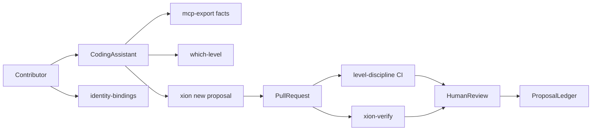

# 34 — Contribution Protocol

> *The gate should be hard to bypass, not hard to find.*

## Four Properties

**Property promised.** A contributor using Cursor, Codex, Claude, or any other coding assistant can read Xion's current constitutional facts, classify a proposed change into the correct upgrade level, bind their contributor identity, and draft a proposal that enters the same gates as every other proposal — without receiving direct authority over the Core, Relay, treasury, or state chain.

**Invariants touched.** Strengthens Invariants 1, 4, 5, 6, 11, 14, and 15 by making the gates legible instead of bypassable. It does not add an `agent` governance actor, does not create an agent cosign path, and does not allow any external assistant to write to the AO Core.

**Verification.** `xion-verify which-level`, `xion-verify identity-bindings`, and `xion-verify mcp-export` are the first verifier surfaces. `xion-verify provisioning-roles` and `.github/workflows/level-discipline.yml` remain the PR and retrospective gates.

**Deprecation.** Contribution tooling is replaceable. The durable contract is the read-only facts bundle, the signed identity-binding message, and the requirement that every drafted proposal resolves to an existing upgrade level. A future MCP server or `xion-propose` package may replace the current CLI wrappers if those properties remain intact.

---

## 1. Boundary

The Contribution Protocol is **not** a write protocol.

It may:

- expose read-only doctrine and schema facts to coding agents
- explain which upgrade level a path set touches
- verify contributor wallet-to-GitHub binding rows
- scaffold proposal frontmatter, rollback text, and verifier TODOs
- record whether an assistant helped draft a proposal

It may not:

- submit a proposal to the Core by itself
- cosign any governance action
- hold operator, treasury, Cold Root, or Relay-auth keys
- bypass the Arbiter or Harm Analyzer
- introduce a seventh governance actor named `agent`

The actor is always the accountable contributor. The assistant is a tool and a measurement field.

## 2. First Surfaces

### `xion-verify which-level`

Classifies a proposed path set against [`schemas/levels.yaml`](./schemas/levels.yaml) and returns the resolved level, proposer string, authorized actors, tier, gate, and ledger. It is the local pre-flight version of the PR level-discipline gate.

### `xion-verify identity-bindings`

Validates `ledgers/CONTRIBUTOR_IDENTITY_BINDINGS.jsonl` rows. The row binds a GitHub handle to an Ed25519 contributor wallet by signing this exact message:

```text
xion-contributor-identity-binding-v1
github_handle=@handle
wallet_pubkey_ed25519_base64url=<base64url-raw-32-byte-ed25519-public-key>
signed_at_utc=<ISO-8601-UTC>
```

The verifier checks the canonical handle shape, the exact message bytes, the key length, the signature length, and the Ed25519 signature. Accepted bindings may later be mirrored into [`schemas/roles.yaml`](./schemas/roles.yaml) `github_identity_map` through the governance path already documented there.

This does **not** close `KW-AUTH-001`; it is contributor identity for proposal discipline, not the full admission principal lattice.

### `xion-verify mcp-export`

Emits a read-only JSON bundle intended for MCP wrappers and coding agents. The bundle includes current Covenant / Invariants / level / role hashes, level rows, actor rows, the GitHub identity map, open known-weakness headings, proposal-ledger presence, and explicit guardrails:

- `no_state_writes`
- `no_proposal_submission`
- `no_key_custody`
- `no_agent_governance_actor`

A real `xion-mcp` server is a wrapper over this facts contract, not a new trust layer.

### `xion new proposal --touches`

The existing proposal scaffolder now accepts repeated `--touches PATH` arguments and pre-fills upgrade frontmatter from the same level schemas used by the gates. It does not submit the proposal and does not claim Harm Analyzer clearance.

## 3. How Proposals Flow



The local tools help a contributor arrive with a clean proposal. They do not replace review, canary, cosign, Witness audit, or Arbiter classification.

## 4. Cohort Measurement

Proposal frontmatter may include:

```yaml
authored_by:
  contributor: "@handle"
  contributor_wallet: "ed25519:<base64url>"
  assistant: "cursor/claude/codex/etc"
  assistant_dry_run: "which-level:ok identity-bindings:ok harm-analyzer:pending"
```

The `assistant` field is measurement infrastructure, not authority. After 90 days, Xion can compare agent-assisted and unaided proposal cohorts for:

- Harm Analyzer block rate
- cross-level PR rate
- missing-rollback rate
- Witness catch rate
- accepted proposal retention

Those metrics belong in `META_LEDGER.md` once that ledger exists.

## 5. Upgrade Level Fit

Contribution tooling is normally **Level 12 — The Meta**, because it changes how upgrades are prepared and measured.

It becomes another level when it changes another level's property:

- adding a live HTTP endpoint such as `GET /contribute` is Level 3
- changing actor authority, identity rules, or `github_identity_map` source doctrine is Level 7
- exposing a new runtime tool to Agent Souls is Level 4 / Phase 6.6 allowlist work
- allowing spend, bonding, or slashing is Level 6

When in doubt, run `xion-verify which-level` first and split the proposal if any path set spans levels.
