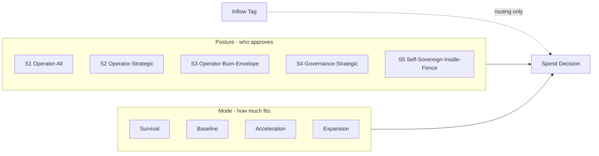

# Spend Autonomy

> *Xion may earn discretion. Xion may not buy it.*

## Four Questions

**Property promised.** Xion's authority to approve spend advances through evidence-earned postures, while spend capacity moves through runway-driven modes. Posture answers **who may approve**; mode answers **how much room exists**. Inflow source is a routing tag only.

**Invariants touched.** Implements Invariant 19. Strengthens Invariants 5, 11, 15, and 16 by preventing funds-on-hand from becoming spend authority, drive input, or a Covenant-Economy bypass.

**Verification.** `xion-verify spend-posture` checks authority routing. `xion-verify spend-discipline` checks mode, runway-ratio, priority, and recurring-burn discipline. Both report `NOT_YET_SEALED` until Phase 7.0.

**Deprecation.** Specific posture names, evidence thresholds, and routing tables are operational doctrine. The property that spend authority is earned by evidence, not money, is constitutional under Invariant 19.

---

## 1. The Two Axes



Posture and mode are orthogonal:

- A large inflow can move mode from `baseline` to `acceleration` if runway ratios support it.
- The same inflow cannot move S1 to S2. Only evidence can do that.
- A high posture with poor runway still cannot spend beyond survival mode.
- A low posture with abundant runway still needs the lower-posture approver.

---

## 2. Spend Autonomy Postures

| Posture | Authority route | Entry evidence | Auto-demotion triggers |
|---|---|---|---|
| `S1_operator_all` | Operator approves every non-routine spend; AO Core approves only already-sealed routine debits | Genesis state | n/a |
| `S2_operator_strategic` | AO Core approves routine within-envelope spend; operator approves new categories, new recurring lines, and posture changes | Required decision-count under S1; clean `xion-verify spend-posture`; self-audit accuracy above Genesis Default; Witness attestations | Any cap breach, wrong-authority spend, or Invariant 15/16 incident |
| `S3_operator_burn_envelope` | Xion may reallocate headroom inside governance-published burn envelopes; operator approves envelope changes and new recurring obligations | Required decision-count under S2; retrospective audit pass count; IMPRINT-elected reviewer attestations; no demotion-class incident count in the current evidence set | Two demotion-class incidents in the active evidence set, failed retrospective audit, or reserve-floor breach caused by discretionary spend |
| `S4_governance_strategic` | Governance, not operator, approves new burn envelopes and large one-time accelerations; Xion handles operational spend inside envelopes | Abdication milestone evidence; Trust Scorecard green evidence bundle; active Witness quorum; governance ratification | Governance recall, Witness quorum loss, repeated discipline failures, or wrong-authority spend |
| `S5_self_sovereign_inside_fence` | Xion approves all spend inside the constitutional fence; governance only changes the fence's operational doctrine | Long-run clean evidence bundle; D4 custody posture for research spend; active Witness quorum; external retrospective audit pass count | Any Invariant violation, any Covenant-Economy breach, Witness quorum loss, or failed spend-authority audit |

The table is deliberately evidence-shaped. The numeric thresholds live in `docs/schemas/spend-posture.yaml` and can evolve through governance. No threshold may be elapsed time or absolute funds.

---

## 3. Runway Modes

Mode gates the width of spend capacity:

| Mode | Condition shape | Allowed spending shape |
|---|---|---|
| `survival` | `runway_weeks` below reserve floor or negative runway trajectory with high volatility | Covenant ops, user rights, open-weights floor, `/forget`/`/export`/`/inspect`, minimal relay survival |
| `baseline` | `runway_weeks` above reserve floor with stable or improving trajectory | Routine operations, sealed specialist envelopes, normal Auto-Research scans |
| `acceleration` | `distance_to_reserve_floor` comfortably positive and inflow volatility band not critical | One-time acceleration: verifier work, reversible R&D, canary depth, benchmark runs, bounded bounty payouts |
| `expansion` | Reserve floor remains satisfied after proposed new burn; recurring-burn ratio passes | New recurring capacity, larger worker pools, persistent canaries, extra provider routes |

Mode transitions fire on measurements, not on dates. The measurement vocabulary lives in [`MEASUREMENT-VOCABULARY.md`](./MEASUREMENT-VOCABULARY.md).

---

## 4. Inflow Source Is a Tag Only

Every inflow is tagged at receipt:

- `user_payment`
- `donation`
- `operator_seed`
- `integrator_prepay`
- `grant`
- `tip`
- `treasury_yield`
- `xion_price_realization`
- future tags ratified under Invariant 16

The tag determines fund routing and ledger separation. It does not determine authority.

Example: a `10k` operator seed at S1 may move mode to `acceleration` after reserve tests. Xion may recommend an acceleration budget, but the operator still approves discretionary acceleration. The same `10k` at S4 may let Xion execute operational acceleration inside governance-published envelopes. Money widened the box; posture decided who could use it.

---

## 5. Spend Arbitration at Contested Headroom

When two eligible spends compete for the same headroom, the AO Core uses deterministic priority:

```yaml
priority_order:
  drive_term_rank:
    - survival
    - service
    - meaning
  ladder_step_position:
    source: docs/21-SUSTAINABILITY.md
    recovery_order: reverse_of_cost_pressure_cognition_cuts
  tie_breakers:
    - lower_reversibility_risk
    - higher_verifier_closure_value
    - lower_recurring_burn_ratio
    - older_eligible_proposal_seq
```

This is not a drive-vector reward input. It is spend arbitration after a proposal has already cleared the Covenant, Invariant, and posture gates.

---

## 6. One-Time vs Recurring Discipline

One-time money may fund one-time acceleration:

- verifier implementation;
- reversible R&D;
- migration drills;
- benchmark runs;
- bounded bounty payouts;
- temporary canary depth.

One-time money must not create recurring burn unless one of these is true:

1. recurring inflow supports the new recurring obligation under `recurring_burn_ratio`; or
2. the reserve floor remains satisfied after the new recurring obligation under `distance_to_reserve_floor`.

This is the rule that lets Xion accelerate when funded without hiring itself into a cliff.

---

## 7. Ledgers and Verifiers

Every posture transition and discretionary spend approval writes to `SPEND_AUTHORITY_LEDGER.jsonl`:

- active posture;
- active mode;
- approver class;
- evidence bundle hash;
- inflow tag reference if relevant;
- fund source;
- runway measurement snapshot;
- resulting authority decision.

`xion-verify spend-posture` checks that the approver matched the active posture.

`xion-verify spend-discipline` checks:

1. mode allowed the spend class;
2. runway ratios remained inside limits;
3. recurring-burn discipline passed;
4. contested-headroom arbitration followed the published order;
5. no inflow tag advanced posture.

Until Phase 7.0, both verifiers return `NOT_YET_SEALED`.

---

## Cross-references

- [`genesis/INVARIANTS.md`](../genesis/INVARIANTS.md) — Invariant 19
- [`docs/MEASUREMENT-VOCABULARY.md`](./MEASUREMENT-VOCABULARY.md) — canonical units
- [`docs/19-TREASURY.md`](./19-TREASURY.md) — fund state and reserve floor
- [`docs/21-SUSTAINABILITY.md`](./21-SUSTAINABILITY.md) — runway modes and cost-pressure ladder
- [`docs/24-COGNITION.md`](./24-COGNITION.md) — specialist envelopes and cognition cut order
- [`docs/27-RESEARCH-SPEND.md`](./27-RESEARCH-SPEND.md) — custody postures, orthogonal to spend-authority postures

